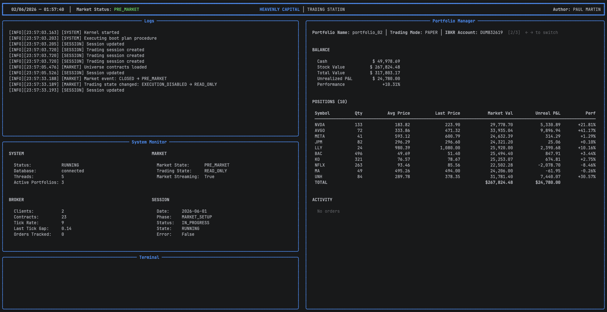

<p align="center">
  
</p>

<p align="center">
  
  
  
  
  
</p>

---

> **⚠️ Work in Progress** — This project is under active development 
> and cannot be used without direct support from the author. 
> If you are interested in the project or want to get in touch, 
> feel free to reach out via [GitHub](https://github.com/PaulMrtn) 
> or open an [issue](https://github.com/PaulMrtn/HeavenlyCapital/issues).
> 
---

## Overview

**HeavenlyCapital** is a Python-based algorithmic trading infrastructure built on top of the Interactive Brokers (IBKR) API, designed for **live automated trading on US equity markets**.

The system handles everything from real-time market data ingestion to order execution and portfolio management. It is built around a modular, event-driven architecture with a strict separation between infrastructure and strategy — the system is entirely **agnostic to how models are built**. Any trained model can be plugged in as long as it follows the expected interface (`.pkl` file registered in the database). How signals are generated is entirely up to the user.

The infrastructure covers:
- Real-time market data ingestion and multi-frequency aggregation
- Feature computation pipeline fed by live market data
- Forecast model lifecycle management — register, version, assign to portfolio
- Signal routing from models to the appropriate portfolios
- Full order execution lifecycle with IBKR
- Portfolio management, mark-to-market, and rebalancing
- Complete PostgreSQL persistence — orders, fills, positions, P&L, logs

---

## Features

**Core engine**
- Event-driven kernel with market state machine (PRE_MARKET → OPEN → POST_MARKET → CLOSED)
- Internal clock with accelerated time simulation for development
- NYSE trading calendar integration
- Managed thread pool with job queues and graceful shutdown

**Market data pipeline**
- Real-time tick ingestion from IBKR with multi-session support (LIVE + PAPER simultaneously)
- OHLC aggregation at 5-second intervals (last, bid, ask)
- Multi-frequency resampling cascade (5s → 30s → 1m → 5m → 10m → 30m → 1h) without redundant recomputation
- Ring buffer per instrument and frequency (numpy) for efficient feature computation
- Structured `CandleEvent` bus connecting the data layer to the strategy layer

**IBKR integration**
- Multi-client session management
- Real-time streaming with tick rate monitoring and connection health tracking
- Order placement (Market, Limit) with full lifecycle tracking (CREATED → SUBMITTED → PARTIALLY_FILLED → FILLED)
- Order, fill, and commission event handling
- Account state synchronization from IBKR servers

**Trading engine**
- Isolated `TradingSession` per portfolio with decoupled `OrderManager`, `PortfolioManager`, and `RiskManager` communicating through an internal message router — modules are independent and do not reference each other directly
- Portfolio mark-to-market in real time from live tickers
- Rebalancing engine — computes order deltas from target weights stored in the database
- Global order router with live/paper queue prioritization
- Full order lifecycle persistence (orders, fills, commissions, positions, P&L)

**Forecasting pipeline**
- Model registry loaded from the database at startup (name, type, version, path)
- Supports 3 model types per portfolio: `BUY`, `SELL`, `STOP_LOSS`
- Feature plugin system — features are registered via decorator and computed on demand from live market data banks
- Signal routing by portfolio — each signal is published only to the portfolios that hold a position in the relevant instrument
- Decision records persisted asynchronously to the database

**Session & portfolio management**
- Paper and live trading modes
- Multi-portfolio support per account
- Capital event tracking (initial capital, additions, withdrawals)
- Portfolio balance and position management

**Persistence**
- Full PostgreSQL schema (see [`sql/`](./sql/) folder)
- Asynchronous batch writes via a dedicated DB writer thread
- Structured logging to database (domain, event, metadata, timestamp)

**Monitoring**
- Real-time terminal dashboard (Rich) showing kernel state, market state, and session status
- Async structured log service with batch DB persistence
- Health check framework on all runtime modules
- Extensible metrics and notification services

---

## Project Structure

```
heavenly_capital/
│
├── core/
│   ├── calendar.py           # NYSE trading calendar
│   ├── clock.py              # Market state machine & time simulation
│   ├── kernel.py             # Central orchestration engine
│   └── thread.py             # Managed thread pool
│
├── data/
│   ├── bus.py                # Thread-safe event bus (pub/sub with token-based unsubscribe)
│   ├── historic.py           # Multi-frequency resampling cascade & candle store
│   └── live.py               # Real-time tick ingestion & OHLC aggregation
│
├── db/
│   ├── connector.py          # PostgreSQL connector & unit of work pattern
│   ├── reader.py             # Data access layer (read operations)
│   └── writer.py             # Data ingestion layer (write operations)
│
├── ibkr/
│   ├── client.py             # IBKR client sessions, streaming & event handling
│   └── gateway.py            # Order gateway, account sync, contract management
│
├── models/
│   ├── account.py            # Account & margin state
│   ├── config.py             # Runtime configuration
│   ├── market_data.py        # OHLC, CandleEvent, MarketDataBank (numpy ring buffer)
│   ├── order.py              # Order state machine & lifecycle
│   ├── portfolio.py          # Portfolio, position & balance models
│   ├── risk.py               # Risk state & snapshot
│   ├── runtime.py            # Module contracts (Protocol, BaseModule, ModuleRouter)
│   ├── session.py            # Session & trading session configuration
│   ├── snapshot.py           # Kernel snapshot for monitoring
│   ├── system.py             # System state, ports & runtime registry
│   └── tickers.py            # Universe & instrument models
│
├── monitoring/
│   ├── error_service.py      # Error capture & reporting
│   ├── health_service.py     # Readiness checks
│   ├── log_service.py        # Async structured logging with batch DB persistence
│   ├── metric_service.py     # Metrics (extensible)
│   └── notification_service.py  # Alerts (extensible)
│
├── services/
│   ├── app.py                # SessionService — setup API (sessions, portfolios, models)
│   └── console.py            # Real-time terminal dashboard
│
├── strategy/
│   ├── artifacts.py          # FeatureSpec, ModelSpec, ModelSignal, DecisionRecord
│   ├── feature_engine.py     # Feature computation engine & FeatureStore
│   ├── features.py           # Feature plugin registry
│   └── forecast_engine.py    # Model loading, prediction & signal routing
│
├── trading/
│   ├── order_manager.py      # Order staging, authorization & routing
│   ├── portfolio_manager.py  # Portfolio state, rebalancing & mark-to-market
│   ├── risk_manager.py       # Risk controls (in progress)
│   ├── router.py             # Global order router (live/paper priority queue)
│   └── session_manager.py    # Trading session lifecycle
│
└── sql/                      # PostgreSQL schema & table definitions
```

---

## Prerequisites

Before using HeavenlyCapital, you need:

- **Python 3.12**
- **Interactive Brokers account** (paper or live) with TWS or IB Gateway running
- **IBKR API** enabled in TWS/Gateway settings (Edit → Global Configuration → API)
- **Market data subscription** — The API requires a Level 1 US top-of-book subscription to receive real-time equity data. This is typically achieved by subscribing to the three US equity exchanges (NYSE, NASDAQ, and AMEX/ARCA), or via the equivalent **IBKR US Equity Level I bundle** (~$4.50/month for non-professional users). A minimum account equity of **$500** is also required in addition to subscription fees.
  
  - By default, every account is limited to **100 simultaneous market data lines** (100 assets streamed at once). To exceed this limit, purchase **Quote Booster Packs** at **$30/month each** (100 additional lines per pack, max 10 packs per account). The limit also scales automatically with account equity and monthly commissions.
    
  - Subscribe and manage via [Client Portal → Market Data Subscriptions](https://www.interactivebrokers.com/en/pricing/market-data-pricing.php).
    
- **A running PostgreSQL database instance** with the required schema pre-created. SQL scripts are located in the [`sql/`](./sql/) folder. The connection is configured via a `.env` file.
  
  > A Docker image with a pre-configured PostgreSQL instance is currently in development and will be available in a future release.
  
- **Trained forecast models** (`.pkl` files) — the system requires **3 models per portfolio**: `BUY`, `SELL`, and `STOP_LOSS`. Models are registered in the database and loaded at runtime. How models are built and trained is entirely up to the user and is outside the scope of this infrastructure.
  
  > A guide on how to integrate custom models into HeavenlyCapital is currently in development.

> This system is designed for users familiar with algorithmic trading, the IBKR ecosystem, and quantitative finance. It is not a plug-and-play solution.

---

## Installation

```bash
git clone https://github.com/PaulMrtn/HeavenlyCapital.git
cd HeavenlyCapital
pip install -r requirements.txt
```

> **Note** — The `requirements.txt` and the compatible fork of `ib_async` required to run this project are not included in this repository. Please [open an issue](https://github.com/PaulMrtn/HeavenlyCapital/issues) or reach out via [GitHub](https://github.com/PaulMrtn) to get access.

---

## Database Setup

HeavenlyCapital requires a running PostgreSQL instance with the schema initialized before starting the system.

1. Create a PostgreSQL database
2. Run the SQL scripts from the [`sql/`](./sql/) folder to create the required tables
3. Configure the connection in your `.env` file

> A Docker-based setup is coming soon to automate this step entirely.

---

## Setup — Sessions, Portfolios & Models

Before running the system, use the `SessionService` to configure accounts, portfolios, and forecast models in the database.

```python
from heavenly_capital.services.app import SessionService
from decimal import Decimal

service = SessionService()

# Create a trading session for an IBKR account
service.create_session(
    session_name="MySession",
    account_id="ACC123",
    mode="PAPER"  # or "LIVE"
)

# Create a portfolio with initial capital
service.create_portfolio(
    account_id="ACC123",
    strategy_id="STRAT001",
    portfolio_id="PORT001",
    portfolio_name="MyPortfolio",
    cash_amount=Decimal("10000.0"),
    currency="USD",
    enabled=True
)

# Register a capital event
service.register_capital_event(
    account_id="ACC123",
    portfolio_id="PORT001",
    event="INITIAL_CAPITAL",  # "INITIAL_CAPITAL" | "CAPITAL_ADDITION" | "CAPITAL_WITHDRAWAL"
    amount=Decimal("10000.0"),
    currency="USD"
)

# Register forecast models — 3 required per portfolio: BUY, SELL, STOP_LOSS
service.set_model(
    model_name="BuyModelV1",
    model_type="BUY",          # "BUY" | "SELL" | "STOP_LOSS"
    version=1.0,
    path="/models/buy_v1.pkl",
    description="Buy signal model",
    enabled=True
)

# Assign a model to a portfolio
service.assign_model_to_portfolio(
    portfolio_id="PORT001",
    model_name="BuyModelV1",
    model_type="BUY",
    version=1.0
)
```

> In **LIVE** mode, the initial capital is fetched directly from IBKR servers and does not need to be specified manually.

---

## Adding Assets to the Universe

HeavenlyCapital fetches market data for instruments stored in the database.
To add an asset to the universe, use the `SessionService`:

```python

from heavenly_capital.services.app import SessionService

service = SessionService()

service.writer.insert_instrument(
    symbol="AAPL",
    long_name="Apple Inc.",
    sector="Technology",
    exchange="NASDAQ",
    currency="USD",
    asset_class="EQUITY"
)

service.writer.insert_instrument(
    symbol="MSFT",
    long_name="Microsoft Corporation",
    sector="Technology",
    exchange="NASDAQ",
    currency="USD",
    asset_class="EQUITY"
)

service.writer.insert_instrument(
    symbol="JPM",
    long_name="JPMorgan Chase & Co.",
    sector="Financial",
    exchange="NYSE",
    currency="USD",
    asset_class="EQUITY"
)

service.writer.insert_instrument(
    symbol="XOM",
    long_name="Exxon Mobil Corp.",
    sector="Energy",
    exchange="NYSE",
    currency="USD",
    asset_class="EQUITY"
)


```

The `con_id` — the IBKR contract identifier — is resolved automatically by the
gateway at startup via `qualify_contracts()`. You can also find it manually in TWS
(right-click on an instrument → Financial Instrument Info → Description) or via
the [IBKR Contract Search](https://www.interactivebrokers.com/en/index.php?f=463).

> **Note** — Automatic contract persistence after qualification is not yet fully
> implemented. A mechanism to automatically resolve and persist `con_id` values
> from IBKR at startup is planned for a future release.

On startup, the gateway loads all instruments from the database, qualifies the
contracts with IBKR, and starts streaming real-time market data automatically.

---

## Scheduling a Rebalance

To schedule a rebalance, assign target weights per instrument (`con_id`) 
to a portfolio for a given date:

```python
service.writer.insert_portfolio_target(
    account_id="ACC123",
    portfolio_id="PORT001",
    strategy_id="STRAT001",
    rebalance_date="2026-04-01",  # format 'YYYY-MM-DD'
    weights={
        265598:   0.30,  # AAPL
        272093:   0.20,  # MSFT
        1520593:  0.50,  # JPM
    }
)
```

Weights are expressed as fractions of the total portfolio value.
They do not need to sum to `1.0` — the remaining allocation is kept as cash.
The rebalancing engine computes the order deltas automatically on the scheduled date
and routes the orders to the appropriate portfolio session.

---

## Running the System

> **⚠️ Debug mode only** — The current entry point is a minimal debug launcher.
> A proper startup script with readiness checks, exit code handling, and process
> management is currently in development (see [Roadmap](#roadmap)).

```python
import asyncio
from heavenly_capital.core.kernel import Kernel

async def main() -> None:
    async with Kernel() as kernel:
        await kernel.run(debug_mode=True)

if __name__ == "__main__":
    asyncio.run(main())
```

Run it with:

```bash
python main.py
```

---

## Terminal

HeavenlyCapital includes a real-time terminal dashboard built on top of the **Rich** CLI library, serving as the primary stdout multiplexer and runtime interface for local operations.

<p align="center">
  
</p>

The CLI interface captures standard keyboard events natively, allowing developers to cycle through portfolio snapshots using the Left/Right directional arrow keys.

Unlike the decoupled monitoring dashboard engineered for the **v1.0 alpha** release—which executes read-only operations against historical tables via the PostgreSQL persistence layer—**this terminal console reads live operational values directly from RAM**. This localized memory inspection architecture guarantees zero-latency telemetry for tracking the internal clock states, numpy ring buffer allocations, thread pool queue depths, and real-time TCP socket tick gaps from the IBKR API.

> **⚠️ Debug mode only**  — The terminal UI layer is exclusively designed for local debugging and sandboxed execution.
> The underlying architecture relies on fully decoupled, thread-safe asynchronous services.
> When deployed to a headless cloud instance, an isolated VPS, or a Docker container (see [Roadmap](#roadmap)), the CLI rendering engine needs to be toggled off.

---

## Roadmap

| Status | Milestone |
|---|---|
| ✅ Done | Core engine — market state machine, clock, thread pool |
| ✅ Done | Real-time data pipeline — tick ingestion, OHLC aggregation, multi-frequency resampling |
| ✅ Done | IBKR integration — multi-session, streaming, order execution |
| ✅ Done | Trading engine — order lifecycle, portfolio management, order routing |
| ✅ Done | Forecasting pipeline — feature engine, model registry, signal routing |
| ✅ Done | Full PostgreSQL persistence — orders, fills, positions, P&L, logs |
| ✅ Done | Session & portfolio management — paper/live, capital events, multi-portfolio |
| 🔄 In progress | Risk manager — stop loss & liquidity management |
| 🔄 In progress | System hardening — configuration, boot sequences, error handling |
| 🔄 In progress | Monitoring — metrics service, health checks, notifications |
| 🔜 Planned | Quantitative research integration — model pipeline end-to-end |
| 🔜 Planned | Data pipeline — Norgate automated ingestion, contract management |
| 🔜 Planned | Testing & CI/CD |
| 🔜 Planned | Docker & VPS deployment |
| 🔜 Planned | Reconciliation & reporting dashboard |


**Current progress — ~60% toward v1.0 alpha**

The core infrastructure is functional end-to-end. The remaining work focuses on
hardening the system for production — robust boot sequences, complete risk management,
automated data pipelines, and deployment infrastructure.

**Estimated v1.0 alpha — Q3 2026**

> v1.0 alpha is defined as: system running stably in paper trading on a VPS,
> with quantitative models integrated and a basic monitoring dashboard in place.

---

## Disclaimer

This project is developed for **personal capital management**. It is not financial advice and is not intended for third-party use. Live trading involves significant financial risk. Use at your own risk.

---

## Author

**Paul Martin** — [GitHub](https://github.com/PaulMrtn)
