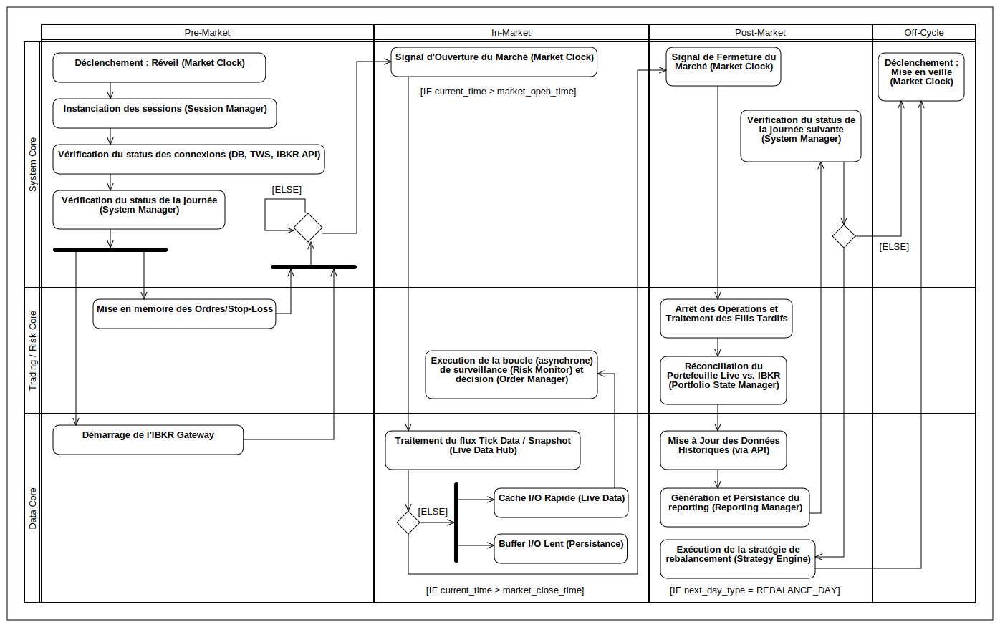

## Diagram Activity : Cycle de Vie Quotidien 

  

---

### I. Phase Pre-Trade (Préparation à l'Ouverture)

Cette phase est dédiée à l'initialisation du système et au chargement des données en préparation du début de la session de trading.

### 1. Initialisation du Cycle de Marché

* **Déclencheur :** Le **System Manager** sort du mode veille suite à un signal temporel programmé par le **Market Clock** (ex: 8h00 AM).
* **Orchestration :** Le **System Manager** :
    * Le `System Manager` calcule l'objet `MarketDayStatus` du jour en cours en utilisant `pandas_market_calendars`. 

* **Contrôle de Jour Ouvré :**
  * **IF [MarketDayStatus.is_trading_day == TRUE]** (Jour ouvré) :
    * Le `System Manager` utilise le `Session Manager` pour instancier les sessions (LIVE/PAPER).
    * Le processus continue vers l'étape 2.
  * **ELSE** (Jour non ouvré, week-end ou jour férié) :
    * Le **System Manager** bascule immédiatement en phase **Off-Cycle** (Veille).

### 2. Vérifications Préalables (Intégrité et Connexion)

* **Phase de vérification :** Le **System Manager** contrôle l'état des connexions critiques :
    * Lien avec la base de données via le **Database Connector**.
    * Lien avec le courtier via l'**IBKR Gateway** (TWS API).
    * Statut et identification de chaque compte Interactive Brokers.

* Prépration de la persitance des données pour la session de trading en base de données (via `IDatabaseWriter`).

### 3. Chargement et Préparation des Données

Cette étape lance des processus en parallèle pour garantir que la prise de décision puisse être immédiate à l'ouverture :

* **Préparation Trading et Risque :**
    * **Jour de Rebalancement :** Le **Portfolio Manager (PM)** charge en mémoire les ordres de rebalancement créés lors de la phase post-marché de la dernière session de trading et stockés en base.
    * **Jour de Trading Normal :** Le **Risk Monitor** charge en mémoire les données de **stop-loss** et de take-profit relatives aux positions en cours.
* **Démarrage Acquisition des Données :**
    * L'**IBKR Gateway** initialise la connexion pour être prêt à émettre les **tick data** (prix) et recevoir les **fills** (exécutions) dès l'ouverture.

### 4. Synchronisation et Transition vers In-Trade

* **Synchronisation :** Le **System Manager** attend la complétion de deux conditions avant de procéder :
    1.  Le chargement des données (Ordres / Stop-Loss) est terminé.
    2.  La connexion à l'**IBKR Gateway** est établie et fonctionnelle.
* **Déclenchement :** Le **System Manager** bascule en phase **In-Trade** uniquement après avoir reçu le signal du **Market Clock** indiquant que l'heure d'ouverture est atteinte.

---

### II. Phase In-Trade (Exécution et Surveillance)

### 5. Traitement des Flux Temps Réel

Dès la transition vers la phase In-Trade, les flux asynchrones sont activés :

* Le **Live Data Hub** commence à recevoir les **tick data** (flux de prix haute fréquence) via l'**IBKR Gateway**.
* Des **snapshots** agrégés sont générés régulièrement.
* **Distribution des Snapshots (Parallélisme) :**
    * **Vers la Persistance (I/O Lent) :** Les snapshots sont mis en file d'attente (buffer) pour une insertion différée en base de données par le **Data Ingestion Layer (DIL)**.
    * **Vers le Temps Réel (I/O Rapide) :** Les snapshots sont écrits dans un **cache** à faible latence.

### 6. Boucle de Décision et d'Exécution

* Le **Risk Monitor** lit le cache temps réel pour surveiller les prix des positions actives et vérifier les conditions de **stop-loss** chargées.
* Le **Portfolio Manager (PM)** évalue les conditions d'achat/vente (selon la stratégie).
* L'**Order Manager** soumet les ordres (préparés ou nouvellement générés) au courtier via l'**IBKR Gateway**.
* Le **Portfolio Manager (PM)** traite les exécutions (`Fills`) reçues de manière asynchrone pour mettre à jour les positions et les lots de PnL.

---

### III. Phase Post-Trade (Réconciliation et Audit)

### 7. Clôture des Opérations et Séquence d'Audit

* **Déclencheur :** Le **System Manager** reçoit le signal de fermeture du **Market Clock**.
* **Réconciliation Finale :** Le **Portfolio Manager (PM)** effectue une **réconciliation** pour comparer l'état final du portefeuille (positions, cash) avec les données d'Interactive Brokers, garantissant l'intégrité.

### 8. Persistance et Audit (Rapport de Fin de Journée)

* **Mise à Jour Historique :** Le **Data Ingestion Layer (DIL)** finalise l'écriture de toutes les données (ticks, fills, lots, trades, logs) en attente (queue) et met à jour les données historiques via une API dédiée. **(Cette étape doit précéder la vérification du jour suivant).**
* **Rapport d'Audit :** Le **Monitoring Module** et le **Reporting Manager** génère le rapport complet de la journée (PnL, métriques de performance, erreurs d'audit) et l'enregistre en base de données via le **Data Ingestion Layer (DIL)**.

### 9. Préparation du Cycle Suivant

* **Vérification du Jour Suivant :** Le **System Manager** consulte le `TradingCalendar` pour déterminer le type de la prochaine journée.
* **Exécution de la Stratégie :**
    * **Condition :** Si le jour suivant est un **jour de rebalancement**, le **Strategy Engine** est exécuté.
    * **Objectif :** Ce moteur determine le portefeuille cible et donc les nouvelles demandes d'ordres en les enregistrant en base de données (via le **Data Ingestion Layer (DIL)**) pour être chargées à la prochaine session de trading (rebalancement). 
* **Transition :** Une fois toutes les tâches Post-Trade complétées et validées, le **System Manager** bascule en phase **Off-Cycle** (Veille).
