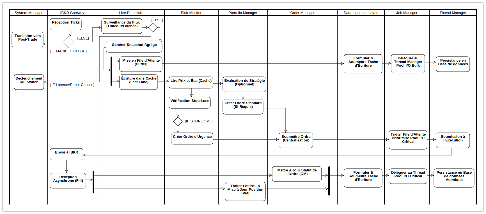

## Diagram Activity : Phase II - In-Trade

  

Cette phase représente le cœur opérationnel du système, dédié au traitement des flux de données à haute fréquence, à la prise de décision en temps réel, à l'exécution priorisée des ordres et à la persistance critique.

### 5. Traitement des Flux Temps Réel

Dès la réception du signal de l'ouverture du marché par le **System Manager**, le **Live Data Hub** initie l'acquisition des données de marché et la distribution en parallèle :

1.  L'**IBKR Gateway** commence à recevoir les **Tick Data** (flux de prix haute fréquence) de manière asynchrone.
2.  **Surveillance Critique du Flux :** Le **Live Data Hub** intercepte les Ticks et exécute immédiatement la **surveillance du flux** (vérification du *timestamp* et du temps écoulé depuis le dernier tick) pour détecter une **latence critique** ou une **erreur de connexion réseau**.
    * **[Latence/Erreur Critique] :** Si le seuil de latence est dépassé ou si la connexion est perdue, le **Live Data Hub** émet un événement `CRITICAL_ERROR` au **System Manager**. Ce dernier déclenche la séquence de **Kill Switch** (arrêt sécurisé et annulation des ordres).
3.  Si le flux est stable **[Latence Acceptable]**, le **Live Data Hub** agrège ces ticks pour générer régulièrement des **Snapshots** des cotations.
4.  Un **Nœud de Fork** distribue le Snapshot en deux flux parallèles pour optimiser la latence :
    * **Flux Temps Réel (Fast-Lane) :** Le Snapshot est immédiatement écrit dans un **cache** en mémoire vive pour un accès instantané par le **Risk Monitor** et le **Portfolio Manager**.
    * **Flux de Persistance (Slow-Lane) :** Le Snapshot est mis en **file d'attente (buffer)** pour une écriture différée en base de données.

#### Persistance des Données de Marché (Bulk I/O)

La persistance des Snapshots est traitée comme une tâche d'arrière-plan massive (**Bulk I/O**).

* Le **Live Data Hub** soumet la tâche d'écriture au **DIL (Data Ingestion Layer)**.
* Le DIL formule la requête et la soumet au **Job Manager**, spécifiant le besoin d'utiliser le **Pool I/O Bulk**.
* Le **Job Manager** délègue au **Thread Manager** l'exécution de la tâche en utilisant un thread du **Pool I/O Bulk** dédié, garantissant que ces écritures lourdes ne bloquent pas les opérations critiques. Le DIL exécute alors l'écriture physique.

---

### 6. Boucle de Décision et d'Exécution

La boucle s'exécute à très haute fréquence, pilotée par le **Risk Monitor** et le **Portfolio Manager**.

#### 6.1 Surveillance et Ordres d'Urgence

Le **Risk Monitor** lit le cache temps réel (le prix le plus récent) et surveille l'état de chaque position.

* Si une condition de **Stop-Loss** ou de **Take-Profit** est atteinte, le Risk Monitor génère immédiatement un **Ordre d'Urgence**.
* Cet ordre est envoyé à l'**Order Manager** avec une indication de **Priorité Maximale**, court-circuitant l'évaluation de stratégie standard du Portfolio Manager.

#### 6.2 Traitement des Ordres Standards et Exécution

* Le **Portfolio Manager** évalue les conditions d'achat/vente selon la stratégie et génère des **Ordres Standards** si nécessaire.

  * Le PM génère des ordres si, et seulement si, l'une des conditions suivantes est remplie :

  1.  **Jour de Rééquilibrage :** Le **System Manager** a marqué la journée comme une journée de rééquilibrage planifiée. Le PM calcule les écarts de pondération et **génère des ordres pour corriger le portefeuille.**
  2.  **Timing Intraday (Optionnel) :** Le **PM** (ou un futur **EMS**) utilise un algorithme d'optimisation (TWAP/VWAP) pour **"timer" le prix d'exécution** d'un ordre spécifique.

* **Règle de Fonctionnement :**

  * **Si c'est un Jour de Rééquilibrage :** Les ordres massifs générés par la correction du portefeuille sont **systématiquement soumis à l'Algorithme d'Optimisation Intraday** afin d'optimiser le prix moyen d'exécution sur la journée. La décision d'émettre des ordres est donc une combinaison de la **logique de Rééquilibrage** et de la **tactique de *timing***.
  * **Si ce n'est PAS un Jour de Rééquilibrage :** Le PM **ne génère aucun ordre** basé sur l'état global du portefeuille. Le PM n'émet un ordre que si une autre fonctionnalité (ex: *Cash Management* ou la stratégie intraday elle-même) le lui demande explicitement, agissant ainsi comme un simple **pass-through** pour des ordres de maintenance. **Par défaut, en dehors d'un jour de rééquilibrage, le PM reste silencieux.**

* L'**Order Manager** reçoit tous les ordres (Urgent ou Standard) et les soumet immédiatement au **Job Manager** pour arbitrage.
* Le **Job Manager** utilise sa logique de priorité pour garantir que les **Ordres d'Urgence** sont traités avant les Ordres Standards. Le Job Manager délègue ensuite la tâche d'envoi au **Thread Manager**, spécifiant le **Pool I/O Critical**.
* Le **Thread Manager** utilise un thread du Pool I/O Critical pour que l'**IBKR Gateway** exécute la transmission de l'ordre au courtier.

#### 6.3 Gestion des Exécutions (Fills) et Persistance Critique

La réception d'une exécution (`Fill`) est un événement critique qui nécessite une action immédiate et atomique entre les différents composants :

1.  L'**IBKR Gateway** reçoit le `Fill` et émet immédiatement un **Événement 'Fill Received'**.
2.  Une parallelization dirige cet événement vers ses deux abonnés critiques :
    * **Order Manager :** Met à jour le statut de l'objet `Order` (quantité exécutée, statut final).
    * **Portfolio Manager :** Met à jour les **Lots de PnL** et l'objet **Position**.
3.  Une fois que l'OM et le PM ont préparé leurs données de mise à jour, l'unité de travail est soumise au **DIL** (via l'interface `IDatabaseWriter`) pour persistance.
4.  Le DIL formule la tâche et la soumet au **Job Manager**, spécifiant l'utilisation du **Pool I/O Critical**.
5.  Le **Job Manager** délègue au **Thread Manager** l'allocation d'un thread du **Pool I/O Critical**, assurant que cette écriture transactionnelle vitale (statut de l'ordre, état financier) est isolée des tâches de fond lentes. Le DIL exécute la transaction de base de données.

La boucle se répète jusqu'à ce que le **System Manager** reçoive le signal de fermeture (`MARKET\_CLOSE`) du **Market Clock**, initiant la transition vers la Phase Post-Trade.

---

