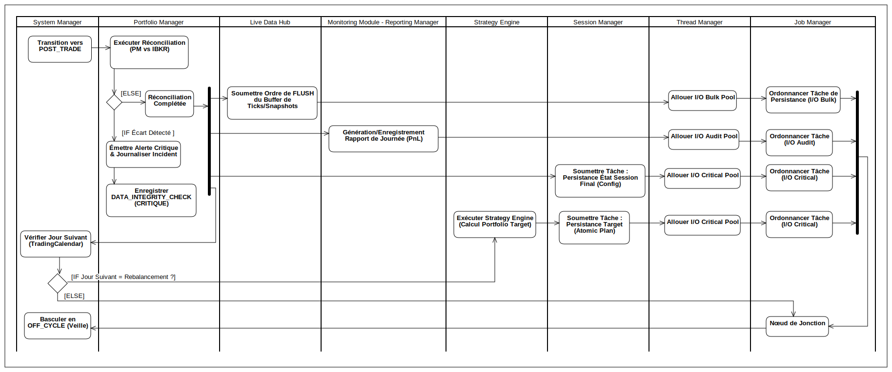

## Diagramme d'Activité : Phase III - Post-Trade

  

---

### 7. Fermeture du Marché et Arrêt Ordonné des Flux

La Phase III est déclenchée par le signal de fermeture du **Market Clock**. La première priorité est de **figer l'état du système** pour garantir que l'audit se base sur des données stables.

* **Déclencheur :** Le **System Manager** reçoit le signal de fermeture du **Market Clock** et bascule le système en état `POST_TRADE`.
* **Arrêt des Modules Temps Réel :** Le **System Manager** ordonne immédiatement l'arrêt des modules de décision et de surveillance :
  * **Arrêt Ordonné de la Surveillance :** Le **Risk Monitor** arrête sa boucle de vérification des prix en temps réel.
  * **Arrêt de la Prise de Décision :** L'**Order Manager** arrête l'évaluation des signaux et l'émission de nouveaux ordres.

* **Synchronisation des Écritures `In-Trade` (Verrouillage de l'État) :**
  * Le **System Manager** ordonne au **Job Manager** de **forcer la complétion** de toutes les écritures critiques en cours (ex: mise à jour des `Fillset`, `Positions`).
  * Le **Live Data Hub** reçoit l'ordre de **purger tous les buffers** d'écriture I/O Lent (Snapshots/Ticks) et d'attendre la validation de leur persistance. Cette étape est critique car elle garantit que toutes les transactions et données de marché de la journée sont enregistrées avant l'audit.

---

### 8. Audit et Persistance Critique de Clôture

Une fois l'état du système stable et figé, les opérations d'audit et de sauvegarde atomique des données de reprise sont exécutées. Ces tâches sont soumises au **Job Manager** pour garantir la traçabilité et l'utilisation des pools de threads appropriés.

* **Réconciliation Finale (Intégrité Financière) :**
  * Le **Portfolio Manager (PM)** exécute la **Réconciliation Finale**, comparant l'état du portefeuille interne avec l'état du courtier (IBKR Gateway).
  * **Contrôle de Garde :** En cas d'écart (`[IF Data Integrity Error]`), le PM émet une **Alerte Critique** et enregistre l'incident (`DATA_INTEGRITY_CHECK`). Le processus continue, mais sous alerte.

* **Persistance Atomique du Livre de Compte (Étape 13) :**
  * Le PM génère le **`SettledSessionBook`** (état financier final, PnL, positions) et soumet sa persistance au **Job Manager**.
  * **Allocation :** Cette écriture utilise le **Pool I/O Audit/Critical** pour garantir une sauvegarde atomique et immédiate.

* **Sauvegarde de la Configuration Globale :**
  * Le **Session Manager** procède à la sauvegarde de l'État Final de la Configuration (`session_config`).
  * **Allocation :** Cette tâche critique utilise également le **Pool I/O Critical**, car l'intégrité des paramètres de redémarrage est essentielle.

* **Génération du Rapport d'Audit Primaire :**
  * Le **Reporting Manager** génère le rapport PnL final et les métriques agrégées pour l'audit. Cette tâche est lancée en parallèle des persistances critiques et utilise le **Pool I/O Audit**.

---

### 9. Finalisation et Transition vers la Veille

L'étape finale garantit que le système ne bascule en veille qu'après la validation des enregistrements les plus importants.

* **Lancement des Tâches Secondaires (Bulk I/O) :**
  * La génération de rapports secondaires ou la mise à jour de données internes non critiques (si nécessaire) est lancée.
  * **Allocation :** Ces tâches sont allouées au **Pool I/O Bulk** pour éviter de bloquer la validation finale.

* **Validation de la Transition :** Le **System Manager** ne bascule le système en phase **Off-Cycle (Veille)** que lorsque la validation de persistance des deux écritures les plus critiques est reçue :
  1. Validation du **`SettledSessionBook`** (Livre de Compte Audité).
  2. Validation de la **`session_config`** (Configuration de Reprise).

Cette double vérification assure une **intégrité totale** au moment de l'arrêt, rendant le système prêt pour le déclenchement indépendant de la Phase IV.
