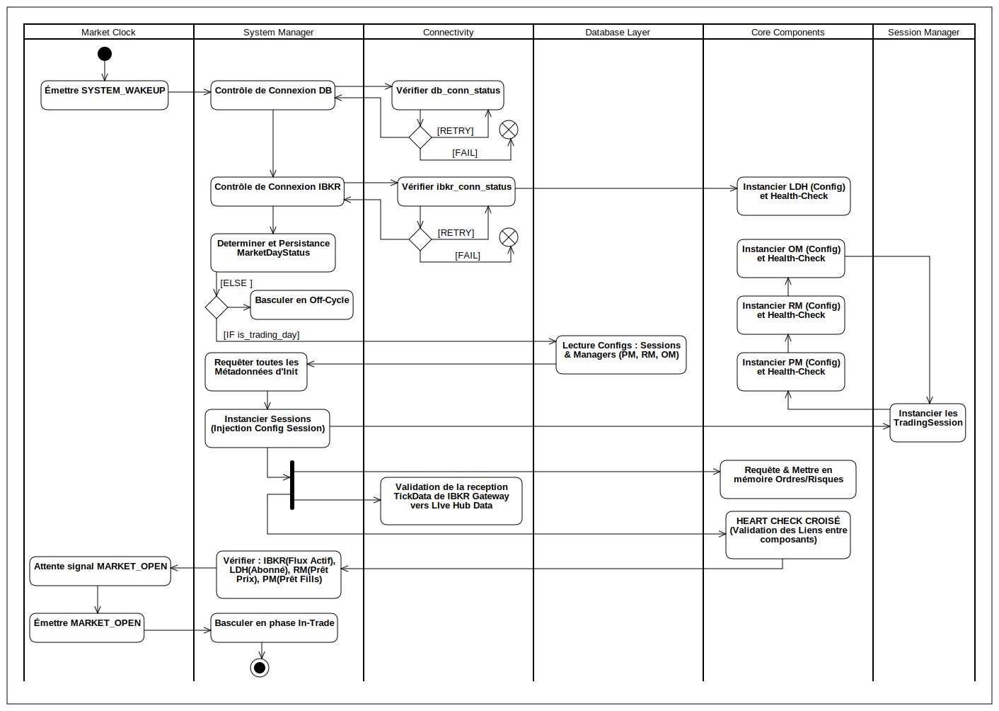

## Diagram Activity : Phase I - Pré-Trade

  

La Phase Pré-Trade est l'étape de **démarrage et de validation** du système. Son objectif est de garantir que tous les composants sont **instanciés, configurés, et opérationnellement prêts à communiquer** avant la réception du signal d'ouverture du marché. La séquence est conçue pour assurer la gestion des erreurs et l'injection des dépendances.

## 1. Démarrage et Contrôles de Résilience (Orchestration par System Manager)

Cette séquence est séquentielle et intègre une logique de **Retry (tentatives)** pour gérer les pannes transitoires de services.

### 1.1. Réveil du Système et Contrôles Critiques

* **Déclenchement :** Le processus est initié par un signal **`SYSTEM_WAKEUP`** émis par le `Market Clock`.
* **Contrôle de Connectivité (DB) :** Le `System Manager` ordonne au `Database Connector` de vérifier l'état de la connexion, en enregistrant le statut initial.
    * **Gestion d'Erreur :** En cas d'échec, le système effectue une boucle de **Retry** (tentatives avec délai croissant). Si le maximum de tentatives est atteint, une **notification d'urgence** est envoyée et le système s'arrête (ERROR).
* **Contrôle de Connectivité Critique (Courtier) :** Une fois la connexion DB stable, le `System Manager` ordonne à l'`IBKR Gateway` de vérifier la connexion à l'API du courtier et à l'application TWS/GB simultanément.
    * **Gestion d'Erreur :** La même logique de **Retry** est appliquée. Si l'échec est persistant, le système s'arrête et envoie une **notification d'urgence** via le `Notification Manager`.

### 1.2. Calcul et Décision de Jour Ouvré

* **Calcul et Persistance du Statut :** Le `System Manager` utilise le package de calendrier (`pandas_market_calendars`) pour déterminer l'objet **`MarketDayStatus`** (incluant le statut `is_trading_day`). Ce statut est persisté via l'`IDatabaseWriter` du `Data Ingestion Layer` pour l'audit et la référence par les managers locaux.
* **Contrôle de Jour Ouvré :** Une condition est évaluée :
    * Si **`MarketDayStatus.is_trading_day == FALSE`**, le `System Manager` bascule immédiatement en phase **Off-Cycle** (Veille), stoppant tout processus d'instanciation coûteux.
    * Si `TRUE`, le processus passe à l'étape 2 d'instanciation.

---

## 2. Instanciation des Composants et Injection des Dépendances / Configs

Les composants globaux sont instanciés en premier. La lecture des configurations depuis la base de données est centralisée par le `System Manager` pour maximiser l'efficacité des I/O.

### 2.1. Instanciation Globale et H-Check Unitaire

* **Singletons :** Les composants globaux et uniques sont instanciés : l'`IBKR Gateway` et le `Live Data Hub (LDH)`.
* **H-Check Unitaire :** Une vérification initiale est effectuée sur chaque objet pour confirmer son intégrité en mémoire et la bonne injection de ses configurations de base.

### 2.2. Initialisation des Pools de Threads

* **Lecture Config du Pool :** Le `System Manager` ordonne au **`Thread Manager (TM)`** de lire la configuration des tailles des pools (Critical, Standard) depuis la Base de Données (via le `Data Access Layer`).
* **Création des Threads :** Le `TM` instancie le nombre configuré de **Threads Persistants (`PoolWorker`)** pour les **Pool I/O CRITICAL** et **Pool I/O STANDARD**. Ces threads restent allumés et en attente pour toute la session de trading.
* **Validation :** Le `TM` notifie le `SM` que les pools sont initialisés et prêts à être empruntés par le `Job Manager`.

### 2.3. Instanciation des Sessions et Managers Locaux (Boucle)

* **Lecture des Métadonnées :** Le `System Manager` requiert toutes les configurations statiques nécessaires (Configurations des Sessions LIVE/PAPER, Métadonnées des Managers) via le `Data Access Layer`.
* **Création des Sessions :** Le `System Manager` ordonne au `Session Manager` de créer les objets **`TradingSession`**.
* **Boucle d'Instanciation :** Une boucle itère sur chaque `TradingSession` créée :
    * Pour chaque session, le triplet de composants locaux est instancié : **`Portfolio Manager (PM)`**, **`Risk Monitor (RM)`**, et **`Order Manager (OM)`**.
    * **Injection de Dépendance :** Le `MarketDayStatus` et les configurations spécifiques à la session sont injectés dans les constructeurs des managers.
    * **H-Check Unitaire (Local) :** Une vérification est effectuée sur chaque manager (PM, RM, OM) pour confirmer leur bonne construction.

---

## 3. Chargement des Données et Parallélisation

L'objectif est d'assurer que les managers locaux ont leurs données opérationnelles chargées et que le canal de données temps réel est prêt, en utilisant le parallélisme.

* **Lancement Parallèle :** Le `System Manager` lance deux branches d'initialisation en parallèle :
    * **Branche A (Chargement de Données) :** Les instances de PM et RM lancent la requête (via le `DAL`) pour lire et mettre en mémoire les données dynamiques du jour (Orders en attente, RiskLimits pour les positions actives).
    * **Branche B (Validation du Flux) :** L'`IBKR Gateway` lance une requête de données TEST (PING sur un symbole simple) et attend la première réponse pour valider que le canal de données IBKR → LDH est ouvert et fonctionnel.
* **Synchronisation :** Le `System Manager` attend la complétion des deux branches avant de procéder à la validation finale.

---

## 4. Validation Opérationnelle Croisée (HEART CHECK)

Cette étape est la validation finale, qui vérifie que les liens de communication asynchrones sont correctement établis.

* **Vérification des Dépendances :** Le `System Manager` effectue des requêtes actives pour valider :
    * Le flux de prix actif entre l'`IBKR Gateway` et le `LDH`.
    * Que le `Risk Monitor (RM)` a chargé toutes les positions et est prêt à recevoir les mises à jour de prix.
    * Que le `Portfolio Manager (PM)` est correctement injecté dans l'`OM` et prêt à traiter les confirmations d'exécution (Fills).
* **Log :** Si tous les tests réussissent, le `System Manager` enregistre le statut **"System Ready"** et entre dans l'état d'attente du signal d'ouverture.

---

## 5. Transition vers la Phase In-Trade

* Le `System Manager` attend le signal **`MARKET_OPEN`** émis par le `Market Clock`.
* Dès réception de ce signal, il bascule l'état du système en phase **In-Trade**.
