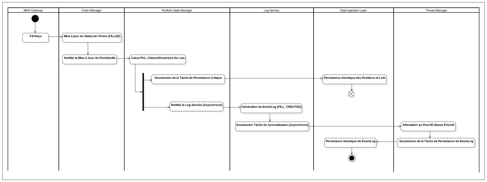

## Processus : Gestion du Fill et Réconciliation (DA-02)

Ce processus décrit les étapes critiques qui suivent la réception d'une confirmation d'exécution d'ordre (`Fill`). Il garantit la mise à jour atomique et immédiate de l'état financier critique via le **Portfolio State Manager (PSM)**, et sépare la journalisation d'audit dans un flux asynchrone à basse priorité.

  

---

### 1. Ingestion du Fill et Préparation Critique (Flux C)

| Étape | Composant | Description |
| :--- | :--- | :--- |
| **D0-C1** | IBKR Gateway $\rightarrow$ Order Manager | Réception du Fill et mise à jour immédiate du statut de l'ordre à FILLED. |
| **C2-C3** | Order Manager $\rightarrow$ PSM | Transfert du contrôle : Le PSM calcule le PnL réalisé et crée les Lots (Acquisition/Realization) **en mémoire**. |
| **C-FORK** | PSM | **Nœud de Fourche :** L'état en mémoire est à jour. Le PSM initie deux chemins **concurrents** pour la persistance et l'audit. |

---

### 2. Persistance Critique (Chemin C)

Ce chemin est exécuté immédiatement par le thread principal (ou haute priorité) pour garantir l'intégrité financière.

| Étape | Composant | Action après le Nœud de Fourche |
| :--- | :--- | :--- |
| **C4** | **PSM** $\rightarrow$ DIL | **Soumission de la Tâche de Persistance Critique :** Le PSM initie l'écriture immédiate de l'état critique (Lots/Positions) au DIL. |
| **C5** | DIL | **Écriture Atomique :** Le DIL gère la transaction ACID vers la base de données. |
| **C6** | PSM | **Fin du Processus Critique** (Le PSM peut être libéré). |

---

### 3. Journalisation Asynchrone (Chemin L)

Ce chemin est déchargé pour l'audit et utilise le Pool I/O Basse Priorité.

| Étape | Composant | Action après le Nœud de Fourche |
| :--- | :--- | :--- |
| **L0** | **PSM** $\rightarrow$ Log Service | **Notifier le Log Service (Asynchrone) :** Le PSM notifie le Log Service de lancer le processus d'audit. |
| **L1** | Log Service | **Génération de l'$EventLog$** structuré (Type `FILL_CREATED`, etc.). |
| **L2** | Log Service $\rightarrow$ Thread Manager | **Soumission Tâche de Journalisation :** Le Log Service décharge la tâche I/O au Thread Manager. |
| **L3** | Thread Manager $\rightarrow$ Log Service | Le Thread Manager affecte la tâche au **Pool I/O Basse Priorité** et démarre l'exécution. |
| **L4** | Log Service $\rightarrow$ DIL | **Soumission de l'`EventLog` :** Le Log Service initie l'écriture via le DIL (pour garantir l'atomicité). |
| **L5-L6** | DIL | **Persistance Atomique :** Le DIL effectue l'écriture de l'`EventLog` et termine le flux asynchrone. |
