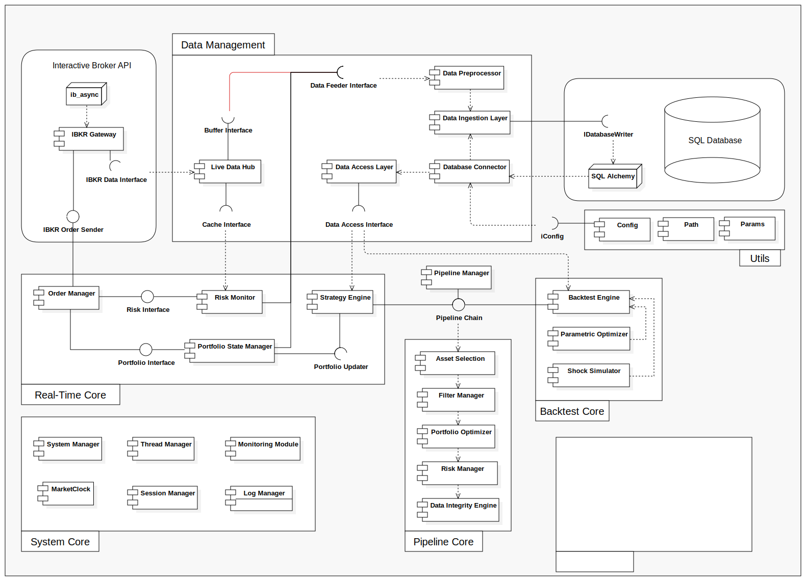

# Diagramme des Composants UML

  

## I. Data Management

Ce cœur est responsable de l'ingestion, du nettoyage, de la persistance et de la mise à disposition des données.

### **Database Connector**

Ce composant est l'interface du système avec la base de données relationnelle. Sa fonction principale est de gérer le cycle de vie des connexions : établir, maintenir, et clore les sessions. Il gère la **résilience** de la connexion, la **lecture sécurisée** des identifiants, et fournit des métriques de **surveillance** au système.

* **Interfaces Fournies / Requises :**
    * **IConnectionFactory** : **Interface fournie** par le `Database Connector` pour instancier et retourner un objet de connexion ou une session de base de données.
    * *SQL Alchemy* : **Package/Framework requis** (ORM) pour la gestion technique du *pool* de connexions.
    * **Config / Secret Vault** : **Composant/Source requis** pour l'extraction sécurisée des identifiants de connexion (*secrets*).
    * **Monitoring Module** : **Composant requis** pour rapporter l'état des connexions et la latence I/O.

#### Notes

* **Résilience :** Implémente une **logique de *retry*** pour rétablir automatiquement la connexion à la base de données en cas de défaillance temporaire du réseau.
* **Sécurité :** Construit l'URI de connexion en lisant les identifiants à partir d'une source sécurisée (**Secret Vault**) et non d'un simple fichier de configuration.
* **Performance/Monitoring :** Transmet des métriques de performance et de santé de la base de données au **Monitoring Module** (e.g., temps de réponse, taux de succès des connexions) pour une surveillance proactive.

### **Data Preprocessor**
  
Ce composant assure la sanitisation et la normalisation des payloads de données brutes. Il est invoqué par le Data Ingestion Layer en amont de toute opération de persistance. Il opère comme une unité de transformation interne garantissant la cohérence du schema des données.

### **Data Ingestion Layer (DIL)**

Le DIL est l'orchestrateur de la persistance des *data sets. Sa responsabilité principale est de fournir un set de méthodes d'écriture pour injecter l'intégralité des flux de données dans le système de stockage persistant. Il assure la séquence des opérations : appel au Data Preprocessor pour la standardisation des données, puis mapping et écriture.

* **Interfaces Fournies / Requises :**
    * **IDatabaseWriter** : **Interface de persistance fournie** par le DIL, constituant le **contrat de service** pour les composants tiers souhaitant stocker des données (e.g., **Live Data Hub**).
    * **Database Connector** : **Composant requis** pour la gestion du *pool* de connexions et des sessions de transaction vers le *data store*.
    * **Data Preprocessor** : **Composant requis** pour standardiser le *payload* de données.
    * *SQL Alchemy* : **Package/Framework requis** (ORM) utilisé pour l'abstraction et l'efficacité des opérations CRUD.

#### Notes

* **Isolation de la Transaction (Atomicité) :** Le DIL doit garantir que chaque appel à l'`IDatabaseWriter` est traité comme une **transaction atomique** (ACID). Ceci est critique pour l'intégrité des données financières (soit l'écriture est complète, soit elle est annulée).
* **Mécanismes de Sauvegarde (Batching) :** Implémentation de mécanismes de **mise en lot (Batching)** pour les écritures à haut débit (ex: *ticks* de prix ou journaux agrégés). Cela réduit la charge d'I/O sur la base de données en groupant les insertions dans une seule transaction.
  
### **Data Access Layer (DAL)**

Le DAL est la couche d'**abstraction de la lecture** qui fournit des méthodes simplifiées et optimisées pour requêter l'intégralité des *data sets* stockés. Il agit comme un **intermédiaire de service** permettant aux composants clients (stratégies, *risk monitors*) de consommer des données sans connaissance directe du *schema* ou de la complexité du **Database Connector**.

* **Interfaces Fournies / Requises :**
    * **IDataReader** : **Interface de lecture fournie** par le DAL. Elle expose des méthodes de haut niveau (ex: `get_historical_prices(asset_id, start_date)`) qui constituent le **contrat de service** pour la consommation de données.
    * **Database Connector** : **Composant requis** pour obtenir la session de connexion active à la base de données.
    * *SQL Alchemy* : **Package/Framework requis** (ORM) utilisé pour la construction et l'exécution des requêtes optimisées.

#### Notes

* **Mise en Cache des Requêtes :** Intégration d'un mécanisme de **caching** au niveau du DAL pour les requêtes de données historiques coûteuses ou fréquemment sollicitées. Cela permet de réduire la **latence** et la **charge I/O** sur la base de données pour les composants consommateurs.
  

### **Live Data Hub**

Ce composant est l'**écouteur central** des flux de prix marché. Il écoute les *triggers* de prix en temps réel via l'**IBKR Gateway** pour créer des **snapshots de marché** réguliers. Ces données sont mises en cache via l'**Interface Cache** et mises en file d'attente pour la persistance via l'**Interface Buffer**.

* **Interfaces Fournies / Requises :**
    * **IBKR Data Interface** : **Interface requise** via **IBKR Gateway** pour recevoir les mises à jour de prix (*market data stream*).
    * **Cache Interface** : **Interface fournie** pour l'écriture des données en cache.
    * **Buffer Interface** : **Interface fournie** pour la mise en file d'attente des données destinées à la persistance asynchrone.
    * **IMarketEventPublisher** : **Interface fournie** pour notifier les abonnés (comme le Job Manager) de la disponibilité d'un nouveau Snapshot.
    * *ib\_async* : **Package/Framework requis** pour la gestion de l'écoute asynchrone des événements de l'API de courtage.

* **Data Classes :**
    * **TickData** : Représente l'état instantané d'un actif (bid/ask, dernière transaction, volumes). C'est la donnée brute du marché.
    * **SnapshotHeader** : Représente l'en-tête d'un instantané global du marché à une fréquence donnée (ex: '1m', '5m').
    * **MarketQuote** : Représente la cotation consolidée d'un actif au sein d'un SnapshotHeader pour une période donnée.

#### Notes

* **Cohérence des Ticks :** Inclusion d'un mécanisme de vérification pour détecter les **sauts (gaps)** ou les incohérences dans la séquence des *ticks* reçus, afin de garantir la qualité des **SnapshotHeader** générés.
* **Suivi de Latence :** Enregistrement du **`receive_timestamp`** (temps de réception par le *Hub*) en plus du `timestamp` du marché. Cela permet de calculer la latence entre le courtier et le système et d'auditer la performance.

---
## II. Real-Time Core

### **IBKR Gateway**

Le composant **IBKR Gateway** sert de **couche d'abstraction (wrapper)** au-dessus de la librairie d'accès API (`ib_async`). Il est le point de contact **unique et résilient** avec l'API d'Interactive Brokers, gérant toutes les communications. Il est responsable de la **Gestion Centralisée des Connexions** et de la **Gestion des Rate Limits** du courtier. Il fournit deux interfaces pour séparer les flux : l'envoi d'ordres et la réception de données. Il intègre également des fonctions de simulation (*mocking*) pour les tests de résilience. 

Lors de la réception d'une exécution (Fill), le Gateway agit comme un Publisher et émet un événement FILL_RECEIVED vers le bus de messagerie interne. Il ne gère pas directement la logique de PnL ou le statut final de l'ordre.

* **Interfaces Fournies / Requises :**
    * **IBKR Order Sender** : **Interface fournie** pour l'envoi des ordres au courtier (utilisée par le **Job Manager**).
    * **IBKR Data Interface** : **Interface fournie** pour la transmission des flux de *tick* et des données temps réel au **Live Data Hub**.
    * *ib\_async* : **Package/Framework requis** pour la gestion asynchrone de la connexion à l'API de courtage.

#### Notes
* **Gestion Centralisée des Connexions et Résilience :** Le *Gateway* doit assurer la **reconnexion automatique** et la gestion des échecs de connexion pour garantir une disponibilité maximale des flux de données et d'ordres.
* **Gestion des Rate Limits :** Implémentation d'un **mécanisme de *throttling*** interne pour s'assurer que le nombre total de requêtes (temps réel, historiques, ordres) transmises à l'API d'IBKR ne dépasse jamais les limites contractuelles du courtier.
* **Simulation et *Mocking* pour les Tests :** Le *Gateway* doit être facilement substituable par une version de **Mock** pour permettre le test en isolation du **Job Manager** et du **Live Data Hub**, simulant les réponses et les latences de l'API.
* **Composant de Réconciliation (Note de Sécurité) :** Bien que l'**IBKR Gateway** lise l'état du compte IBKR, un **Reconciliation Module** dédié est nécessaire pour comparer périodiquement l'état interne du **Portfolio Manager** avec l'état réel du compte courtier, afin de détecter tout écart et d'assurer la sécurité.
  

### **Order Manager**

Le rôle de ce composant est de **centraliser la gestion du cycle de vie des ordres**. Il reçoit les **requêtes de création d'ordre** provenant de différents émetteurs (**Portfolio Manager** pour le rééquilibrage, **Risk Monitor** pour les ordres d'urgence comme le *stop loss*). Il crée l'objet **Order** structuré et le transmet pour exécution au **Job Manager**. Il est également responsable de la mise à jour du statut de l'ordre tout au long de son cycle via une fonction `updateStatus`. 

L'Order Manager est un Subscriber à l'événement FILL_RECEIVED. À la réception du Fill, il met à jour de manière asynchrone les champs filled_qty, remaining_qty, et le status de l'objet Order correspondant. Cette action est critique mais limitée à l'état de l'ordre.

* **Interfaces Fournies / Requises :**
    * **IOrderCreator** : **Interface fournie** pour la réception des requêtes de création d'ordre (utilisée par **Portfolio Manager** et **Risk Monitor**).
    * **IJobSubmission** : **Interface requise** pour l'envoi de l'ordre nouvellement créé vers le **Job Manager** pour l'exécution asynchrone.

* **Data Classes :**
    * **Order** : Représente une instruction d’achat ou de vente d’un actif, définissant son type, sa quantité, son prix et son statut. Elle centralise les relations avec l’actif, les exécutions et les événements.

#### Notes

* **Gestion des IDs :** Maintenir un *mapping* fiable entre l'**ID interne** (`order_id`) de l'objet `Order` et l'**ID du courtier** (`broker_order_id`). Cette correspondance est vitale pour la traçabilité, la gestion des exécutions et les opérations d'annulation (*cancelation*) via l'API de courtage.

* Ce cœur gère les opérations critiques nécessitant une faible latence, notamment l'exécution d'ordres et la surveillance immédiate.

### **Portfolio Manager (PM)**

Le PM est le composant pivot qui maintient l'état financier et les métriques de performance du portefeuille. Il consolide les mouvements (entrées/sorties de *cash*, exécutions d'ordres lues via la base) pour générer l'état actuel (agrégé par lot). Il exécute la fonction de rééquilibrage : il compare l'état actuel à un état cible (futur) pour générer les **requêtes d'ordres** (*rebalancing*), assurant la gestion des lignes de *cash* et l'émission des ordres via l'**Order Manager**. 

Le Portfolio Manager est également un Subscriber à l'événement `FILL_RECEIVED`. Son rôle est de consommer le `Fill` pour déclencher la logique comptable : création/mise à jour des `AcquisitionLot` et `RealizationLot`, mise à jour de la `Position` et persistance de ces états financiers via l'`IDatabaseWriter`.

* **Interfaces Fournies / Requises :**
    * **IPortfolioStateReader** : **Interface fournie** pour exposer l'état actuel et les métriques de performance.
    * **IOrderCreator** : **Interface requise** pour soumettre les ordres de rééquilibrage à l'**Order Manager**.
    * **IDataReader** : **Interface requise** pour récupérer l'état des exécutions et les données de marché nécessaires.
    * **IPortfolioTargetSubmitter : Interface fournie**  Reçois le `PortfolioTarget` final depuis **Strategy Engine** pour le processus de rééquilibrage.
      
* **Data Classes :**
    * **Portfolio** : Représente le conteneur de l'état global du portefeuille (liquidités, capital initial, devise).
    * **CashFlow** : Représente un mouvement de liquidité (dépôt, retrait) affectant la ligne de trésorerie.
    * **Position** : Représente la quantité agrégée d'un actif détenu.

#### Notes

* **Simulation de l'État Cible (Lookahead) :** Le PM doit être capable de **simuler** l'état futur (`Portfolio`) en intégrant les ordres de rééquilibrage, les coûts de transaction et le *slippage* anticipé **avant** de soumettre les ordres.
* **Gestion de l'Atomicité du Rééquilibrage :** Les requêtes d'ordres générées par le rééquilibrage doivent être traitées comme une **transaction atomique**. Si l'ensemble des requêtes ne peut pas être soumis ou validé, aucune partie des ordres ne doit être envoyée.

### **Risk Monitor**

Ce composant est actif **uniquement durant l'ouverture du marché**. Son rôle est de surveiller en continu l'état du marché par rapport aux positions actives et aux limites de risque prédéfinies. Il lit les prix les plus récents depuis l'**Interface Cache** du **Live Data Hub**. Si une métrique de risque (ex: niveau de stop-loss atteint, dépassement de la tolérance maximale) est déclenchée, il génère des **requêtes d'ordres d'urgence** qui sont envoyées à l'**Order Manager** pour une exécution rapide.

* **Interfaces Fournies / Requises :**
    * **ICacheReader** : **Interface requise** pour lire les cotations de prix marché en temps réel depuis le **Live Data Hub**.
    * **IPortfolioStateReader** : **Interface requise** pour lire l'état actuel du portefeuille (valorisation, marges, etc.) du **Portfolio Manager**.
    * **IOrderCreator** : **Interface requise** pour émettre des ordres d'urgence (*stop loss* ou de couverture) vers l'**Order Manager**.
    * **IDataReader** : **Interface requise** (utilisée en phase de *post-market*) pour charger le `RiskSnapshot` initial depuis la base de données.

* **Data Classes :**
    * **RiskSnapshot** : Data Class interne qui contient, après chargement initial, l'ensemble des données de risque nécessaires à la surveillance en temps réel (positions, stop-loss, tolérances maximales par actif, etc.).

#### Notes

* **Priorisation d'Urgence :** Les requêtes d'ordres émises par le *Risk Monitor* doivent inclure un **attribut de priorité maximale** pour garantir que l'**Order Manager** soumette l'ordre sans délai (*fast-lane*).
* **Robustesse aux Inputs Extrêmes :** Le module doit faire l'objet de **tests unitaires rigoureux** simulant des scénarios extrêmes (ex: chute de prix soudaine, prix nul/négatif) afin d'assurer que la logique de déclenchement d'urgence est robuste et stable.
* **Filtrage du Bruit (*Noise Filtering*) :** Intégration d'une **logique de confirmation** des seuils de risque (ex: seuil atteint sur deux *ticks* consécutifs ou maintenu pendant une durée minimale) pour éviter les faux déclenchements basés sur des bruits de marché éphémères.
* **Mécanisme de *Kill Switch* :** Le *Risk Monitor* doit être capable de déclencher un **mécanisme d'arrêt d'urgence global** en cas de défaillance critique, qui comprend l'annulation de tous les ordres actifs et la désactivation des algorithmes de trading.

### **Job Manager**

Le **Job Manager** est l'**ordonnanceur central** et l'**orchestrateur du workflow** du système. Ses objectifs principaux sont :
1.  **Orchestration :** Il est cadencé par les événements du **Market Clock** et gère l'exécution des tâches selon leur planification et leurs **dépendances** prédéfinies (`ScheduledJob`).
2.  **Files d'Attente :** Il implémente un **mécanisme de file d'attente prioritaire** pour traiter les ordres urgents (Risk Monitor) devant les tâches régulières (Rebalancing).
3.  **Tolérance aux Pannes et Reprise :** Il assure la **tolérance aux pannes** et la **reprise** des tâches non-terminales en cas d'échec, en utilisant l'historique de `JobExecution`.

* **Interfaces Fournies / Requises :**
    * **IBKR Order Sender** : **Interface fournie** pour l'envoi des ordres au courtier.
    * **IJobSubmission** : **Interface fournie** pour recevoir les requêtes de tâches immédiates ou prioritaires (ex: Ordres du **Order Manager**).
    * **IThreadPoolExecutor** : **Interface fournie** pour soumettre une fonction ou une tâche au *thread pool* pour une exécution asynchrone non bloquante.
    * **IMarketEventSubscriber** : **Interface requise** pour écouter les événements de cadencement du **Market Clock**.
    * **IDatabaseWriter** : **Interface requise** (via le DIL) pour la persistance des statuts d'exécution et d'ordres.
    * **ILogService** : **Interface requise** pour journaliser les détails de l'exécution (`JobExecution`).

* **Data Classes :**
    * **ScheduledJob** : Représente la définition d'une tâche planifiée au sein du système.
    * **JobExecution** : Représente une instance unique de l'exécution d'une tâche (historique, statut, horodatages).

###  Notes

* **Gestion des Dépendances (Workflow) :** Mise en œuvre d'un moteur de *workflow* permettant de définir des **dépendances strictes** entre les tâches (ex: Tâche B ne s'exécute que si Tâche A a le statut `COMPLETED_SUCCESS`).
* **Mécanisme de File d'Attente Prioritaire :** La file d'attente doit garantir que les ordres urgents (avec l'attribut de priorité maximale) sont traités et soumis à l'**IBKR Gateway** avant toutes les autres tâches, y compris l'envoi en masse d'ordres de *rebalancing*.
* **Tolérance aux Pannes et Reprise :** Implémentation d'une **logique de *retry*** limitée pour les échecs transitoires, ainsi qu'un mécanisme de notification critique pour les échecs non récupérables, en se basant sur le statut de `JobExecution`.
* **Atomicité de l'Ordre :** Lors de la soumission d'ordres (via `IJobSubmission`), le Job Manager doit s'assurer que l'intégralité du *payload* d'ordres est bien transmise à l'**IBKR Order Sender** pour maintenir le principe d'**Atomicité du Rééquilibrage** défini dans le PM.

---

## IV. System Core

### **Market Clock**

Le **Market Clock** est l'instance unique (Singleton) et globale du système. Ce composant surveille l'heure actuelle en continu (24/7, 365 jours par an). Il est déclenché par l'heure du système et n'a aucune connaissance des jours de fermeture de marché ou des week-ends. Son rôle est de générer l'événement de réveil (Bootstrapping) à une heure prédéfinie chaque jour. Après avoir notifié le System Manager du début de la journée, il continue de surveiller les heures de transition des phases de marché pour le cadencement des processus non liés au trading (monitoring, processus de fin de journée, etc.).

* **Interfaces Fournies / Requises :**
  * **IMarketEventPublisher** : **Interface fournie** pour notifier le System Manager de l'événement de réveil (SYSTEM_WAKEUP) et des signaux temporels récurrents (MINUTE_TICK).
  * **Config** : **Composant/Source requis** pour charger l'heure de réveil quotidienne (Bootstrapping) et la fréquence d'émission des signaux de cadencement.

* **Data Classes :**
  * **MarketEvent** : Journal structuré de tous les événements temporels critiques (SYSTEM_WAKEUP, MARKET_OPEN, MARKET_CLOSE) avec leur horodatage précis.

 #### Notes
 
* **Global et Singleton** : Garantit une référence temporelle unique pour toutes les parties du système.

* **Déclencheur Quotidien Non Conditionnel** : S'active 365 jours par an pour générer l'événement SYSTEM_WAKEUP et démarrer la séquence d'initialisation. La vérification si c'est un jour de trading est déléguée aux couches supérieures (ex: Session Manager via un Trading Calendar).

* **Cadencement Universel** : Émet des signaux récurrents (ex: MINUTE_TICK) basés sur la fréquence définie dans la configuration pour synchroniser les tâches régulières du Job Manager, y compris celles qui doivent s'exécuter les jours non-ouvrables.
  

### **System Manager**

Le **System Manager** est le **point d'entrée unique (Singleton)** et l'autorité centrale de l'application. Sa responsabilité principale est de gérer l'**état opérationnel global** (`TradingSystem`) et de la détermination de l'état du marché du jour, en utilisant directement le package `pandas_market_calendars`. Il orchestre le démarrage de l'ensemble des services, surveille la **santé des connexions** critiques (DB, IBKR), maintient la version du système, et sert de référent pour les ressources partagées, comme l'**état des *snapshots* de données** (`SnapshotHeader`).

* **Interfaces Fournies / Requises :**
    * **ISystemMonitor** : **Interface fournie** pour exposer l'état de santé du système (statuts des connexions, version, `SystemStatus`).
    * **ISnapshotProvider** : **Interface fournie** pour fournir l'accès au `SnapshotHeader` unique et global.
    * **IConnectionMonitor** : **Interface requise** (exposée par le Database Connector) pour interroger le statut de la connexion DB (`db_conn_status`).
    * **IBKRStatusChecker** : **Interface requise** (exposée par l'IBKR Gateway) pour interroger le statut de la connexion au courtier (`ibkr_conn_status`).
    * **ISessionManager** : **Interface requise** (exposée par le Session Manager) pour commander le démarrage ou l'arrêt des sessions.
    * **IStatusResolver** : **Interface requise** ppour obtenir le statut global du jour (`MarketDayStatus`).

* **Data Classes :**
    * **TradingSystem** : Représente l'instance unique du système de trading, supervisant son état opérationnel, l'état des connexions (DB, IBKR), la version et orchestrant les `TradingSession`.
    * **MarketDayStatus** : Indique le type de cycle pour la journée de trading à la suite du reveil du ``TradingSystem`.

#### Notes

* **Mécanisme de Démarrage Séquencé (Bootstrapping) :** Le *System Manager* doit gérer le démarrage des services dans un **ordre séquentiel strict** : MarketDay Status Resolver $\rightarrow$ Connexion DB $\rightarrow$ Connexion IBKR $\rightarrow$ Chargement Config Globale $\rightarrow$ Démarrage des Sessions.
* **Gestion des Échecs Critiques :** Définir une politique claire en cas d'échec d'une dépendance critique (ex: perte de connexion DB en cours de marché) et ordonner au **Job Manager** de déclencher le *Kill Switch* et de basculer en mode `STOPPED`.

### **Session Manager**

**Description :** Le **Session Manager** est le composant responsable de la gestion de l'état et du cycle de vie de chaque session d'exécution (`TradingSession`). Une session modélise l'exécution d'une stratégie sur un portefeuille et peut opérer en mode **LIVE**, **PAPER** ou **BACKTEST**. Il gère la création, le démarrage, la mise en pause et l'arrêt (status) des sessions, et fournit le contexte d'exécution (mode, priorité) aux autres composants du système.

* **Interfaces Fournies / Requises :**
    * **ISessionManager** : **Interface fournie** pour les opérations CRUD sur l'état d'une session.
    * **IExecutionContextProvider** : **Interface fournie** pour fournir le contexte d'exécution (`mode`, `session_id`) aux composants en aval (ex: **Order Manager** pour l'attribution de la priorité).
    * **IDatabaseWriter** : **Interface requise** (via DIL) pour la persistance des nouveaux objets `TradingSession`.
    * **IDataReader** : **Interface requise** (via DAL) pour la récupération des sessions existantes.

* **Data Classes :**
    * **TradingSession** : Modélise l'unité centrale de l'exécution, définissant le contexte, le mode d'exécution (`LIVE`, `PAPER`), le statut, et les relations avec l'ensemble des données de trading.

#### Notes

* **Gestion de la Priorité d'Exécution :** Définir et appliquer une **règle de priorité** basée sur le `mode` de la session (ex: `LIVE` > `PAPER`). L'`IExecutionContextProvider` doit exposer la priorité pour les composants critiques comme l'**Order Manager** et le **Job Manager**.

### **Thread Manager**

Le **Thread Manager** est la couche d'abstraction qui gère la **concurrence** au sein du système. Il est responsable de l'**allocation des ressources physiques** (threads/processus) et des **mécanismes logiques de synchronisation**. Ses objectifs principaux sont :
1.  **Partition des Ressources :** Création de **pools de ressources séparés** (ex: Pool I/O vs Pool CPU) pour empêcher qu'une tâche intensive en calcul ne bloque les threads des ordres d'urgence, garantissant ainsi une faible latence.
2.  **Synchronisation Sécurisée :** Fournir les outils d'abstraction (verrous, sémaphores) nécessaires aux composants clients pour **éviter les conditions de course (*race conditions*)** lors de l'accès aux données partagées (ex: *cache* de prix).
3.  **Double Pool I/O** : allouer deux pools de threads I/O distincts au DIL lors de la phase In-Market :
   I/O Critical Pool : Utilisé uniquement par les transactions à faible volume/haute criticité (ex: Fills, Orders, Statuts).
   I/O Bulk Pool : Utilisé pour l'ingestion massive des données de marché (Ticks, Snapshots, Logs) pour le batching et le buffering.

* **Interfaces Fournies / Requises :**
    * **IThreadPoolExecutor** : **Interface fournie** pour soumettre une fonction ou une tâche au *thread pool* pour une exécution asynchrone non bloquante.
    * *Primitives de Concurrence* : **Package/Framework requis** pour l'implémentation de la logique de parallélisation (ex: verrous, sémaphores, futures).

#### Lien avec le Pool de Connexions à la Base de Données

Les **Pools d'E/S** gérés par le **Thread Manager** (incluant `Pool I/O Critical`, `Pool I/O Real-Time`, et `Pool I/O Bulk`) opèrent en étroite collaboration avec le mécanisme de gestion des connexions à la base de données (DB). Pour garantir la **séparation des priorités** et l'**isolation des performances** entre les tâches, il est essentiel que l'accès à la persistance ne devienne pas un goulot d'étranglement.

* **Mécanisme d'Accès :** Lorsqu'un thread d'un des pools d'E/S est alloué pour exécuter une tâche de persistance (via le `DIL`), ce thread **demande l'accès à la DB via le `Database Connector`**.
* **Garantie de Séparation :** Le `Database Connector` s'appuie sur son **Pool de Connexions** pour garantir qu'une **connexion isolée et dédiée** est attribuée au thread appelant pour la durée de la transaction.
* **Impact sur la Priorité :** Cette isolation garantit que les opérations massives et lentes du `Pool I/O Bulk` n'occupent pas la même ressource physique (connexion DB) que les mises à jour atomiques et critiques des `Pool I/O Critical` et `Pool I/O Real-Time`, préservant ainsi la faible latence des écritures financières vitales.

---
## V. Monitoring & Logging

### **Monitoring Module**

Le **Monitoring Module** est le service central responsable de la collecte et de l'agrégation des **métriques de performance** du système. Son objectif principal est de **supporter la phase de calibration** durant le *paper trading* en mesurant les latences réelles (temps d'exécution des ordres, récupération des prix, exécution des *jobs*). Il est conçu pour que la collecte des métriques soit **asynchrone** et **non bloquante** (*Fire-and-Forget*), afin de garantir l'absence d'impact sur la performance du cœur de trading. Les données sont stockées pour une analyse manuelle et l'identification des anomalies système.

* **Interfaces Fournies / Requises :**
    * **IMetricPublisher** : **Interface fournie** pour l'envoi asynchrone des métriques par les autres composants (ex: **Order Manager**).
    * **IMetricReader** : **Interface fournie** pour exposer les métriques agrégées pour l'analyse (utilisé par le **System Manager** ou les outils d'analyse hors ligne).
    * **ILogService** : **Interface requise** pour enregistrer les alertes ou les événements de métriques.

* **Data Classes :**
    * **SystemMetric** : Représente une seule mesure de performance ou de santé du système.
    * **MetricSnapshot** : Conteneur agrégé de plusieurs `SystemMetric` sur une période donnée.

#### Notes

* **Isolation de la Collecte (Fire-and-Forget) :** L'implémentation doit garantir que l'appel à l'`IMetricPublisher` est **non bloquant** et s'exécute dans un *thread* séparé, de façon à ce que la collecte n'introduise **aucune latence** dans le flux d'exécution critique.
* **Support à la Calibration :** La structure des `SystemMetric` doit prioriser les données pertinentes pour la calibration (ex: **latence inter-module**, **taux de remplissage des ordres simulés**) afin de faciliter la validation du système avant le passage en mode LIVE.

### **Log Service**

Le **Log Service** est le composant d'audit central qui garantit la **traçabilité complète** du système. Il enregistre les objets `EventLog` structurés pour tous les événements critiques et majeurs générés. Le service est conçu pour fonctionner de manière **asynchrone et non-bloquante** (`ILogger.log()`) afin de ne pas impacter la latence d'exécution des modules. Il garantit la **persistance immédiate** en base de données pour l'audit et publie simultanément les événements filtrés vers une console pour la consultation en temps réel.

* **Interfaces Fournies / Requises :**
    * **ILogger** : **Interface fournie** pour l'enregistrement des nouveaux objets `EventLog`.
    * **ILogReader** : **Interface fournie** pour permettre aux consoles ou aux outils d'analyse de récupérer l'historique des événements.
    * **IDatabaseWriter** : **Interface requise** (via DIL) pour la persistance des enregistrements `EventLog`.

* **Data Classes :**
    * **EventLog** : Journal structuré de tous les événements critiques du système, liant l'événement à sa session, son type d'entité, et fournissant un *payload* de détails complet.

---

### VI. Pipeline Core

### **Pipeline Manager**

Le **Pipeline Manager** est l'unité d'orchestration qui gère la **séquence des étapes de transformation** englobant le processus de **sélection d'actif**, le **filtrage** sur l'univers, l'**optimisation** des composants et le **contrôle du risque** qui détermineront le **Portefeuille Cible**. Il permet le choix de la **procédure de calcul**  (Vectorisé ou Itératif).

* **Interfaces Fournies / Requises :**
    * **IPipelineExecutor** : **Interface fournie** par le `Pipeline Manager` pour lancer l'exécution du Pipeline, prenant le `PipelineDOT` en entrée.
    * **IDatabaseWriter** : **Interface requise** (via le DIL) pour la persistance des résultats finaux (Portefeuille Cible) et des diagnostics de la Pipeline.
    * **ILogger** : **Interface requise** (via le Log Service) pour journaliser les événements clés, les échecs d'étape, et la latence d'exécution.
    * **Asset Selection / Filter Manager / Portfolio Optimizer / Risk Manager / Data Integrity Engine** : **Composants requis** pour l'exécution séquentielle.

#### Version provisoire :
#### **Pipeline Data Object Transfer (PipelineDOT)**

Le PipelineDOT est l'objet de données centralisé qui transite entre tous les composants du Pipeline Core. Il assure l'atomicité et la traçabilité des données à chaque étape de transformation.

| Attribut | Type de Donnée | Description | Composant |
| :--- | :--- | :--- | :--- |
| **`pipeline_id`** | UUID | Identifiant unique de l'exécution du Pipeline. | Strategy Engine |
| **`execution_timestamp`** | DateTime | Horodatage de début de l'exécution. | Strategy Engine |
| **`execution_mode`** | Enum (VECTORIZED, ITERATIVE) | Définit le mode de calcul utilisé (Vectorisé, Itératif). | Backtest Engine / Strategy Engine |
| **`strategy_parameters`** | StrategyParams Object | Ensemble complet de paramètres pour l'ensemble des composants de la pipeline. | Lecture par tous |
| **`market_data_snapshot`** | MarketData Object | Conteneur des données de marché. (Source : Database) | Data Access Layer |
| **`eligible_assets`** | List<AssetID> | Liste des actifs sélectionnés pour l'analyse. | Asset Selection |
| **`filtered_assets`** | List<AssetID> | Liste finale des actifs ayant passé le filtrage binaire (ACCEPTED / REJECTED). | Filter Manager |
| **`portfolio_target`** | PortfolioTarget Object | **Portefeuille Cible** avec les poids ($\mathbf{w}_{\text{cible}}$), créé par l'Optimizer et validé par le Risk Manager. | Portfolio Optimizer / Risk Manager |
| **`risk_diagnostics`** | RiskMetrics Object | Ensemble des métriques et du statut de conformité calculés (VaR, statut $\sum w$, etc.). | Risk Manager |
| **`integrity_status`** | Enum (Status) | Statut final du contrôle d'intégrité et de réconciliation (`VALID`, `WARNING`, `CRITICAL_FAILURE`). | Data Integrity Engine |

#### Notes

* **Monitoring :** L'exécution du **Pipeline Manager** doit rapporter au `Monitoring Module` le temps d'exécution total de la Pipeline (latence de décision).

### **Asset Selection**

L'**Asset Selection** est la première étape de transformation dans le Pipeline. Son rôle est de **réduire l'univers d'actifs** disponibles aux seuls actifs éligibles. Les critères sont prédéfinis par la stratégie, mais leurs **seuils sont variables** pour permettre l'optimisation paramétrique.

* **Interfaces Fournies / Requises :**
    * **ISelector** : **Interface fournie** par le `Asset Selection` pour appliquer les critères de sélection et mettre à jour le `PipelineDOT`.

### **Filter Manager**

Le **Filter Manager** est la **deuxième étape de transformation** dans le Pipeline. Son rôle est d'appliquer une **chaîne d'évaluations binaires** (`ACCEPTED`/`REJECTED`) sur chaque actif de l'univers sélectionné par l'Asset Selection. Il opère comme un **composent générique** pour les filtres, permettant l'ajout ou le retrait dynamique de sous-composants de filtrage sans altérer l'interface du Pipeline.

* **Interfaces Fournies / Requises :**
    * **IFilterService** : **Interface fournie** par le `Filter Manager` pour exécuter la séquence de filtres configurée et mettre à jour le `PipelineDOT`.
    * **IComponentFilter** : **Interface requise/implémentée** par tout sous-composant de filtrage (ex: MacroFilter) pour garantir l'interopérabilité au sein du Manager.

### **Portfolio Optimizer**

Le **Portfolio Optimizer** est la **troisième étape de transformation** dans le Pipeline. Son rôle est de calculer la **structure d'allocation optimale** (poids $\mathbf{w}_{\text{cible}}$) des actifs filtrés. Ce composant renvoie le **Portefeuille Cible idéal**, basé sur les objectifs de la stratégie et d'un jeu de contraintes théoriques.

* **Interfaces Fournies / Requises :**
    * **IOptimizer** : **Interface fournie** par le `Portfolio Optimizer` pour recevoir les données d'entrée (actifs filtrés, matrices de risque) et retourner le `PortfolioTarget`.

#### Notes

* **Format de Sortie pour le Strategy Engine :** Le `portfolio_target` doit embarquer les informations necessaire en plus des poids $\mathbf{w}_{\text{cible}}$ afin d'effectuer les calculs de rééquilibrage, de frictions et de conformité effectués par le Portfolio Manager, utilisé par le Strategy Engine.

### **Risk Manager**

Le **Risk Manager** est la **quatrième étape de transformation** dans le Pipeline. Il agit comme un **Contrôleur de Conformité et de Contraintes (Compliance and Constraint Checker)** sur le Portefeuille Cible théorique ($\mathbf{w}_{\text{cible}}$) généré par le **Portfolio Optimizer**.

1.  **Évaluer le risque** : Calculer les métriques de risque globales du portefeuille cible proposé.
2.  **Appliquer les contraintes** : Vérifier la conformité de ce portefeuille aux contrainte fondamentale. 
3.  **Valider ou Rejeter** : Si le risque est jugé acceptable, le portefeuille est validé et transmis. Si les contraintes sont violées (en mode production), le Manager **rejette le portefeuille cible et génère une erreur critique.**

* **Interfaces Fournies / Requises :**
    * **IRiskEvaluator** : **Interface fournie** par le `Risk Manager` pour lancer l'évaluation et la conformité du Portefeuille Cible.

#### Notes

* **Implémentation de Modes de Risque :** Le Manager doit proposer des modes de calcul de risque configurables (**Fast-Check** pour le mode LIVE) afin de garantir que l'étape n'introduise pas de latence excessive en production.
* **Audit et Traçabilité :** En cas de rejet critique, le Manager doit générer un **rapport de diagnostic détaillé** persistant, spécifiant la contrainte exacte violée pour faciliter l'audit.

### **Data Integrity Engine**

Le **Data Integrity Engine** est la **cinquième et dernière étape de transformation** de votre Pipeline. Son rôle principal est de servir de test de réconciliation : il compare le `PortfolioTarget` généré par le mode **Vectorized** avec le résultat du mode **Iterative** pour identifier tout écart critique dû à la différence de méthodologie de calcul.

**Target ID Check** : Lorsque cette option est activée, le DIE effectue un **Contrôle d'Existence et de Statut** sur les actifs du `PortfolioTarget` final.

* **Interfaces Fournies / Requises :**
    * **IIntegrityChecker** : **Interface fournie** par le `Data Integrity Engine` pour lancer les vérifications de réconciliation ou de sécurité.
    * **IExchangeStatusProvider** : **Interface requise** (via l'intégration IBKR Gateway ou un service similaire) pour interroger l'état d'existence et de négociabilité des symboles (tickers) du Portefeuille Cible.

---

### VIII. Strategy Engine

Le **Strategy Engine** est le cœur décisionnel du système, chargé d'encapsuler la **logique d'investissement** sous la forme d'un algorithme paramétrable. Le composant doit supporter et gérer plusieurs stratégies simultanément. Il est toujours exécuté dans le **contexte d'une session unique (`TradingSession`)**, garantissant ainsi que les décisions prises (lancement de la Pipeline) utilisent le jeu de **`StrategyParameters`** et le mode d'exécution spécifiques à cette session. Pour se réaliser, il **accède aux données** nécessaires via l'interface **`IDataReader`** fournie par le **Data Access Layer (DAL)**.

Son rôle est d'**initier et d'orchestrer le processus de rééquilibrage** :
1.  Il utilise le contexte de la session pour identifier et injecter les **`StrategyParameters`** (déterminés lors de la phase de backtest) dans le flux.
2.  Il lance l'exécution de la **Pipeline Core** (`IPipelineExecutor`) pour calculer la nouvelle allocation optimale (`PortfolioTarget`).
3.  Il soumet ce `PortfolioTarget` au **Portfolio Manager (PM)** pour la traduction de cette intention en ordres d'exécution.

#### Interfaces Fournies / Requises

* **IStrategyProvider : Interface fournie** par le Strategy Engine. Permet d'interroger le moteur pour l'état de la stratégie et la nécessité d'un rééquilibrage.
* **IExecutionContextProvider : Interface requise** (via le Session Manager). Nécessaire pour obtenir le contexte d'exécution (`session_id`, `mode`, `priorité`) et charger les paramètres spécifiques à la stratégie.
* **IPipelineExecutor : Interface requise** (via le Pipeline Manager). Lance la **Pipeline Core** pour calculer l'allocation optimale.
* **IPortfolioTargetSubmitter : Interface requise** (via le PM). Soumet le `PortfolioTarget` final au **PM** pour le processus de rééquilibrage.
* **IDataReader : Interface requise** (via le DAL). Accède aux données historiques ou fondamentales pour l'évaluation du déclencheur.

#### Version provisoire :
#### StrategyDataTransferObject (SDTO)

| Attribut | Type de Donnée | Description |
| :--- | :--- | :--- |
| **`strategy_id`** | UUID | Identifiant unique de l'instance de stratégie. |
| **`session_id`** | UUID | **Identifiant unique de la `TradingSession`** (Ajouté pour le contexte multi-stratégie). |
| **`evaluation_timestamp`** | DateTime | Horodatage de l'instant où l'évaluation du rééquilibrage est effectuée. |
| **`strategy_parameters`** | StrategyParams Object | L'ensemble des paramètres configurés appliqués à la Pipeline. |
| **`current_market_snapshot`** | MarketData Object | Le dernier instantané de prix marché reçu (pour lecture contextuelle). |
| **`portfolio_state_summary`** | PortfolioStateSummary Object | Un résumé de l'état actuel du portefeuille requis pour l'évaluation interne. |
| **`rebalancing_required`** | Boolean | Le résultat de l'évaluation : `True` si les conditions de rééquilibrage sont remplies. |
| **`last_target_portfolio`** | PortfolioTarget Object (Optionnel) | La dernière allocation cible calculée, utilisée pour le calcul de la déviation. |

---

### VIII. Backtest Core

### **Backtest Engine**

Le **Backtest Engine** permet la simulation des stratégies sur des données historiques, en orchestrant l'évolution de l'état financier complet (capital, cash, positions) du portefeuille à travers le temps et intègre la simulation des frictions (fees, slippage) pour chaque ordre exécuté. Ce composant est un module de recherche quantitative destiné à améliorer la stratégie de trading en déterminant les métriques de performance et les indicateurs de risque optimaux d’un portefeuille. Avant d'invoquer la Pipeline Core, le Backtest Engine peut intégrer deux extensions optionnelles : le **Parametric Optimizer** et le **Shock Simulator**.

* **Interfaces Fournies / Requises :**
    * **IBacktestRunner** : **Interface fournie** regroupant l'ensemble des méthodes pour contrôler la simulation.
    * **IDatabaseWriter** : **Interface requise** pour enregistrer et persister les résultats finaux de la simulation de backtest.

#### Version provisoire :
#### **BacktestRunODT** : 

| Attribut | Type de Donnée | Définition |
| :--- | :--- | :--- |
| **`backtest_date`** | DateTime | Date actuelle de la simulation en cours (pas de temps). |
| **`initial_capital`** | Decimal | Montant initial du capital alloué au début de la simulation. |
| **`current_cash`** | Decimal | Montant actuel de la ligne de trésorerie disponible (cash) dans le portefeuille simulé. |
| **`positions_snapshot`** | Map<AssetID, Position> | État actuel des positions détenues (quantités et prix d'achat/vente). |
| **`order_history`** | List<OrderLog> | Historique complet des ordres simulés, avec leurs statuts d'exécution, fees et slippage appliqués. |
| **`performance_metrics`** | Metrics Object | Structure contenant les métriques de performance cumulées (ex: P&L cumulé, Sharpe Ratio, Volatilité, Max Drawdown). |
| **`risk_metrics_history`** | List<RiskSnapshot> | Historique séquentiel des métriques de risque calculées (ex: VaR historique, Stress-Test). |
| **`simulation_settings`** | SimulationSettings | Paramètres spécifiques à la simulation (ex: niveau de slippage appliqué, modèle de coût de transaction). |
| **`current_pipeline_dot`** | PipelineDOT Object | **L'objet de données de la Pipeline** en cours d'exécution pour le pas de temps actuel. |

#### Notes

* **Walk-Forward**: Le moteur intégrera un mécanisme de séparation des données d'entraînement/validation, permettant à l'utilisateur de choisir les dates de *split*.
* **Multi-Treading et Throttling** : Support d'un mode sans tête (*headless mode*) et d'un *Throttling* pour optimiser la vitesse lors des exécutions parallélisées.

### **Parametric Optimizer**

Le **Parametric Optimizer** est une extension optionnelle du **Backtest Engine**. Son objectif est de trouver la combinaison optimale de paramètres (*`strategy_parameters`*) pour une stratégie donnée, en maximisant une metric sur une période d'entraînement (In-Sample). Il accomplit ceci en ajustant itérativement les paramètres de la pipeline et en lançant des simulations via le **Backtest Engine**. Les méthodes utilisées incluent le **Balayage (Grid Search)**, l'**Optimisation Bayésienne** (optuna). 

* **Interfaces Fournies / Requises :**
    * **IParameterOptimizer** : **Interface fournie** pour configurer l'espace de recherche, la fonction objectif et lancer l'optimisation.
    * **IBacktestRunner** : **Interface requise** pour exécuter les simulations du Pipeline pour chaque combinaison de paramètres testée.
    * **IDatabaseWriter** : **Interface requise** pour enregistrer l'historique de l'optimisation.

#### Data Classes

* **OptimizationResult** : Contient le meilleur jeu de paramètres trouvé, le score de la fonction objectif associé, et la performance Out-of-Sample correspondante.

#### Notes

* **Gestion du Parallelisme** : Le composant doit implémenter un système de **Worker Pool** pour exécuter les tests de paramètres en **parallèle** (multiprocessing ou distribué).
* **Visualisation en Temps Réel** : Fournir une interface pour visualiser la progression de l'optimisation en temps réel (ex: convergence Bayésienne, score du meilleur paramètre).

### **Shock Simulator**

Le **Shock Simulator** est une extension optionnelle du **Backtest Engine** dédiée à l'analyse de robustesse et aux *stress-tests*. Ce composant intervient après l'exécution de la Pipeline Core. Il prend le Portefeuille Cible ($\mathbf{w}_{\text{cible}}$) et le soumet à une simulation de crise ou de chocs de marché extrêmes. Le but est d'évaluer la résilience de l'allocation proposée en calculant des métriques de risque sous stress (ex: VaR extrême, Drawdown en cas de krach simulé) sur un choc historique, paramétrique, simulation de décorrélation, etc.

* **Interfaces Fournies / Requises :**
    * **IShockApplier** : **Interface fournie** pour configurer le scénario de choc et lancer la simulation de stress.
    * **IDatabaseWriter** : **Interface requise** pour enregistrer et persister les résultats du stress-test.

#### Data Classes

* **ShockScenario** : Objet décrivant le choc à appliquer (type de choc, ampleur, durée, période historique de référence, etc.).

#### Notes
#### TODO

---

### IX. Utilitaires

* **Reporting Manager** : Génère des rapports de performance et d'activité du système.
#### TODO
* **Notification Manager** : Envoie des alertes aux utilisateurs ou aux systèmes externes.
#### TODO
* **Config, Path, Params** : **Interfaces/Paramètres**
---
