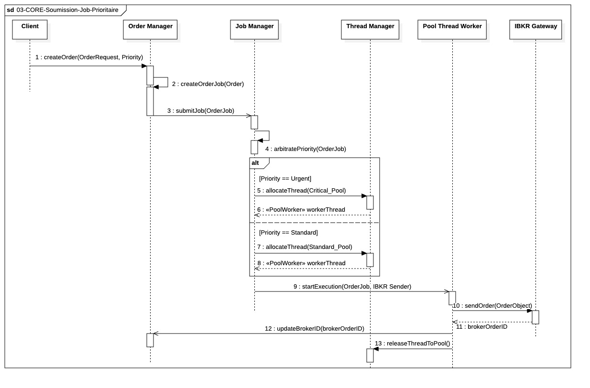

Voici la documentation finale pour le processus critique **03-CORE-Soumission-Job-Prioritaire**, intégrant la clarification sur la fonction d'arbitrage du Job Manager.

---

## `03-CORE-Soumission-Job-Prioritaire`

  

---

## Objectif

Ce processus modélise le cœur de l'exécution à faible latence du système : l'**arbitrage de la priorité** d'un ordre (Urgent ou Standard) et l'allocation d'un **thread persistant dédié** (Pool I/O Critical ou Standard) pour son envoi immédiat au courtier.

Ce diagramme est la concrétisation de l'isolation des I/O et de la gestion de la concurrence.

## 1. Soumission et Préparation du Job

Le processus est déclenché par un **composant client** (le `Risk Monitor` pour l'Urgent, le `Portfolio Manager` pour le Standard). La priorité a été **assignée en amont** par la logique métier du client.

* Le client transmet l'ordre à l'**Order Manager (OM)**.
* L'OM crée l'objet **`OrderJob`**, qui contient l'ordre et son niveau de priorité (Critical / Standard).
* L'OM délègue le `OrderJob` de manière asynchrone au **Job Manager (JM)**.

## 2. Arbitrage de Priorité et Allocation du Pool

Le **Job Manager** est l'arbitre central. Il exécute la fonction **`arbitratePriority(OrderJob)`** pour router la tâche.

* Le `JM` lit l'attribut `Priority` pour déterminer la stratégie de routage.
* **Si la priorité est URGENTE :** Le `JM` demande un thread existant au **Pool I/O CRITICAL** du **Thread Manager (TM)**. Ce pool garantit une exécution immédiate, isolée des autres charges.
* **Si la priorité est STANDARD :** Le `JM` demande un thread existant au **Pool I/O STANDARD**.

Le `TM` répond en fournissant une instance de thread **existante et prête à l'emploi** (`PoolWorker`), créée lors de la phase de *bootstrapping* (**Séquence 06**).

## 3. Exécution et Libération du Thread

Une fois le thread alloué, le processus se termine par l'exécution de l'I/O et le nettoyage rapide de la ressource :

* Le **thread emprunté** exécute l'appel I/O bloquant pour soumettre l'ordre via l'**IBKR Gateway**.
* Après avoir reçu la confirmation de l'ordre (`brokerOrderID`), le thread notifie l'`OM` pour la mise à jour en mémoire.
* Le thread est ensuite immédiatement **remis à disposition** dans son pool par le `Thread Manager` (via l'appel `releaseThreadToPool()`).

Cette approche garantit que les ressources de haute valeur (Pool I/O CRITICAL) sont **utilisées, mais jamais bloquées** par l'attente du courtier, assurant ainsi la capacité à traiter le prochain ordre urgent sans délai.
