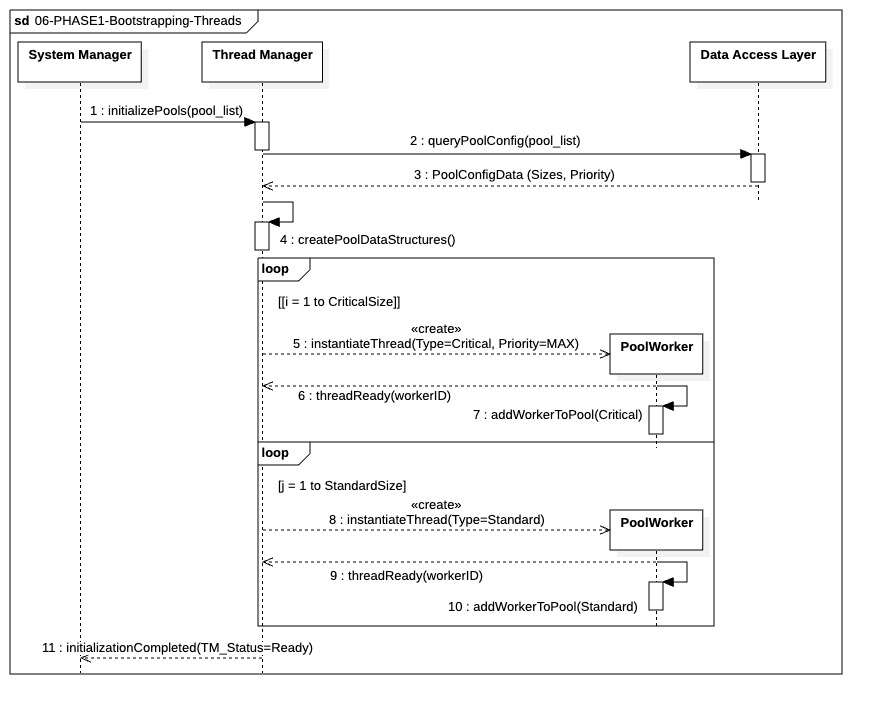

# `06-PHASE1-Bootstrapping-Threads`

  

## Objectif

Ce processus modélise l'étape critique de la **création des Threads** de notre architecture de trading.

Le but est de garantir que tous les **Pools d'I/O (Input/Output) spécialisés** — notamment le **Pool I/O CRITICAL** pour les ordres d'urgence et le **Pool I/O STANDARD** pour les ordres planifiés — sont instanciés, pré-alloués et prêts à l'emploi **avant l'ouverture du marché**.

## 1. Lecture de la Configuration (Dépendance)

Avant toute création, le **Thread Manager (TM)** lit la configuration des tailles de pools depuis la Base de Données. Cette étape est cruciale pour déterminer le nombre exact de threads à instancier pour chaque classe de priorité (Critical, Standard, Bulk, etc.).

## 2. Création et Persistance des Ressources

Le `Thread Manager` effectue ensuite un **bootstrapping** des ressources :

* **Boucles d'Instanciation :** Le `Thread Manager` itère pour créer le nombre défini de threads (appelés `PoolWorker`). Ces threads sont initialisés avec la priorité système appropriée (par exemple, `MAX` pour le Pool CRITICAL).
* **Threads Persistants :** Ces threads sont créés une seule fois au démarrage et restent allumés et en attente pour toute la session de trading. Ils ne sont **pas détruits** après chaque utilisation, mais simplement remis à disposition dans leur pool respectif.

## 3. Garantie d'Efficacité et d'Isolation

Le succès de cette séquence est essentiel car il assure :

* **Réduction de la Latence :** En éliminant l'overhead de la création de thread au moment de l'exécution, les ordres critiques peuvent accéder instantanément à une ressource dédiée.
* **Isolation des Tâches :** Le partitionnement des threads par priorité garantit qu'une tâche lente (comme l'écriture massive de données dans le Pool BULK) ne pourra jamais bloquer un `PoolWorker` du Pool I/O CRITICAL.

L'achèvement de cette séquence est notifié au **System Manager** et valide le passage à l'étape d'Instanciation des Managers locaux.
