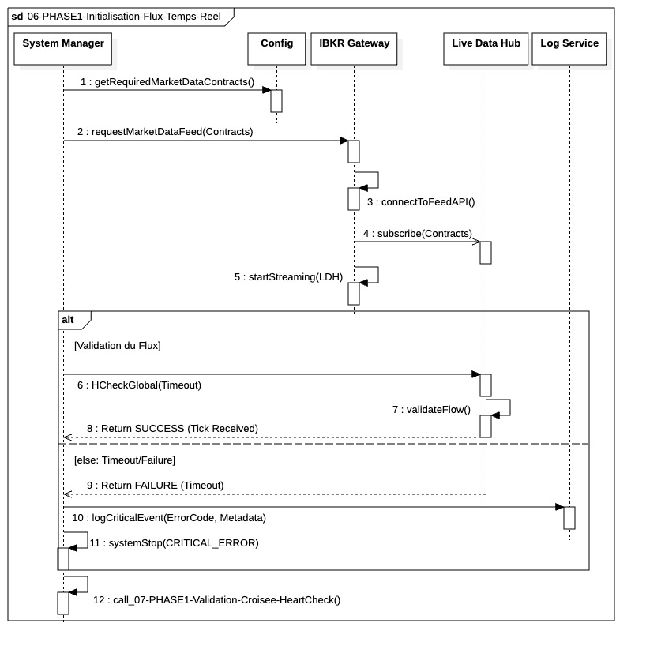

# `06-PHASE1-Initialisation-Flux-Temps-Reel`

  

---

### 1. Objectif

La finalité de ce module est d'établir la **connexion en temps réel** aux données de marché et de **valider** que le flux de prix est actif et correctement acheminé vers le cache du système.

---

### 2. Contexte

Cette étape intervient immédiatement après le chargement des données statiques (positions initiales, limites de risque). Elle est essentielle car elle prépare la source d'information principale pour l'exécution du trading. Sans prix temps réel, le `Risk Monitor` et le `Portfolio Manager` ne peuvent pas fonctionner. Elle établit la liaison entre l'`IBKR Gateway` et le `Live Data Hub (LDH)`.

---

### 3. Logique Générale

Le **`System Manager`** commence par récupérer la liste complète de tous les instruments nécessaires à la surveillance et à l'exécution de toutes les sessions actives. Il ordonne ensuite à l'`IBKR Gateway` d'établir la connexion physique et de demander l'abonnement à ces données. L'`IBKR Gateway` configure le **`LDH`** pour qu'il reçoive les **ticks de prix** asynchrones. Pour finaliser, le `System Manager` effectue un **contrôle de santé** sur le `LDH`, attendant la confirmation de la **réception d'au moins un *tick*** dans un délai imparti. Le succès de cette vérification permet de passer à la phase de validation finale.

---

### 4. Règles Critiques

* **Activation du Flux :** L'établissement de la connexion doit être synchrone, mais l'arrivée des données (`ticks`) est **asynchrone** et ne doit pas bloquer le fil d'orchestration.
* **Validation Critique :** Le contrôle **`HCheckFirstTickReceived`** est une contrainte non-fonctionnelle cruciale. Il s'agit d'une preuve de vie : si aucun prix n'est reçu avant l'expiration du *timeout*, l'opération est considérée comme une **défaillance critique**, et le *bootstrapping* doit être avorté.
* **Encapsulation :** Le `LDH` est le seul récepteur des prix bruts provenant de l'`IBKR Gateway`. Les autres managers ne doivent pas communiquer directement avec la passerelle pour les données de marché.

---

### 5. Conclusion

Ce module garantit que le système dispose d'un **canal de données de marché actif et testé**. L'opération se termine lorsque le `Live Data Hub` confirme qu'il est alimenté par des prix en temps réel pour les instruments requis, permettant ainsi la transition vers les vérifications finales de cohérence du système.
