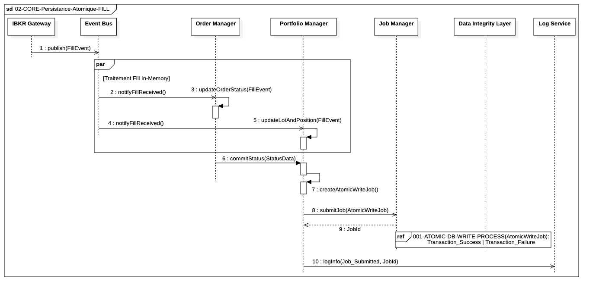

#  `02-CORE-Persistance-Atomique-FILL`

  

---

## Objectif

Ce diagramme modélise le processus asynchrone et atomique garantissant que l'exécution d'un ordre (`FILL`) est enregistrée en base de données de manière cohérente, sans bloquer le traitement des événements de marché en temps réel.

## 1. Déclenchement et Traitement In-Memory (Temps Réel)

Le processus vise à mettre à jour l'état du système **le plus rapidement possible** avant la persistance disque :

* **Déclenchement :** L'**IBKR Gateway** reçoit l'exécution (`FILL`) et publie un **`FillEvent`** sur l'**Event Bus** (asynchrone).
* **Traitement Parallèle :** L'**Order Manager (OM)** et le **Portfolio Manager (PM)** s'abonnent et travaillent en parallèle :
    * L'**OM** met à jour le statut de l'Ordre en mémoire.
    * Le **PM** recalcule la nouvelle position et l'exposition au risque en mémoire.
* **Agrégation Synchrone :** L'OM appelle le PM (**`commitStatus(StatusData)`**) pour lui transférer l'état de l'ordre mis à jour.

## 2. Délégation et Persistance Atomique (Asynchrone)

Le **PM** est le point de contrôle qui déclenche l'écriture disque, isolant l'I/O du flux temps réel :

* **Création du Job :** Le PM agrège l'état de l'ordre et la position pour créer l'objet **`AtomicWriteJob`**.
* **Délégation :** Le PM soumet le Job au **Job Manager** (**`submitJob(AtomicWriteJob)`**) de manière **asynchrone**.
* **Audit :** Le PM logue la soumission du Job (`logInfo(Job_Submitted)`) et est libéré pour traiter le prochain événement de marché.

## 3. Exécution du Job (Hors Séquence)

L'exécution réelle de l'écriture est gérée par le Job Manager dans un *thread pool* dédié (**Pool I/O Real-Time**) :

* Le **Job Manager** utilise le **Data Integrity Layer (DIL)**.
* Le DIL garantit que la mise à jour de la **Position ET du Statut de l'Ordre** sont effectuées dans une seule **transaction atomique** (`COMMIT` ou `ROLLBACK`).

Cette architecture garantit la **faible latence** du traitement initial et l'**intégrité des données** lors de l'enregistrement.
