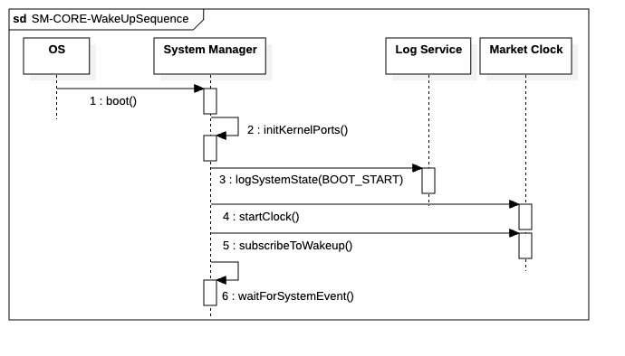

## `00-CORE-WakeUpSequence`

  

---

### 1. Objectif

L'objectif de ce module est d'initialiser le **noyau minimal** (Micro-Kernel) du système de trading. Il établit les fondations nécessaires pour que l'application puisse monitorer le temps, journaliser son activité et réagir aux événements système en amont du chargement des composants métiers.

---

### 2. Contexte

Ce scénario constitue le point d'entrée lors du lancement du processus par le système d'exploitation. Il s'agit d'une **séquence générique** indispensable à tout type de démarrage :
  * **Initialisation standard** : Pour le lancement de la Phase 1 (Pre-Trade) ou de la Phase 4 (Strategic Setup).
  * **Reprise sur erreur** : Lors d'un reboot automatique suite à une défaillance critique.
  * **Redémarrage forcé** : En cas de réinitialisation manuelle ou technique du moteur.

---

### 3. Logique générale

Le processus suit une séquence d'auto-construction stricte et immuable :
  * **Initialisation des services statiques** : Liaison immédiate avec les callbacks de bas niveau (Log, Notification, Erreur) pour permettre le signalement de tout échec ultérieur.
  * **Démarrage de la référence temporelle** : Activation de la `Market Clock`, pilier central de la synchronisation des flux financiers.
  * **Passage en veille active** : Le système s'abonne aux futurs signaux de réveil (`subscribeToWakeup`) et entre dans un état d'attente passive (`waitForSystemEvent`), minimisant la consommation de ressources CPU tant que l'heure d'ouverture ou le prochain cycle n'est pas atteint.

---

### 4. Règles critiques

* **Universalité** : La séquence doit rester agnostique vis-à-vis de la phase qu'elle précède pour garantir la stabilité du boot.
* **Priorité à l'Audit** : Aucun service ne doit démarrer avant que le `Log Service` ne soit lié, garantissant une trace de boot complète.
* **Résilience du Réveil** : L'abonnement aux événements de réveil doit être effectif avant la fin du bootstrap pour éviter tout "sommeil éternel" du système.
* **Consommation CPU** : L'état final d'attente doit être non-bloquant et économe pour respecter les fenêtres de maintenance OS.

---

### 5. Conclusion

Ce module garantit un **démarrage déterministe, auditable et polyvalent**. Quel que soit le contexte (initialisation nominale ou reboot d'urgence), il assure que le moteur de trading est correctement "setup" et prêt à réagir aux signaux de la `Market Clock`.

---

|ID|Fonction/Message|Émetteur|Récepteur|Description|
|:---|:---|:---|:---|:---|
|1|boot()|OS|System Manager|Commande de démarrage initiale du processus par le système d'exploitation.|
|2|initKernelPorts()|System Manager|System Manager|Initialisation des interfaces de bas niveau et liaison des callbacks (Log, Error, Notification).|
|3|logSystemState(BOOT_START)|System Manager|Log Service|Journalisation synchrone marquant l'entrée du noyau dans sa phase d'auto-construction.|
|4|startClock()|System Manager|Market Clock|Activation de l'horloge système pour la gestion du temps et le futur ordonnancement.|
|5|subscribeToWakeup()|System Manager|Market Clock|Enregistrement du System Manager pour recevoir les alertes de réveil programmées.|
|6|setSystemState(STATE_IDLE_READY)|System Manager|System Manager|Transition interne vers l'état de veille active, confirmant que le noyau est armé et stable.|
|7|waitForSystemEvent()|System Manager|System Manager|Entrée en mode basse consommation (Idle) en attente passive d'une interruption ou d'un signal.|

---

### 6. Ports et Interfaces

**IProcessControlPort**
* **Implémenté par** : `System Manager` / `Runtime Environment`
* **Injecté dans / Utilisé par** : `System Manager`
* **Responsabilité opérationnelle** : Gérer les transitions d'état de vie du processus et l'entrée dans les différents modes d'exécution.
* **Règles d’accès ou d’usage** : Invoqué pour le message `setSystemState(STATE_IDLE_READY)` et la gestion du passage en mode `waitForSystemEvent()`.

**IMarketEventProvider**
* **Implémenté par** : `Market Clock`
* **Injecté dans / Utilisé par** : `System Manager`
* **Responsabilité opérationnelle** : Activation de la référence temporelle (`startClock`) et gestion des abonnements aux événements de structure de session.
* **Règles d’accès ou d’usage** : Doit être opérationnel immédiatement après le boot pour permettre l'appel `subscribeToWakeup()`. Précision milliseconde requise.

**ILogger**
* **Implémenté par** : `Logger Global`
* **Injecté dans / Utilisé par** : `System Manager` (et tous les futurs composants)
* **Responsabilité opérationnelle** : Journalisation technique et opérationnelle du système.
* **Règles d’accès ou d’usage** : Dans cette séquence, utilisé en **mode synchrone** via `logSystemState(BOOT_START)` pour garantir que la trace de démarrage est physiquement écrite avant la suite des opérations.

**IKernelBootstrapPort** (Créé pour spécifier `initKernelPorts`)
* **Implémenté par** : `System Manager` (Internal Logic)
* **Injecté dans / Utilisé par** : `System Manager`
* **Responsabilité opérationnelle** : Liaison technique initiale (Bootstrapping) des "systèmes nerveux" de l'application (Error Handler, Notification Callback).
* **Règles d’accès ou d’usage** : Premier appel après le `boot()`. Doit être exécuté avant toute tentative de log ou d'accès aux autres services.

**IErrorHandler**
* **Implémenté par** : `ErrorService`
* **Injecté dans / Utilisé par** : `System Manager`
* **Responsabilité opérationnelle** : Classification et propagation des erreurs fatales si le bootstrap échoue (ex: échec de `startClock`).
* **Règles d’accès ou d’usage** : Appels synchrones uniquement lors de cette phase pour garantir l'arrêt immédiat du processus en cas d'anomalie noyau.
