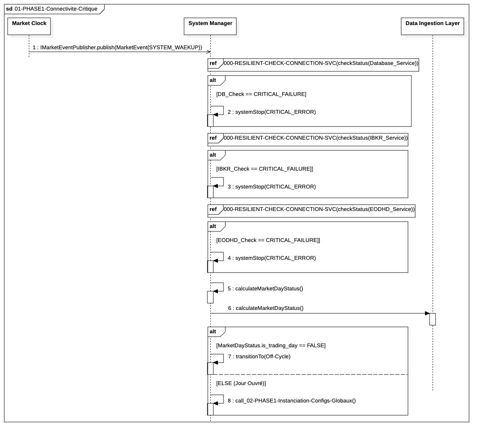

## `01-PHASE1-Connectivite-Critique`

  

### 1. Objectif

Ce module a pour finalité d'agir comme **point d'entrée sécurisé** du système de trading. Il garantit que le processus de *bootstrapping* ne se poursuit qu'après avoir validé la **disponibilité de toutes les dépendances critiques** (Base de Données et Courtier) et confirmé la **pertinence métier** (Jour Ouvré).

---

### 2. Contexte

Le module s'inscrit au début absolu de la **Phase Pré-Trade (Bootstrapping)**, immédiatement après la réception du signal **`SYSTEM_WAKEUP`** du `Market Clock`. Son existence vise à prévenir le gaspillage de ressources (temps d'instanciation des composants) si les services fondamentaux (I/O) ou la condition de marché sont absents.

---

### 3. Logique Générale

Le processus est géré par le **`System Manager`** et se déroule de manière séquentielle et conditionnelle :

1.  **Vérification Sécurisée :** Le `System Manager` vérifie séquentiellement la **Base de Données**, à l'**IBKR Gateway** puis à l'**API EODHD**, en utilisant une routine de résilience standard (gestion des *Retry*).
2.  **Calcul du Statut :** Une fois les connexions établies, le système détermine le **`MarketDayStatus`** (Jour Ouvré ou non) et le persiste pour l'audit.
3.  **Décision de Poursuite :** Le flux bifurque selon le statut du marché. Si le jour n'est pas ouvré, le système entre en veille (`Off-Cycle`). Si le jour est ouvré, le *bootstrapping* se poursuit vers l'étape d'instanciation.

---

### 4. Règles Critiques

* **Résilience Uniforme :** Toutes les vérifications de connexion critiques utilisent le fragment transversal **`SM-RESILIENT-CHECK-CONNECTION` ** pour garantir une logique uniforme de gestion des pannes transitoires et de l'audit.
* **Arrêt Atomique :** Un **échec critique et persistant** (épuisement des *retries*) sur la DB, l'IBKR Gateway ou l'API EODHD entraîne l'envoi immédiat d'une alerte et la **destruction immédiate** du processus (`systemStop`). Le système ne tolère aucune défaillance de dépendance à ce stade.
* **Priorité Métier :** La condition de **Jour Ouvré** agit comme un **garde-fou** final avant la consommation de ressources. Le système ne peut pas instancier les managers locaux si le marché est fermé.

---

### 5. Conclusion

Le module **`01-PHASE1-Connectivite-Critique`** garantit que l'initialisation du système est toujours **conditionnelle** à la santé de ses dépendances et à la pertinence du contexte de marché. Il assure l'**intégrité du démarrage** par une procédure d'arrêt strict en cas de défaillance fondamentale, avant de passer à la phase coûteuse d'instanciation.

---

| ID | Fonction / Message | Émetteur | Récepteur | Description |
|:---|:---|:---|:---|:---|
|1|publish(MarketEvent{SYSTEM_WAKEUP})|Market Clock|System Manager|Événement asynchrone déclenchant le réveil du système et le début du bootstrapping.|
|ref|SM-RESILIENT-CHECK-CONNECTION(Service_Name)|System Manager|Fragment Résilience|Vérification séquentielle (DB, IBKR, EODHD) avec timeouts différenciés (2s, 10s, 5s).|
|2,3,4|systemStop(CRITICAL_ERROR)|System Manager|System Manager|Auto-appel déclenchant la procédure d'arrêt d'urgence et la destruction du runtime.|
|5|calculateMarketDayStatus()|System Manager|System Manager|Logique interne déterminant si le jour actuel est un jour de trading via le module Calendar.|
|6|persistMarketDayStatus()|System Manager|Data Ingestion Layer|Délégation au DIL pour la persistance du statut du jour et récupération de données contextuelles.|
|7a|cleanupConnections()|System Manager|System Manager|Libération des sockets et ressources (DB/IBKR) pour éviter toute fuite de ressources en mode Off-Cycle.|
|7b|transitionTo(Off-Cycle)|System Manager|System Manager|Mise en veille du système si le marché est fermé (pas d'instanciation nécessaire).|
|8|call_02-PHASE1...()|System Manager|System Manager|Passage à la séquence suivante d'instanciation globale si toutes les conditions sont validées.|

---

### 6. Ports et Interfaces

* **Interface DIL** : introduire une interface `MarketDayStatusWriter` côté DIL pour gérer la persistance du `MarketDayStatus`.
* **Port côté System Manager** : ajouter un port `MarketDayStatusWriterPort` dans le `System Manager` pour communiquer avec cette interface.

---

### NOTE

**Uniformité des Services** : Le System Manager utilise ici trois fois de suite le fragment de résilience. Il faut s'assurer que les Timeouts sont différenciés : un timeout DB doit être très court, alors qu'un timeout IBKR Gateway peut nécessiter plus de temps pour une reconnexion réseau.

**Gestion du "Off-Cycle"** : La transition vers l'état Off-Cycle (Message 7) doit s'assurer de libérer proprement les connexions établies aux étapes précédentes (DB/IBKR) pour éviter de maintenir des sockets ouverts inutilement toute la journée.

**Calendar** : La logique du calendrier est encapsulée dans un attribut dédié du SystemManager, il interroge son instance interne de gestion calendaire. Cela respecte le principe de responsabilité unique (SRP) tout en gardant le SystemManager comme point d'entrée unique de la logique de contrôle.
