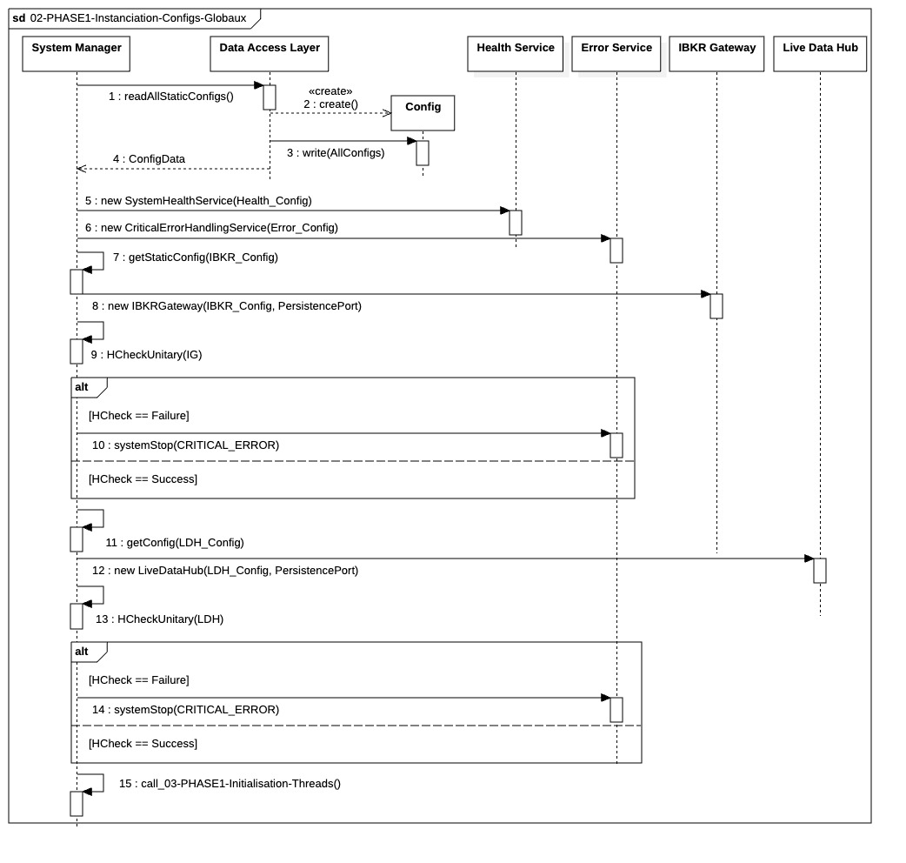

## `02-PHASE1-Instanciation-Configs-Globaux`

  

### 1. Objectif

La finalité de ce module est de centraliser la récupération de **toutes les configurations statiques** nécessaires au système de trading et d'utiliser immédiatement ces données pour instancier les **composants globaux (Singletons)** critiques, les rendant opérationnels pour la suite du *bootstrapping*.

---

### 2. Contexte

Ce module s'inscrit directement après la validation de la connectivité et du jour ouvré (**01-PHASE1-Connectivite-Critique**). Il représente la première étape d'allocation et de configuration des ressources en mémoire vive. Il est indispensable car les Singletons créés ici (`IBKR Gateway` et `Live Data Hub`) sont des dépendances fondamentales pour tous les managers locaux qui seront instanciés plus tard.

---

### 3. Logique Générale

Le fonctionnement est basé sur le principe de l'**optimisation I/O** et de l'**injection immédiate de dépendance**. Le **`System Manager`** ordonne au **`Data Access Layer (DAL)`** de lire **en un seul bloc** toutes les configurations depuis la base de données. Ces données sont stockées temporairement en mémoire. Le `System Manager` utilise ensuite ces paramètres pour créer séquentiellement l'`IBKR Gateway` et le `Live Data Hub`, s'assurant que chaque Singleton est créé avec son état de configuration final et valide.

---

### 4. Règles Critiques

* **Lecture Atomique :** Le **`DAL`** doit s'assurer que la lecture de l'ensemble des configurations est réalisée en une seule fois pour **minimiser la latence I/O** vers la base de données.
* **Intégrité de l'Instanciation :** Les Singletons doivent être instanciés avec leur configuration injectée dans le constructeur. Ils ne doivent pas dépendre de valeurs par défaut ou d'une configuration ultérieure. Un **H-Check unitaire** est effectué immédiatement après chaque création pour valider l'intégrité de l'objet en mémoire.
* **Pas de Démarrage Actif :** Bien qu'ils soient instanciés, les Singletons ne lancent **pas encore** leurs boucles de connexion ou de traitement des données. Ils passent simplement à l'état "Prêt".

---

### 5. Conclusion

Le module **`02-PHASE1-Instanciation-Configs-Globaux`** garantit que la lecture des configurations critiques est **rapide et complète**, et que les composants globaux nécessaires au flux de trading (`IBKR Gateway`, `LDH`) sont **instanciés de manière sécurisée et valide** en mémoire avant que le système ne procède à la création des ressources coûteuses et des managers métier.
