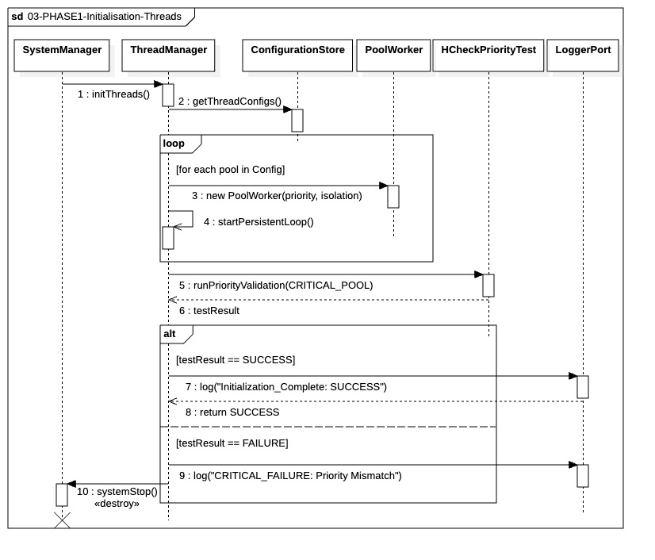

## `03-PHASE1-Initialisation-Threads`

  

---

### 1. Objectif

La finalité de ce module est d'allouer les ressources d'exécution physiques du système en créant quatre **Pools de Threads spécialisés** (`CRITICAL`, `STANDARD`, `BULK`, `AUDIT`). Il garantit que ces ressources sont entièrement pré-allouées, isolées, et que le Pool Critique opère avec une priorité garantie par l'OS avant tout engagement de trading.

---

### 2. Contexte

Ce module intervient après la lecture des configurations globales. C'est une étape d'**allocation de ressources lourdes**. Le système ne peut passer à la phase 04 (Instanciation des Managers Locaux) sans une validation explicite de la couche d'exécution, car la sécurité opérationnelle et la faible latence du système en dépendent.

---

### 3. Logique Générale & Architecture des Pools

Le processus est orchestré par le **`Thread Manager (TM)`** selon une hiérarchie stricte d'isolation :

1. **Récupération des Configs :** Le `TM` extrait les tailles et priorités depuis le `Configuration Store`.
2. **Pré-allocation Systématique :** Le `TM` instancie les `PoolWorker` pour les quatre segments :
  * **CRITICAL_POOL (Priorité Maximale / Real-Time) :** Ordres d'urgence, liquidations Risk Management (RM) et transmission Order Manager (OM).
  * **STANDARD_POOL (Priorité Haute) :** Stratégies Portfolio Manager (PM), flux LDH et logique métier standard.
  * **BULK_POOL (Priorité Basse / Background) :** Écritures I/O non critiques, archivage des logs, persistance lente (DIL).
  * **AUDIT_POOL (Priorité Normale) :** Réconciliations post-trade et génération des SessionBooks.
3. **Boucle Persistante :** Chaque thread démarre une boucle d'attente (`startExecutionLoop`) immédiatement. Ils ne sont **jamais détruits** pendant la session pour éliminer la latence de création.
4. **Validation OS (HCheckPriorityTest) :** Un test actif vérifie que le scheduler de l'OS honore réellement la priorité du `CRITICAL_POOL`.

---

### 4. Règles Critiques & Zero-Tolerance

* **Politique Zero-Tolerance :** Si un seul `PoolWorker` échoue à l'instanciation ou si le `HCheckPriorityTest` renvoie un échec (priorité non honorée), le `Thread Manager` doit retourner un état `CRITICAL_FAILURE`.
* **Arrêt Immédiat :** En cas de `CRITICAL_FAILURE`, le `System Manager` doit exécuter un `systemStop()` immédiat. Le trading ne peut être engagé sans la certitude d'une isolation parfaite.
* **Isolation Stricte :** Aucun pool ne doit interférer avec un autre. Les tâches lourdes du `BULK_POOL` ne peuvent en aucun cas cannibaliser les ressources du `CRITICAL_POOL`.

---

### 5. Conclusion

Le module **`03-PHASE1-Initialisation-Threads`** garantit que la couche d'exécution du système est **entièrement pré-allouée, segmentée par priorité** et **validée en performance**. Il établit une base d'exécution fiable et à faible latence, essentielle avant l'instanciation des managers métier qui dépendront de ces ressources.

---

|ID|Fonction / Message|Émetteur|Récepteur|Description|
|:---|:---|:---|:---|:---|
|1|initThreads()|System Manager|Thread Manager|Synchronous command to initialize the system's execution layer.|
|2|getThreadConfigs()|Thread Manager|Configuration Store|Retrieval of pool sizes and priority levels from static configuration.|
|3|new PoolWorker(priority, isolation, IMetricPort)|Thread Manager|PoolWorker|Instantiation of pool threads with injected telemetry port for latency measurement.|
|4|startPersistentLoop()|PoolWorker|PoolWorker|Activation of the thread loop in a persistent "ready-to-work" standby mode.|
|5|runPriorityValidation(CRITICAL_POOL)|Thread Manager|HCheckPriorityTest|Technical validation that the OS honors real-time priority for the critical pool.|
|6|testResult|HCheckPriorityTest|Thread Manager|Asynchronous return of the priority validation result.|
|7|log("Initialization_Complete: SUCCESS")|Thread Manager|LoggerPort|Logging of successful thread pool allocation and validation.|
|8|return SUCCESS|Thread Manager|System Manager|Confirmation to the system manager that the execution layer is operational.|
|9|log("CRITICAL_FAILURE: Priority Mismatch")|Thread Manager|LoggerPort|Logging of a fatal error if thread isolation or priority is compromised.|
|10|systemStop()|System Manager|System Manager|Immediate process destruction triggered by a thread initialization failure.|
|11|registerMonitoring(PoolID)|Thread Manager|Metric Service|Registration of pools with the metric service for continuous congestion monitoring.|

--- 

### 6. Ports et Interfaces

**IThreadManagerPort**
- **Implémenté par :** Thread Manager
- **Injecté dans / Utilisé par :** System Manager
- **Responsabilité opérationnelle :** Allocation et gestion des pools de threads, démarrage des loops persistantes, reporting de l’état initialisation
- **Règles d’accès ou d’usage :**
  - Invocation synchrone depuis System Manager uniquement.
  - Retour obligatoire de `Initialization_Complete` avant passage à la séquence suivante.
  - Interdiction d’accéder directement aux PoolWorkers depuis d’autres modules.
  - Phase autorisée : BOOTSTRAP_ONLY
  - Interdit en runtime métier

**IThreadPoolConfigPort**
- **Implémenté par :** Configuration Store
- **Injecté dans / Utilisé par :** Thread Manager
- **Responsabilité opérationnelle :** Fournir tailles et priorités des pools
- **Règles d’accès ou d’usage :**
  - Lecture seule pendant l’initialisation.
  - Interdiction de modification en runtime.
  - Doit être disponible avant la création des PoolWorkers.
  - Phase autorisée : BOOTSTRAP_ONLY

**ILogger**  
- **Implémenté par :** Logger Global  
- **Injecté dans / Utilisé par :** Thread Manager, System Manager, Portfolio Manager, Risk Monitor, Order Manager  
- **Responsabilité :** Journalisation technique, opérationnelle et audit de conformité du système  
- **Règles :** Supporte les niveaux DEBUG / INFO / WARN / ERROR / CRITICAL / AUDIT. Mode synchrone obligatoire pour le bootstrapping et erreurs fatales. Mode non-bloquant pour le runtime métier. PoolWorkers ne peuvent jamais écrire directement.

**IMetricPort**
* **Implémenté par** : `Metric Service`
* **Injecté dans / Utilisé par** : `PoolWorker`
* **Responsabilité opérationnelle** :
* Fournir un canal de communication dédié à la télémétrie pour la mesure des latences d'exécution au sein des threads.
* Permettre la remontée continue des données de performance vers le `Metric Service` pour le suivi de la congestion et de la santé des pools.
* **Règles d’accès ou d’usage** :
  * **Injection au Bootstrap** : L'interface doit être injectée lors de l'instanciation de chaque `PoolWorker` durant la PHASE 1.
  * **Asynchronisme strict** : L'utilisation de ce port par les workers doit être non-bloquante pour ne jamais impacter la latence du traitement métier, particulièrement pour le `CRITICAL_POOL`.
  * **Mode Fire-and-Forget** : En cas de saturation du service de métriques, les données de télémétrie doivent être abandonnées (dropped) plutôt que de mettre le thread en attente.
  * **Identification** : Chaque message transmis via ce port doit inclure le `PoolID` unique pour permettre une agrégation correcte par le service de monitoring.

