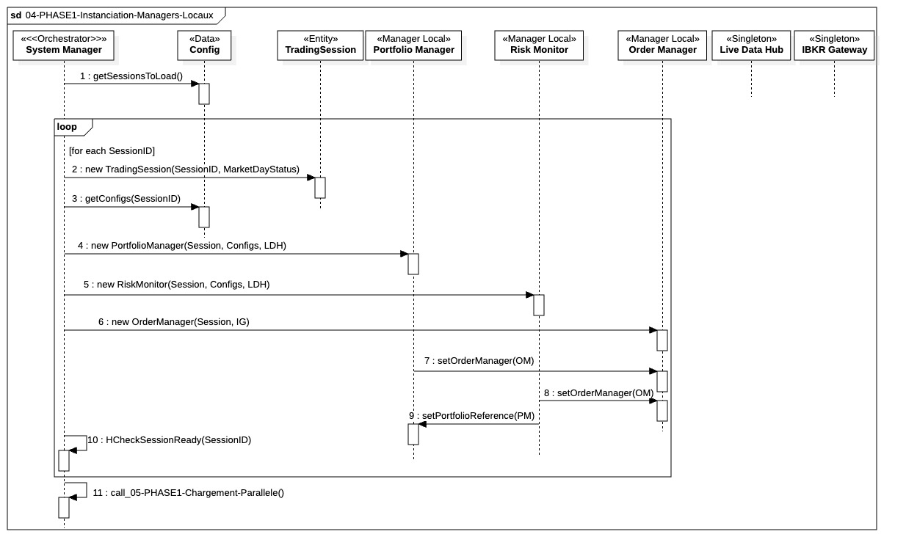

## `04-PHASE1-Instanciation-Managers-Locaux`

  

---

### 1. Objectif

La finalité de ce module est d'allouer la couche d'exécution métier du système en instanciant **toutes les sessions de trading actives**. Cela comprend la création, l'injection de dépendances et la liaison des triplets de managers locaux (**Portfolio Manager**, **Risk Monitor**, **Order Manager**) pour chaque stratégie. L'objectif est de garantir qu'avant tout chargement de données, incluant les oracles ML, la structure logique de décision et de sécurité est opérationnelle, isolée et supervisée. Cette étape assure également que chaque session dispose de ses propres modèles d'inférence immuables pour valider les signaux d'exécution en temps réel.

---

### 2. Contexte

Cette étape s'inscrit immédiatement après l'initialisation des services d'infrastructure persistants (Singletons globaux, Pools de Threads, `HealthService`, `ErrorService`). Elle constitue le pont entre l'infrastructure globale et l'exécution spécifique à une stratégie. Elle lie la logique de décision (**PM**) aux ressources d'exécution (**IG**, **LDH**, **LHB**) et au mécanisme de protection d'urgence (**RM**) tout en intégrant les modèles ML chargés depuis le système de fichiers. L'intégrité de ces modèles est vérifiée avant leur injection définitive dans les managers métier.

---

### 3. Logique Générale

Le **System Manager** orchestre une boucle itérative pour chaque identifiant de session récupéré via le `StaticConfigPort`. Le processus suit cet ordre strict pour garantir l'intégrité des liens et le respect du principe **Fail-Fast** :

#### Étape 1 : Récupération et Création Identitaire

* **Extraction des Paramètres :** Le système récupère les seuils de risque, les identifiants de modèles ML et les configurations de marché via `getConfigs(SessionID)`.
* **Instanciation de la Session :** Création de l'objet `TradingSession` (ID, MarketDayStatus), servant de conteneur logique pour le triplet de managers.

#### Étape 2 : Allocation des Managers (Injection par Constructeur)

L'injection par constructeur est privilégiée pour garantir l'immuabilité des ports fondamentaux. Les deux sources de données (**LDH** pour le signal, **LHB** pour l'historique) sont injectées simultanément :
1. **Portfolio Manager (PM) :** Créé avec son ID, les ports `PersistencePort` (DIL), `IErrorHandler`, le `MarketDataPort` (LDH) et le port **`ILiveDataReader`** (LHB).
2. **Order Manager (OM) :** Créé avec la référence `BrokerGatewayPort` (IBKR), le port `PersistencePort` (DIL) et `IErrorHandler`.
3. **Risk Monitor (RM) :** Créé en dernier. Il reçoit le port **`ILiveDataReader`** (LHB), l'accès au `MarketDataPort` (LDH) et le port `IErrorHandler`.

#### Étape 3 : Allocation des Oracles ML (Inférence Locale)

* **Résolution des Artefacts :** Le System Manager localise les fichiers de modèles (ModelID + Version) définis en configuration.
* **Instanciation des Modèles :**
  * Injection de l'oracle `IExecutionDecisionModel` dans le **PM**.
  * Injection de l'oracle `IStopPredictionModel` dans le **RM**.
* **Isolation :** Chaque session possède sa propre instance en mémoire, évitant toute contention lors de l'inférence asynchrone.

#### Étape 4 : Liaison des Canaux et Abonnements (Linking)

* **Canal de Performance :** Le System Manager lie l'OM au PM via `setOrderManager(OM)`.
* **Canal de Surveillance :** Le System Manager lie le PM au RM via `setPortfolioReference(PM)`, permettant au RM d'interroger le port `IPositionProvider`.
* **Abonnement EventBus :** Les managers (PM/RM) s'enregistrent sur l'**`IEventBusPort`**.
* *Note : Le bus reste "Silencieux" (Mute) tant que le bootstrap n'est pas finalisé.*

#### Étape 5 : Finalisation et Audit de Readiness

* **Port de Santé Dédié :** Le System Manager effectue directement les vérifications de latence locale et de l'état des files pour le triplet PM/RM/OM.
* **H-Check de Session :** A: Appel à `HCheckSessionReady(ID)` géré en interne par le System Manager, qui valide :
  1. La connectivité au **LHB**.
  2. La validité des pointeurs vers les modèles ML.
  3. L'intégrité des canaux de communication PM-RM-OM.

---

### 4. Règles Critiques

* **Primauté du Constructeur :** L'injection par **constructeur** est obligatoire pour tous les ports critiques (`IOrderSubmissionPort`, `IPositionProvider`, `IErrorHandler`, `ILiveDataReader`). Les setters sont strictement réservés aux liaisons de second rang (ex: `setOrderManager`) pour résoudre les dépendances circulaires sans compromettre l'immuabilité initiale.
  
* **Dualité d'Accès Data (LDH vs LHB)** :
  * Le **LDH** (via `MarketDataPort`) fournit l'événement de notifcation et l'arrivée d'une `Marketquote`.
  * Le **LHB** (via `ILiveDataReader`) fournit la profondeur historique nécessaire aux calculs vectoriels. Cette séparation garantit que la lecture d'une série temporelle lourde ne bloque jamais la réception du prochain tick.
  
* **Couplage Minimal et Standardisé :** Le **RM** n'écrit jamais dans le **PM**. L'**OM** n'accède jamais au **PM**. Tout échange inter-composant est médié par des ports immuables.
* **Isolation RM/PM :** Le **Risk Monitor** ne possède aucune référence à la logique interne du PM. Il consomme l'état des positions via des snapshots immuables fournis par le port **`IPositionProvider`**. Cela garantit que le RM reste réactif (Zero-Lock) même si le PM effectue des calculs intensifs.
* **Performance du Pull  :** L'accès aux N slots du **LHB** via `ILiveDataReader` est garanti **lock-free**. Le PM et le RM peuvent "Pull" des tranches de données (Slices) sans créer de contention sur le thread d'ingestion des prix.
  
* **Segmentation des Pools d'Exécution :**
  * **RM :** Isolé sur le `RM_CRITICAL_POOL` (Priorité OS maximale).
  * **PM :** Opère sur le `STRATEGY_POOL`.
  * **OM :** Géré par le `IO_POOL` (Réseau/Persistance).
  * 
* **Immutabilité des Modèles :** Une fois injectés, `IExecutionDecisionModel` et `IStopPredictionModel` sont en lecture seule. Ils ne possèdent aucun état interne mutable.
* **Pureté Fonctionnelle :** Les modèles agissent comme des fonctions pures (). Ils n'ont aucun droit d'accès aux ports de persistance ou de connectivité broker.
* **Isolation ML/Manager :** Chaque instance de manager possède son propre exemplaire d'oracle. Un manager ne peut jamais invoquer le modèle d'un composant tiers.
* **Abstraction du DIL :** Les managers n'ont aucun couplage direct avec le **Data Integrity Layer**. Ils utilisent des interfaces métier dont les appels sont routés vers le `BULK_POOL` ou le `AUDIT_POOL` via des transactions atomiques (`startTransaction`).
  
* **Centralisation Fail-Fast :** Le port `IErrorHandler` reste le canal unique de remontée. La sévérité `CRITICAL` déclenche un `systemStop` immédiat si et seulement si elle impacte l'infrastructure globale ou une session configurée en mode `LIVE`. Pour les sessions `PAPER`, l'erreur fatale au bootstrap est interceptée par le `System Manager` pour déclencher une destruction locale (`destroy()`) sans interrompre le processus global.

* **Isolation de l'Échec (Paper vs Live) :** Toute session configurée en mode `LIVE` est considérée comme une dépendance critique du système ; son échec au bootstrap entraîne l'arrêt total (`systemStop`). Les sessions `PAPER` sont considérées comme facultatives.
* **Nettoyage Mémoire :** En cas d'échec d'une session Paper, le System Manager doit explicitement appeler le destructeur de la `TradingSession` pour s'assurer qu'aucun thread ou port (notamment l'abonnement à l'`EventBus`) ne reste actif en arrière-plan.
* **Audit des Échecs :** Même si le système continue son exécution après l'échec d'une session Paper, l'erreur doit être enregistrée avec un niveau WARN pour permettre une analyse post-mortem
* **Silence du Bootstrapping :** Bien qu'injecté, l'**`IEventBusPort`** est maintenu en état "mute" durant toute la Phase 1 pour éviter tout déclenchement de logique métier avant l'ouverture officielle de la session.

---

### 5. Conclusion

Ce module garantit que l'architecture métier est instanciée et que tous les **canaux de communication critiques** (Ordres, Surveillance, Données) entre les composants locaux sont établis. La structure du système est ainsi **isolée et sécurisée**, prête à charger les données initiales et à passer en mode veille de trading.

---

|ID|Fonction/Message|Émetteur|Récepteur|Description|
|:---|:---|:---|:---|:---|
|1|getSessionsToLoad()|System Manager|Config|Récupération de la liste des IDs de sessions actives pour la journée.|
|2|new TradingSession(ID, Status)|System Manager|TradingSession|Instanciation de l'objet racine de la session.|
|3|getConfigs(SessionID)|System Manager|Config|Récupération des seuils de risque et chemins des modèles ML.|
|4|new PM(ID, Config, LDH, LHB, PersistencePort, IExecModel)|System Manager|Portfolio Manager|Instanciation avec injection du LHB pour l'accès aux séries temporelles.|
|5|new RM(ID, Config, LDH, LHB, IStopModel)|System Manager|Risk Monitor|Instanciation avec injection du LHB et du modèle de risque prédictif.|
|6|new OM(ID, IG, PersistencePort)|System Manager|Order Manager|Instanciation de l'exécuteur avec liaison à la passerelle IBKR.|
|7|subscribe(PM, RM)|System Manager|EventBus|Inscription des managers aux notifications de disponibilité des données du LHB.|
|8|setOrderManager(OM)|System Manager|PM|Établissement du canal de transmission des ordres de performance.|
|9|setPortfolioReference(PM)|System Manager|RM|Liaison du RM au PM via le port IPositionProvider (Snapshots immuables).|
|10|HCheckSessionReady(ID)|System Manager|System Manager|Vérification de l'intégrité du triplet (PM/RM/OM) et des liaisons LHB/LDH.|

---

### 6. Ports et Interfaces

**PersistencePort**
* **Implémenté par :** Data Integrity Layer (DIL) / AtomicDBWriteProcess
* **Injecté dans :** Portfolio Manager (PM), Order Manager (OM), Live Data Hub (LDH) si nécessaire
* **Responsabilité :** Point unique d’accès pour toute persistance critique du système :
  * Snapshots de positions et portefeuilles
  * Journaux de sessions et SessionBooks
  * Ordres et exécutions (Fills)
  * États courants du système métier
* **Règles d’accès :**
  * Accès direct au DIL interdit en dehors de ce port
  * Persistance **atomique** obligatoire : startTransaction / commit / rollback
  * Isolation stricte : aucun module externe ne peut modifier ou lire directement les objets métier sans passer par ce port
  * Supporte les écritures synchronisées et sécurisées pour les opérations critiques
* **Phase d’utilisation :**
  * Bootstrapping et runtime métier, selon contexte
  * Tous accès critiques doivent transiter par ce port
* **Objectif :** Assurer la cohérence, atomicité et auditabilité des données critiques à travers tout le système

**Port : IPositionProvider**
  * **Implémenté par :** Portfolio Manager.
  * **Injecté dans :** Risk Monitor (et tout module en lecture seule).
  * **Responsabilité :** Fournir des snapshots immuables (`PositionSnapshot`) des positions en temps réel.
  * **Règles d’usage :** **Lecture seule.** Aucun verrou (lock) bloquant autorisé. Interdiction de modifier les objets exposés.

**BrokerGatewayPort**
* **Implémenté par :** Gateway externe IBKR
* **Injecté dans :** Order Manager (OM)
* **Responsabilité :**
  * Abstraction complète de la communication avec le broker
  * Transmission technique des ordres et réception des callbacks
  * Gestion de la priorité des ordres (`CRITICAL` vs `STANDARD`)
* **Règles d’usage :**
  * Aucun accès direct autorisé par PM ou RM (tout passe par OM)
  * Le Risk Monitor soumet les ordres urgents via **IOrderSubmissionPort**, qui délègue ensuite vers le **BrokerGatewayPort** dans OM
* **Objectif :** Isoler le courtier des modules métier tout en permettant le passage sécurisé des ordres critiques et standards

**MarketDataPort**
  * **Implémenté par :** `Live Data Hub` (LDH)
  * **Injecté dans / Utilisé par :** `Portfolio Manager`, `Risk Monitor`
  * **Responsabilité opérationnelle :** Diffusion du dernier prix (Last Quote) pour le réveil des unités de calcul.
  * **Règles d’usage :** Complémentaire au `ILiveDataReader`.

**IOrderSubmissionPort**
- Implémenté par : Order Manager (OM)
- Injecté dans : Risk Monitor (RM)
- Responsabilité : Soumission prioritaire d’ordres d’urgence et de liquidation
- Règles :
  - Exclusivité RM
  - Messages doivent porter le flag CRITICAL pour bypasser la file standard

**Port : ILogger**
  * **Implémenté par :** Logger Global.
  * **Injecté dans :** PM, RM, OM, System Manager.
  * **Responsabilité :** Journalisation technique et audit de conformité.
  * **Règles d’usage :** Non-bloquant. Ne doit jamais impacter les threads critiques d'exécution. Respect rigoureux des niveaux de priorité d'audit.

**Port : ISessionConfigProvider**
  * **Implémenté par :** Config Service Global.
  * **Injecté dans :** System Manager, Order Manager.
  * **Responsabilité :** Fournir les paramètres statiques et les seuils de risque par session.
  * **Règles d’usage :** **Lecture seule.** Pas de modification dynamique autorisée pendant la session de trading.

**Port : IErrorHandler**
  * **Implémenté par :** ErrorService (Core Infrastructure).
  * **Injecté dans :** PM, RM, OM.
  * **Responsabilité :** Centralisation des erreurs critiques, classification de sévérité et déclenchement des protocoles **Fail-Fast**.
  * **Règles d’usage :** **Écriture uniquement.** Appels synchrones pour les erreurs fatales uniquement. Interdiction de "Retry" interne au port. Instance unique, partagée et Thread-Safe.

**IExecutionDecisionModel**
* **Implémenté par :** Modèles ML chargés (XGBoost, Régression, etc.).
* **Injecté dans :** Portfolio Manager.
* **Responsabilité :** Oracle de décision. Détermine si le prix actuel permet l'exécution d'un ordre planifié.
* **Règles :** Déterministe, sans effet de bord, aucun accès I/O.

**IStopPredictionModel**
* **Implémenté par :** Modèles ML de risque chargés.
* **Injecté dans :** Risk Monitor.
* **Responsabilité :** Anticipation de sortie. Détermine si une liquidation préventive est requise avant l'atteinte mécanique du stop-loss.
* **Règles :** Indépendant de la logique du Portfolio Manager.

**ILiveDataReader**
* **Implémenté par** : `LiveHistoryBuffer` (LHB)
* **Injecté dans / Utilisé par** : `Portfolio Manager`, `Risk Monitor`
* **Responsabilité opérationnelle** : Fournir un accès lecture seule, non-bloquant (), aux séries temporelles de la session.
* **Règles d’accès ou d’usage** : Utilisation de pointeurs vers la matrice de N slots. Interdiction stricte d'écriture.
  
**IEventBusPort**
* **Implémenté par :** `EventBus`
* **Injecté dans / Utilisé par :** `Portfolio Manager`, `Risk Monitor` (Abonnés)
* **Responsabilité opérationnelle :** Notification de la fin d'écriture dans le LHB pour déclencher le cycle de décision (Pull).
