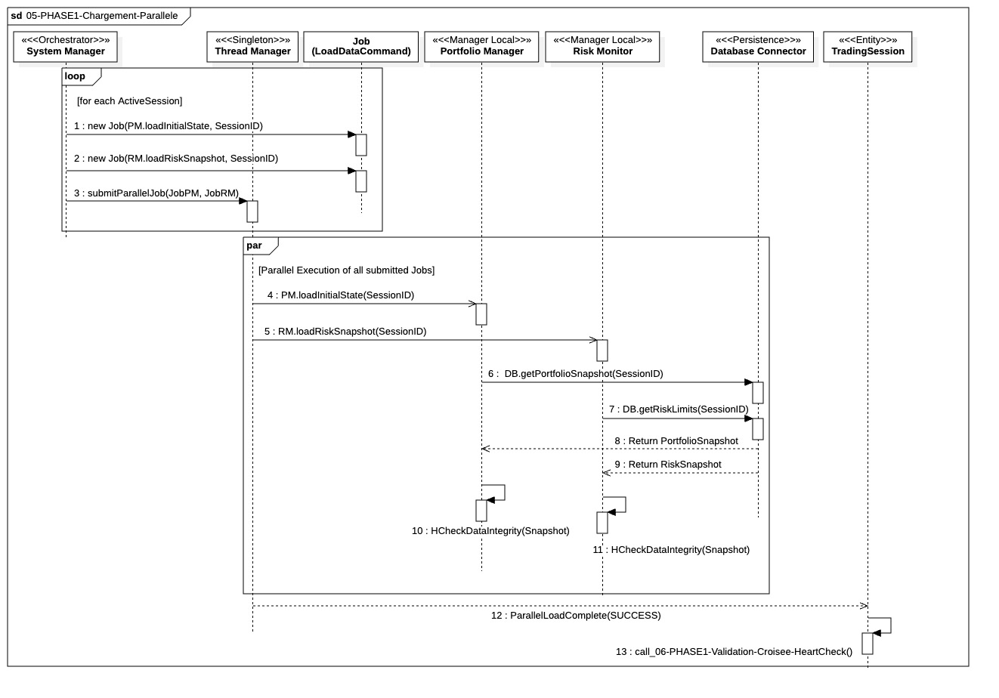

## `05-PHASE1-Chargement-Parallele`

  

---

### 1. Objectif

La finalité de ce module est de charger l'état initial complet de toutes les sessions de trading **en parallèle**. Il vise à minimiser le temps de latence au démarrage en exécutant les opérations de lecture de base de données (I/O) de manière concurrente.

---

### 2. Contexte

Cette étape se situe immédiatement après l'**instanciation des managers locaux** (Phase 04) et utilise les **Pools de Threads** (initialisés en Phase 03). Elle est la première phase à exploiter la parallélisation pour préparer les managers (`PM` et `RM`) avec les données nécessaires à leur fonctionnement.

---

### 3. Logique Générale

Le **`System Manager`** délègue entièrement la charge de travail au **`Thread Manager`**. Pour chaque session active :

1.  Deux commandes de travail (`Job`) sont créées : une pour le **`Portfolio Manager`** (`loadInitialState`) et une pour le **`Risk Monitor`** (`loadRiskSnapshot`).
2.  Ces commandes sont soumises au `Thread Manager` avec l'instruction d'exécution **parallèle**.
3.  Des **PoolWorkers** distincts (issus des pools alloués) exécutent les tâches, demandant simultanément leurs données respectives au `Database Connector`.
4.  Une fois les données reçues, chaque manager (PM et RM) effectue son **contrôle d'intégrité métier** (`HCheckDataIntegrity`) sur les objets chargés.
5.  Le `Thread Manager` consolide les résultats de toutes les tâches et les renvoie sous forme de liste de statuts (`JobStatusList`) au `System Manager` pour la décision finale.
---

### 4. Règles Critiques

* **Non-Blocage :** Le thread du **`System Manager`** ne doit pas être bloqué par l'attente de la base de données. Il est libéré dès la soumission des tâches.
* **Gestion d'Erreur Centralisée :** Le `System Manager` applique la logique d'arrêt via **`evaluateBootstrapStatus()`** sur la liste des statuts reçus.
    * Tout échec de session **`LIVE`** déclenche l'arrêt immédiat via **`systemStop(CRITICAL_ERROR)`**.
    * Les échecs de session **`PAPER`** sont logués, la session est invalidée, et le processus continue.
* **I/O Maximisation :** Le parallélisme est utilisé pour masquer la latence des opérations I/O bloquantes de la base de données.
* **Vérification Métier :** Le **`HCheckDataIntegrity`** est un garde-fou. Il assure la **cohérence logique** des données (ex. : la somme des lots correspond à la position totale) avant la mise en service du manager.

---

### 5. Conclusion

Ce module garantit un **démarrage rapide et résilient** du système en gérant efficacement l'attente I/O. Il assure également que chaque manager local (PM et RM) est prêt et que son état initial est validé. Le succès de cette étape permet de passer à l'initialisation du flux de données temps réel.

---

# Ports / Interfaces – Séquence 05-PHASE1-Chargement-Parallèle (Hedge Fund Grade)

**IPortfolioStateReader**
- **Implémenté par** : Data Access Layer (DAL)
- **Injecté dans / Utilisé par** : Portfolio Manager
- **Responsabilité opérationnelle** : Chargement en lecture seule de l’état initial du portefeuille (positions, cash, lots)
- **Règles d’accès ou d’usage** :
  - Lecture seule
  - Interdiction totale d’écriture
  - Appel autorisé uniquement durant PHASE1
  - Aucun accès transactionnel

**IRiskStateReader**
- **Implémenté par** : Data Access Layer (DAL)
- **Injecté dans / Utilisé par** : Risk Monitor
- **Responsabilité opérationnelle** : Chargement des snapshots de risque initiaux (limites, expositions, seuils)
- **Règles d’accès ou d’usage** :
  - Données immuables
  - Aucun recalcul dynamique
  - Usage exclusif PHASE1
  - Interdiction de dépendance au PM

**ILoadPortfolioStateCommand**
- **Implémenté par** : Portfolio Manager
- **Injecté dans / Utilisé par** : Thread Manager
- **Responsabilité opérationnelle** : Encapsulation du chargement initial du portefeuille sous forme de job exécutable
- **Règles d’accès ou d’usage** :
  - Un job par session
  - Exécution unique
  - Timeout obligatoire
  - Retour d’un JobStatus typé

**ILoadRiskStateCommand**
- **Implémenté par** : Risk Monitor
- **Injecté dans / Utilisé par** : Thread Manager
- **Responsabilité opérationnelle** : Encapsulation du chargement initial des données de risque
- **Règles d’accès ou d’usage** :
  - Un job par session
  - Exécution unique
  - Timeout obligatoire
  - Isolation totale entre sessions

**IDataIntegrityCheckPort**
- **Implémenté par** : IntegrityCheckService (Core)
- **Injecté dans / Utilisé par** : Portfolio Manager, Risk Monitor
- **Responsabilité opérationnelle** : Validation métier post-chargement des données initiales
- **Règles d’accès ou d’usage** :
  - Appel synchrone
  - Aucun accès I/O
  - Retour structuré (OK / WARNING / FAIL)
  - Échec ⇒ propagation immédiate au System Manager

**IJobTimeoutPolicyPort**
- **Implémenté par** : Thread Manager
- **Injecté dans / Utilisé par** : PoolWorker
- **Responsabilité opérationnelle** : Application des délais maximum d’exécution par job
- **Règles d’accès ou d’usage** :
  - Timeout dur
  - Dépassement ⇒ JobStatus.FAILURE
  - Aucun retry automatique

**IJobStatusReporterPort**
- **Implémenté par** : Thread Manager
- **Injecté dans / Utilisé par** : System Manager
- **Responsabilité opérationnelle** : Remontée structurée des statuts d’exécution par session
- **Règles d’accès ou d’usage** :
  - Chaque statut doit contenir SessionID
  - Aucun agrégat métier
  - Transmission synchrone en fin de batch

**IHealthCheckPort**
- **Implémenté par** : HealthService (Infrastructure Layer)
- **Injecté dans / Utilisé par** : Portfolio Manager, Risk Monitor
- **Responsabilité opérationnelle** : Vérification locale de disponibilité avant lancement des jobs
- **Règles d’accès ou d’usage** :
  - Appel obligatoire avant soumission au Thread Manager
  - Aucun I/O bloquant
  - Usage interdit en boucle temps réel

**IErrorHandler**
- **Implémenté par** : ErrorService (Core Infrastructure)
- **Injecté dans / Utilisé par** : Portfolio Manager, Risk Monitor
- **Responsabilité opérationnelle** : Centralisation des erreurs critiques durant le chargement parallèle
- **Règles d’accès ou d’usage** :
  - Écriture seule
  - Appel synchrone pour erreurs fatales
  - Interdiction de retry interne
