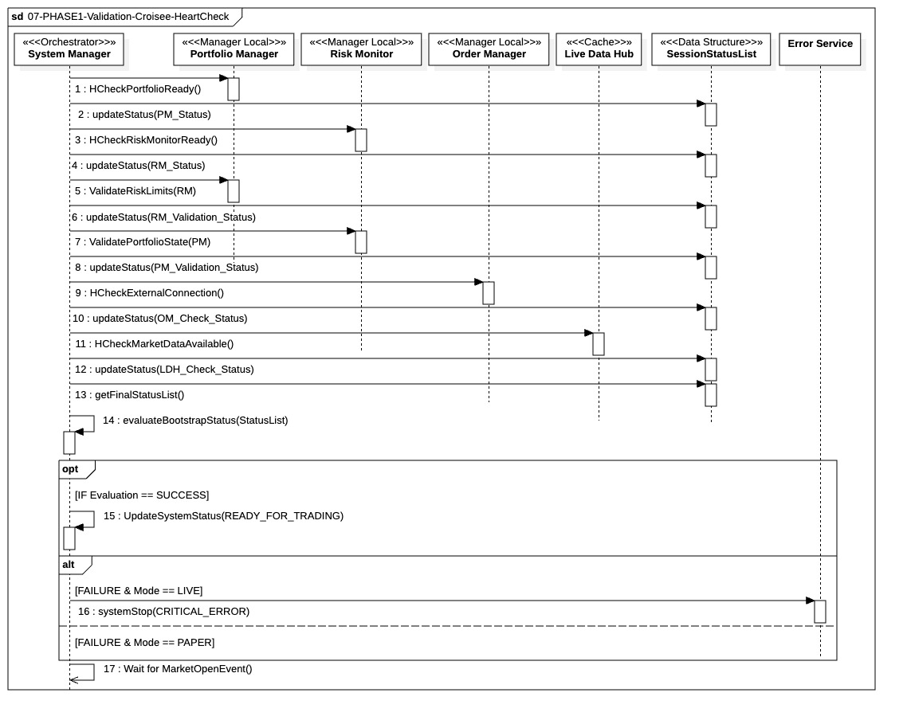

## `07-PHASE1-Validation-Croisee-HeartCheck`

  

---

### 1. Objectif

La finalité de ce module est d'effectuer la **validation croisée finale** et un **contrôle de santé global (`HeartCheck`)** sur l'ensemble du système. Il garantit la cohérence opérationnelle et la sécurité des liens entre les managers via les interfaces `IBootstrapReadinessCheck` et `ICrossValidator` avant de faire la transition vers l'état `READY_FOR_TRADING`.

---

### 2. Contexte

Cette étape est la **dernière de la Phase 1 (Pre-Trade)**. Elle est exécutée après le succès du **chargement statique** (Phase 05) et de l'**initialisation du flux temps réel** (Phase 06). Elle est critique car elle confirme que les données chargées par un manager sont compatibles avec les règles et l'état des autres, agissant comme le **point de non-retour sécurisé** avant de donner le feu vert pour la session de trading.

---

### 3. Logique Générale

Le **`System Manager`** (`IBootstrapCoordinator`) orchestre une série de vérifications en cascade pour recueillir le statut opérationnel de chaque manager et la cohérence inter-composants.

1. **Validation de l'Infrastructure de Données (Fast-Lane) :**
  * **Réception (LDH) :** Confirmation que les `TickData` arrivent de l'IBKR Gateway.
  * **Indexation (LHB) :** Confirmation de la transformation des ticks en `MarketQuote` et du stockage dans le buffer actif.
  * **Preuve de Consommabilité :** Simulation d'une lecture via **`ILiveDataReader`** pour garantir que le buffer est sain et prêt pour l'analyse.

2. **Vérifications Unitaires & ML (`IBootstrapReadinessCheck`) :**
  * **Intégrité Technique :** Validation de l'instanciation des structures et de l'état des threads.
  * **Preuve de Double Lecture :** Le HeartCheck confirme que le manager (PM/RM) réussit une lecture combinée sur le **LDH** (dernier prix) ET sur le **LHB** (vecteur de prix).
  * **Inférence "à blanc" :** Exécution de test sur les modèles ML injectés (`IExecutionDecisionModel` / `IStopPredictionModel`) pour garantir l'opérationnalité de la pipeline sans crash.
  * **Contrainte de Latence :** Chaque oracle ML doit répondre dans un budget temporel strictement borné.
  
3. **Validations Croisées (`ICrossValidator`) :**
  * Validation de la cohérence métier inter-domaines (ex: compatibilité entre limites de risque et état actuel du portefeuille).

4. **Vérification de l'Infrastructure Sortante :**
  * Test de la liaison physique et logique avec le courtier via **`IExternalConnectivity`** avec un timeout strict de **5000ms**.

5. **Centralisation et Persistance des Statuts :**
  * **Découplage :** Les managers retournent leurs résultats au `System Manager` qui centralise les mises à jour.
  * **Persistance Isolée :** Le `System Manager` écrit le **`DATA_INFRA_Status`** (regroupant LDH et LHB) et les statuts managers via **`ISessionStatusWriter`**.
  * **Audit Trail :** Cette traçabilité permet de diagnostiquer précisément si une erreur provient de la réception, de l'indexation historique ou d'une défaillance métier.

---

### 4. Règles Critiques

* **Intégrité Totale du Flux (End-to-End) :** Le succès du contrôle de santé marché est strictement subordonné à la réussite de la chaîne complète **IBKR → LDH → LHB**. Si le LDH confirme la réception mais que le LHB signale une erreur d'indexation, un échec de swap de buffer ou un timeout, le statut global est marqué **FAILED**.
* **Tolérance aux Erreurs Asymétrique (Fail-Fast) :** Toute défaillance (technique, flux, ou LHB) concernant une session **`LIVE`** entraîne un arrêt immédiat du système via **`systemStop(CRITICAL_ERROR)`**. Les échecs en session **`PAPER`** sont isolés : la session spécifique est invalidée dans la `SessionStatusList`, mais le bootstrap se poursuit pour les autres sessions actives.
* **Gravité du Statut LHB :** Le statut **`LHB_Check_Status`** est considéré comme bloquant pour l'ensemble du système. Une défaillance du buffer historique interdit toute transition vers l'état `READY_FOR_TRADING`, car elle compromettrait l'intégrité des vecteurs de données utilisés par les modèles ML.
* **Défaillance et Latence ML :** Toute anomalie des oracles ML (exception logicielle, non-réponse ou dépassement du budget de latence d'inférence) entraîne un **FAIL** immédiat pour les sessions **`LIVE`**. Le système garantit ainsi qu'aucune décision de trading ne sera prise par un modèle instable ou trop lent.
* **Évaluation Centralisée :** L'arbitrage final et la transition vers l'état opérationnel sont gérés exclusivement par la fonction **`evaluateBootstrapStatus()`** après la collecte exhaustive de tous les statuts.
* **Persistance au fil de l'eau :** Chaque statut (LDH, LHB, PM, RM, OM) est écrit immédiatement par le `System Manager` via l'interface `ISessionStatusWriter`. Cette écriture séquentielle garantit une traçabilité totale et un audit post-mortem précis en cas de crash durant le HeartCheck.

---

### 5. Conclusion

Ce module garantit la **double intégrité (données et connexion)** et la **cohérence métier** du système. Le succès de cette étape signifie que l'état du portefeuille est validé par rapport aux règles de risque et que tous les canaux de communication (entrée de prix et sortie d'ordres) sont actifs et testés. Le système est alors sécurisé et prêt à réagir à l'ouverture du marché.

---

|ID|Fonction/Message|Émetteur|Récepteur|Description|
|:---|:---|:---|:---|:---|
|1|HCheckMarketDataAvailable()|SystemManager|LiveDataHub|Vérifie la réception effective du flux de prix temps réel (Preuve de vie LDH).|
|2|HCheckHistoricBufferReady()|SystemManager|HistoricLiveHub|Vérifie l'état LHB_READY, le mécanisme de double buffering et la fraîcheur des données indexées.|
|3|updateStatus(DATA_INFRA_Status)|SystemManager|SessionStatusList|Enregistrement centralisé du statut d'intégrité de la chaîne de données complète (LDH+LHB).|
|4|HCheckPortfolioReady()|SystemManager|PortfolioManager|Validation de l'intégrité technique (threads) et test d'inférence ML via lecture ILiveDataReader.|
|5|updateStatus(PM_Status)|SystemManager|SessionStatusList|Persistance du statut de préparation technique du Portfolio Manager.|
|6|HCheckRiskMonitorReady()|SystemManager|RiskMonitor|Validation de l'activation des limites et test d'inférence de protection via ILiveDataReader.|
|7|updateStatus(RM_Status)|SystemManager|SessionStatusList|Persistance du statut de préparation technique du Risk Monitor.|
|8|ValidateRiskLimits(RM)|SystemManager|PortfolioManager|Validation croisée demandant au PM de confirmer sa compatibilité avec les limites de risque actives.|
|9|updateStatus(RM_Validation_Status)|SystemManager|SessionStatusList|Enregistrement du résultat de la validation de cohérence métier côté Risque.|
|10|ValidatePortfolioState(PM)|SystemManager|RiskMonitor|Validation croisée demandant au RM de vérifier la cohérence entre positions et limites.|
|11|updateStatus(PM_Validation_Status)|SystemManager|SessionStatusList|Enregistrement du résultat de la validation de cohérence métier côté Portefeuille.|
|12|HCheckExternalConnection()|SystemManager|OrderManager|Test de la liaison physique et logique avec le courtier (Gateway/FIX) avec timeout de 5s.|
|13|updateStatus(OM_Check_Status)|SystemManager|SessionStatusList|Enregistrement de l'état de la connexion sortante pour l'exécution des ordres.|
|14|getFinalStatusList()|SystemManager|SessionStatusList|Récupération de l'agrégat de tous les statuts techniques et métiers pour arbitrage final.|
|15|evaluateBootstrapStatus(StatusList)|SystemManager|SystemManager|Analyse de la liste selon la logique de tolérance asymétrique (LIVE vs PAPER).|
|16|UpdateSystemStatus(READY_FOR_TRADING)|SystemManager|SystemManager|Transition vers l'état opérationnel final si l'évaluation est un succès total.|
|17|systemStop(CRITICAL_ERROR)|SystemManager|ErrorService|Déclenchement de l'arrêt fatal immédiat si une erreur critique est détectée en mode LIVE.|
|18|Wait for MarketOpenEvent()|SystemManager|SystemManager|Mise en attente asynchrone du signal d'ouverture du marché pour débuter le trading.|

---

### 6. Ports et Interfaces

**IBootstrapReadinessCheck**
* **Implémenté par** : `PortfolioManager`, `RiskMonitor`, `OrderManager`, `LiveDataHub`
* **Injecté dans / Utilisé par** : `SystemManager`
* **Responsabilité opérationnelle** : Validation de l'intégrité technique (instanciation des structures, état des threads, readiness local).
  * Vérifier que l'état interne est LHB_READY. :
    * Valider que le Buffer Actif reçoit les écritures et que le Buffer Passif est accessible en lecture.
    * Contrôler que le dernier snapshot indexé respecte le seuil de fraîcheur par rapport au temps système.
    * S'assurer de l'absence de backlog bloquant dans la file d'attente de persistance vers la Slow-Lane.
* **Règles d’accès ou d’usage** : Appel synchrone obligatoire en Phase 1. Interdiction de mutation d'état (Read-Only technique).
* **Règle ML** : L'implémentation dans le PM et le RM doit inclure un appel d'inférence de test sur l'interface de l'oracle ML. Si le modèle lève une exception ou ne répond pas dans le temps imparti, le Manager doit retourner un statut FAILED.

**ICrossValidator**
* **Implémenté par** : `PortfolioManager`, `RiskMonitor`
* **Injecté dans / Utilisé par** : `SystemManager`
* **Responsabilité opérationnelle** : Validation de la cohérence métier inter-domaines (compatibilité Risk Limits vs Portfolio State).
* **Règles d’accès ou d’usage** : Exclusivité au bootstrap. Dépendance requise aux données de marché pour validation des seuils.

**IExternalConnectivity**
* **Implémenté par** : `OrderManager`
* **Injecté dans / Utilisé par** : `SystemManager`
* **Responsabilité opérationnelle** : Vérification de la liaison physique et logique avec le courtier (Gateway/FIX).
* **Règles d’accès ou d’usage** : Timeout strict de 5000ms. Tout échec est considéré comme une erreur critique en mode LIVE.

**MarketDataPort**
* **Implémenté par** : `LiveDataHub`
* **Injecté dans / Utilisé par** : `PortfolioManager`, `RiskMonitor`
* **Responsabilité opérationnelle** : Diffusion des derniers prix de marché pour la validation de la santé du flux et des Stop-Loss.
* **Règles d’accès ou d’usage** : Lecture seule. Objets immuables. Accès via cache local uniquement.

**IPositionProvider**
* **Implémenté par** : `PortfolioManager`
* **Injecté dans / Utilisé par** : `RiskMonitor`
* **Responsabilité opérationnelle** : Fourniture des snapshots de positions pour contrôle de conformité par le risque.
* **Règles d’accès ou d’usage** : Lecture seule. Interdiction de verrous bloquants (Lock-free ou snapshotting).

**ISessionStatusWriter**
* **Implémenté par** : `Data Integration Layer (DIL)`
* **Injecté dans / Utilisé par** : `SystemManager`
* **Responsabilité opérationnelle** : Persistance centralisée des statuts de validation de chaque composant.
* **Règles d’accès ou d’usage** : Passage exclusif par le fragment `AtomicDBWrite`. Interdiction d'usage par les managers locaux.

**IBootstrapCoordinator**
* **Implémenté par** : `SystemManager`
* **Injecté dans / Utilisé par** : Bootstrap Thread / Main Entry
* **Responsabilité opérationnelle** : Arbitrage final des statuts collectés et transition vers l'état `READY_FOR_TRADING`.
* **Règles d’accès ou d’usage** : Logique de "Fail-fast". Exécution prioritaire sur le pool de threads `CRITICAL`.

**IErrorHandler**
* **Implémenté par** : `ErrorService`
* **Injecté dans / Utilisé par** : Tous les composants
* **Responsabilité opérationnelle** : Gestion et propagation des exceptions fatales lors des échecs de validation.
* **Règles d’accès ou d’usage** : Appel synchrone pour les erreurs bloquantes. Instance unique (Singleton).

**ILogger**
* **Implémenté par** : `Logger Global`
* **Injecté dans / Utilisé par** : Tous les composants
* **Responsabilité opérationnelle** : Audit trail de la séquence de validation et traçabilité des succès/échecs.
* **Règles d’accès ou d’usage** : Mode synchrone exigé durant cette phase de bootstrap pour garantir l'écriture des logs avant un crash potentiel.

**IExecutionDecisionModel**
Interface de validation d'exécution pour le Portfolio Manager.
* **Rôle :** Décision binaire (Go/No-Go) sur les ordres planifiés via calcul de features en temps réel (`last_price`).
* **Implémentation :** Artefacts ML immuables (XGBoost, Regressions, etc.).
* **Contraintes :**
  * **Stateless :** Aucune mémoire entre deux inférences.
  * **Isolation :** Zéro I/O (disque/réseau) lors du calcul.
  * **Ready-Check :** Support d'inférence "à blanc" au bootstrap (Phase 07).

**IStopPredictionModel**
Interface de protection préventive pour le Risk Monitor.
* **Rôle :** Anticipation de sortie de position (Smart Stop-Loss) avant les seuils mécaniques.
* **Implémentation :** Modèles de classification de risque.
* **Contraintes :**
  * **Lecture Seule :** Renvoie un booléen sans modifier l'état du Manager.
  * **Performance :** Temps de calcul déterministe (Priorité Critique).
  * **Isolation :** Ressources mémoire indépendantes de l'oracle du PM.

**ILiveDataReader**
* **Implémenté par** : `Historic Live Hub` (LHB)
* **Utilisé par** : `Portfolio Manager`, `Risk Monitor`
* **Responsabilité opérationnelle** : Fourniture de tranches de données (Slices/Vecteurs) pour les calculs ML en temps constant .
* **Règle HeartCheck** : Doit être testée en Phase 07 via une requête de lecture sur l'index courant pour valider la chaîne de décision.
**Impact architectural :** Sans cette mise à jour, votre `HeartCheck` valide que le moteur ML tourne "à vide", mais ne garantit pas qu'il puisse accéder aux données du LHB. L'intégration de ces étapes sécurise le cycle complet de décision.

