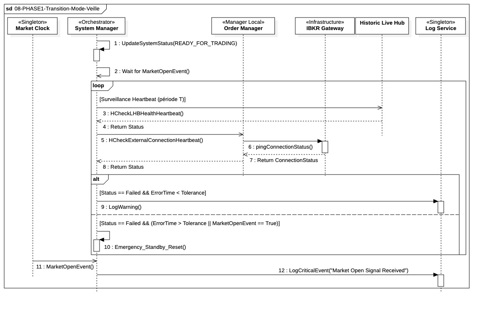

## `08-PHASE2-Transition-Mode-Veille`

  

--- 

### 1. Objectif

La finalité de ce module est de faire passer le système de l'état d'initialisation réussie à l'état de **veille sécurisée et active** (`WAITING`), et d'attendre l'événement temporel déclencheur de l'ouverture du marché.

---

### 2. Contexte

Cette séquence marque la fin de la **Phase 1 (Bootstrapping / PreTrade)**. Elle est déclenchée après la validation finale (Étape 07) qui a confirmé la cohérence opérationnelle et l'intégrité de l'infrastructure. Son rôle est de maintenir la disponibilité opérationnelle du système sans exécuter de stratégie de trading.

---

### 3. Logique Générale

Le **`System Manager (SM)`** commence par mettre à jour l'état global du système à **`READY_FOR_TRADING`**. Le système entre ensuite dans un mode **d'attente asynchrone** (`Wait for MarketOpenEvent()`). Pendant cette attente passive, une boucle de surveillance est lancée en arrière-plan. Cette boucle exécute un **Heartbeat** périodique, où l'`Order Manager (OM)` vérifie activement la stabilité de la connexion avec l'`IBKR Gateway`. Le mode veille se termine uniquement lorsque le **`Market Clock`** envoie le signal **`MarketOpenEvent()`**. À la réception de ce signal, le SM enregistre l'événement dans les logs (audit), puis lance immédiatement la (InTrade).

---

### 4. Règles Critiques

* **Point de Non-Retour :** La mise à jour du statut vers **`READY_FOR_TRADING`** confirme que tous les contrôles de sécurité (LIVE vs PAPER) ont été passés avec succès.
* **Surveillance Obligatoire :** La boucle de **Heartbeat** doit être maintenue. Si la vérification périodique de la connexion externe par l'`OM` échoue durant cette phase, le `SM` doit déclencher un **arrêt d'urgence** (`systemStop(CRITICAL_ERROR)`) car l'exécution serait impossible à l'ouverture. (**A negocier**)
* **Déclenchement Auditable** : La réception du signal d'ouverture doit obligatoirement être enregistrée via un log critique. Cette trace auditable est essentielle pour la réconciliation des horaires et la preuve de l'heure exacte du début d'exécution.
* **Déclenchement Temporel :** Le seul événement qui met fin à l'attente est le signal asynchrone émis par le **`Market Clock`** à l'heure d'ouverture définie.

---

### 5. Conclusion

Ce module garantit que le système reste **sain et réactif** pendant la période d'attente. Il s'assure que toutes les conditions techniques sont remplies pour un démarrage immédiat et sécurisé, assurant une transition sans accroc de l'état de préparation à l'état d'exécution au moment précis de l'ouverture du marché.

---

| ID | Fonction / Message | Émetteur | Récepteur | Description |
|:---|:--- |:--- |:--- |:--- |
| 1 | UpdateSystemStatus(READY_FOR_TRADING) | System Manager | System Manager | Auto-appel pour mettre à jour l'état interne du système vers la préparation finale. |
| 2 | Wait for MarketOpenEvent() | System Manager | System Manager | Passage en mode écoute asynchrone pour l'événement déclencheur temporel. |
| 3 | HCheckExternalConnectionHeartbeat() | System Manager | Order Manager | Déclenchement périodique de la vérification de santé de la connexion. |
| 4 | pingConnectionStatus() | Order Manager | IBKR Gateway | Appel technique vers l'infrastructure externe pour tester la réactivité du tunnel. |
| 5 | Return ConnectionStatus | IBKR Gateway | Order Manager | Réponse de l'infrastructure externe sur l'état du lien (OK/KO). |
| 6 | Return Status | Order Manager | System Manager | Transmission du résultat du heartbeat pour décision de maintien ou d'arrêt critique. |
| 7 | MarketOpenEvent() | Market Clock | System Manager | Signal d'interruption horaire indiquant l'ouverture officielle des marchés. |
| 8 | LogCriticalEvent("Market Open Signal Received") | System Manager | Log Service | Enregistrement immuable de l'horodatage de réception pour audit et réconciliation. |
| 9 | call_PHASE2-Execution() | System Manager | System Manager | Transition vers la logique métier active d'exécution des ordres. |
