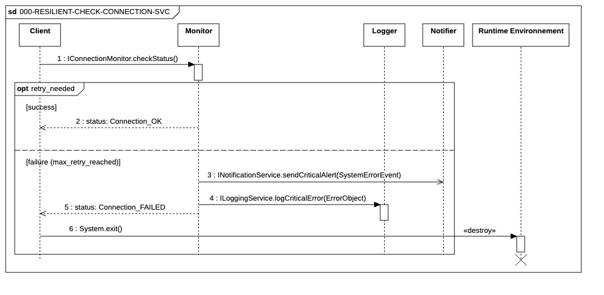

## `SM-RESILIENT-CHECK-CONNECTION`

  

---

### 1. Objectif

Le fragment d'interaction de référence `SM-RESILIENT-CHECK-CONNECTION` modélise le processus standard et uniforme de **vérification de la connectivité résiliente** pour tous les services critiques (Base de Données, Courtier, etc.) lors de la phase de *bootstrapping* du système.

Ce fragment garantit le respect du principe **DRY (Don't Repeat Yourself)** et assure que toute vérification de service adhère à un standard de haute disponibilité incluant la résilience automatique et l'auditabilité immédiate en cas d'échec critique.

### 2. Lifelines et Rôles

Le fragment utilise des rôles génériques pour modéliser l'interaction :

* **`Client`**: Le composant qui demande l'état du service (ex: `System Manager`). Il est bloqué pendant l'appel synchrone.
* **`Monitor`**: Le composant qui implémente le service de surveillance de connexion (ex: `Database Connector`, `IBKR Gateway`). Il fournit l'interface `IConnectionMonitor`.
* **`Logger`**: Le service d'audit centralisé, accédé via l'interface `ILoggingService`.
* **`Notifier`**: Le service d'alerte, accédé via l'interface `INotificationService`.

### 3. Logique de Séquence

La séquence se déroule en trois phases principales : la tentative de connexion résiliente, la gestion de l'issue (succès ou échec critique), et la procédure d'arrêt sécurisé.

#### 3.1. Tentative et Résilience

1.  **Requête de Statut**: Le `Client` envoie la requête synchrone `IConnectionMonitor.checkStatus(component_name)` au `Monitor`.
2.  **Retry Logic (Fragment `opt`)**: Le `Monitor` tente d'établir la connexion. En cas d'échec transitoire, le fragment optionnel `opt [retry_needed]` s'active pour répéter la tentative de connexion interne. L'implémentation de cette logique utilise l'**Exponential Backoff** pour espacer les tentatives.

#### 3.2. Gestion de l'Issue (Fragment `alt`)

Le fragment alternatif `alt` définit les deux résultats possibles après l'épuisement de la logique de résilience :

* **Cas Succès `[success]`**: Le `Monitor` répond immédiatement avec le statut `status: Connection_OK`. Le contrôle est rendu au `Client` qui poursuit l'initialisation.
* **Cas Échec Critique `[failure (max_retry_reached)]`**: L'échec est permanent. Le `Monitor` déclenche la procédure de gestion de crise :
    * Le `Monitor` crée un objet `SystemErrorEvent` standardisé contenant les détails de l'échec.
    * **Alerte Asynchrone**: Le `Monitor` envoie l'objet `SystemErrorEvent` au `Notifier` via `INotificationService.sendCriticalAlert()`. L'appel est **asynchrone** pour garantir une alerte immédiate.
    * **Audit Synchrone**: Le `Monitor` envoie l'objet `SystemErrorEvent` au `Logger` via **`ILoggingService.logCriticalError()`**. L'appel est **synchrone** pour garantir que la trace de l'événement est écrite physiquement avant l'arrêt du processus.

#### 3.3. Arrêt du Processus

1.  **Retour d'Échec**: Après la confirmation de l'audit (log synchrone), le `Monitor` lève une exception (`<<exception>> CRITICAL_FAILURE`) en retour au `Client`.
2.  **Destruction**: Le `Client` (`System Manager`) intercepte l'exception et met fin immédiatement à son activation, modélisée par le marqueur **`destroy` (X)**. Ceci met fin à l'exécution du programme complet.

### 4. Interfaces Clés Utilisées

* **`IConnectionMonitor`**: Interface requise par le `Client` et fournie par le `Monitor` pour interroger l'état de la connexion.
* **`ILoggingService`**: Interface pour garantir l'enregistrement critique et synchrone des erreurs.
* **`INotificationService`**: Interface pour l'envoi rapide et asynchrone des alertes aux opérateurs.

 | ID | Fonction / Message | Émetteur | Récepteur | Description |
|:---|:---|:---|:---|:---|
| 1 | IConnectionMonitor.checkStatus() | SystemManager | Monitor | Appel synchrone de vérification de santé. Le SystemManager bloque jusqu'à l'obtention d'un état final. |
| 2 | status: Connection_OK | Monitor | SystemManager | Signal de retour confirmant la disponibilité du service après succès ou retries. |
| 3 | sendCriticalAlert(SystemErrorEvent) | Monitor | Notifier | Alerte asynchrone immédiate vers les canaux externes (Admin). |
| 4 | logCriticalError(ErrorObject) | Monitor | Logger | Audit synchrone. **Note :** Doit impérativement cibler un support local (File/Stdout) si le service défaillant est la DB. |
| 5 | status: Connection_FAILED | Monitor | SystemManager | Notification d'échec définitif après épuisement des tentatives de résilience. |
| 6 | System.exit() | SystemManager | Runtime Env. | Fermeture forcée du processus par l'autorité centrale en cas d'absence de dépendance critique. |

### Note 

* Permettez l'Injection d'une Action par le Client après un succès de connexion (ex: une routine de configuration post-connexion), améliorant ainsi la réutilisabilité du fragment pour toutes les étapes d'initialisation.
