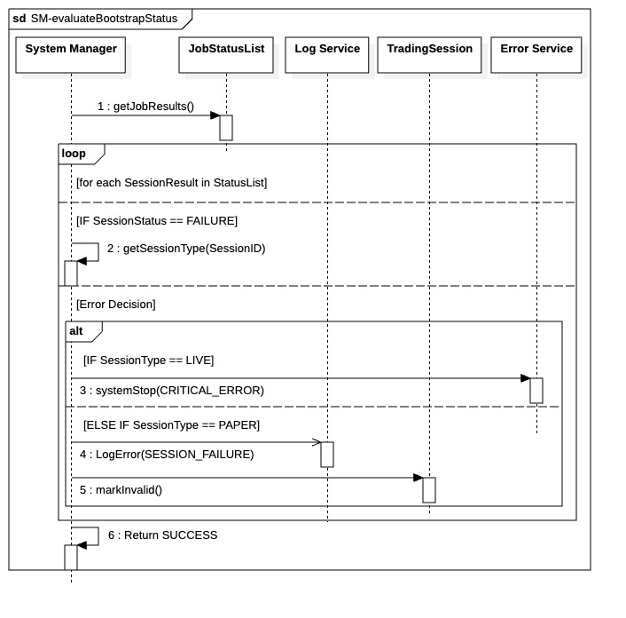

##  `SM-evaluateBootstrapStatus`

  

---

### 1. Objectif

Cette fonction est le point de contrôle unique pour appliquer la **politique de tolérance aux erreurs asymétrique** du système. Elle décide, via l'arbitrage du **`IBootstrapCoordinator`**, s'il faut interrompre le processus global ou continuer après une défaillance de session spécifique.

---

### 2. Contexte

Méthode interne du **`System Manager`** appelée après chaque étape critique de la Phase 1. Elle isole la logique de décision d'arrêt des managers locaux en s'appuyant sur des données immuables chargées via le **`StaticConfigPort`**.

---

### 3. Logique Générale

Le **`System Manager`** récupère l'état des travaux via le **`IJobStatusReporterPort`** (`JobStatusList`). Pour chaque échec détecté :

1. Il identifie le type de session (`LIVE` ou `PAPER`) par un accès local aux données immuables (provenant du **`StaticConfigPort`**).
2. Si une session **`LIVE`** a échoué, il délègue l'arrêt immédiat au service centralisé.
3. Si une session **`PAPER`** a échoué, il consigne l'incident via le **`ILogger`**, marque la session comme invalide via le **`ISessionStatusWriter`** et poursuit l'évaluation.

---

### 4. Règles Critiques

* **Tolérance Zéro (LIVE) :** Toute défaillance `LIVE` déclenche un arrêt fatal synchrone via **`IErrorHandler.handleFatalError(CRITICAL_ERROR)`**. Cette action est terminale.
* **Tolérance Conditionnelle (PAPER) :** Les échecs `PAPER` sont isolés, permettant au bootstrapping de se poursuivre pour les sessions valides.
* **Performance & Sécurité :** L'utilisation du **`StaticConfigPort`** garantit que la vérification du type de session se fait en mémoire (RAM), sans latence I/O ni risque de modification dynamique de la configuration.
* **Séparation des Responsabilités :** Le `SM` (via `IBootstrapCoordinator`) est le seul composant habilité à interpréter la criticité d'un échec de job.

---

### 5. Conclusion

Cette fonction garantit la sécurité du système en priorisant l'**intégrité des sessions en direct**. En centralisant la gestion des erreurs critiques vers le **`IErrorHandler`**, elle assure un arrêt déterministe en cas de défaillance `LIVE` tout en préservant la continuité opérationnelle des sessions de test (`PAPER`) valides.

---

| ID | Fonction / Message | Émetteur | Récepteur | Description |
|:---|:--- |:--- |:--- |:--- |
| 1  | getJobResults()                  | System Manager | JobStatusList   | Récupère la liste des résultats de bootstrapping.                                                             |
| 2  | getSessionType(SessionID)        | System Manager | System Manager  | AUTO-APPEL : Accès immédiat au dictionnaire immuable (StaticConfigPort) chargé en RAM.                        |
| 3  | handleFatalError(CRITICAL_ERROR) | System Manager | IErrorHandler   | Appel synchrone vers le service centralisé. Déclenche l'arrêt immédiat du système si la session est LIVE.     |
| 4  | LogError(SESSION_FAILURE)        | System Manager | Log Service     | Notification d'erreur pour une session PAPER.                                                                 |
| 5  | markInvalid()                  | System Manager | TradingSession  | Invalidation de l'instance en mémoire (le DIL est ignoré selon tes instructions).                             |
| 6  | Return SUCCESS                   | System Manager | Appelant        | Retourne le contrôle uniquement si aucune erreur fatale (LIVE) n'a interrompu la boucle.                       |

---

### 6. Ports et Interfaces

### **IJobStatusReporterPort**
* **Implémenté par** : `Thread Manager`
* **Injecté dans / Utilisé par** : `System Manager`
* **Responsabilité opérationnelle** : Fournir le reporting structuré des résultats d'exécution des jobs de bootstrapping (succès ou échec de chaque session).
* **Règles d’accès ou d’usage** : Transmission synchrone. Utilisé par le SM pour obtenir la liste `JobStatusList` au début de l'évaluation.

### **StaticConfigPort**
* **Implémenté par** : `Data Access Layer (DAL)`
* **Injecté dans / Utilisé par** : `System Manager`
* **Responsabilité opérationnelle** : Fournir l'accès aux configurations immuables (Dictionnaire/Map) chargées en RAM. Dans cette séquence, il permet de résoudre le type de session (`LIVE` vs `PAPER`) sans accès I/O.
* **Règles d’accès ou d’usage** : Bootstrapping uniquement. Lecture seule d'un snapshot immuable injecté au démarrage.

### **IErrorHandler**
* **Implémenté par** : `ErrorService`
* **Injecté dans / Utilisé par** : `System Manager`
* **Responsabilité opérationnelle** : Gestion et propagation des erreurs fatales. Reçoit le signal `handleFatalError` si une session `LIVE` est en échec.
* **Règles d’accès ou d’usage** : Appel synchrone obligatoire pour les erreurs critiques. Instance unique thread-safe. Déclenche l'arrêt immédiat du flux.

### **ILogger**
* **Implémenté par** : `Logger Global`
* **Injecté dans / Utilisé par** : `System Manager`
* **Responsabilité opérationnelle** : Journalisation technique et audit. Utilisé pour enregistrer les échecs de sessions non-critiques (`PAPER`).
* **Règles d’accès ou d’usage** : Mode synchrone pour le bootstrapping. Doit enregistrer l'erreur avant que le SM ne continue l'évaluation.

### NOTE 

* evaluateBootstrapStatus est l’unique point de décision : les managers rapportent, le System Manager arbitre (LIVE vs PAPER), puis appelle explicitement l’ErrorService qui exécute l’arrêt sans jamais interpréter le contexte.
