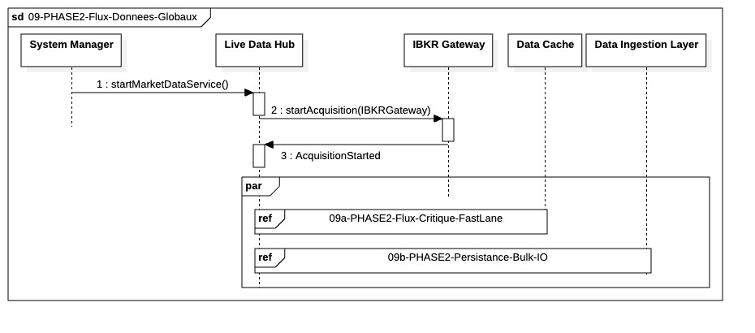

## `09-PHASE2-Flux-Donnees-Globaux`

  

---

### 1. Objectif

La finalité de ce module est d'orchestrer le traitement complet des données de marché en temps réel, garantissant le **parallélisme** et le **découplage strict** entre les exigences de faible latence (Fast-Lane) et les exigences d'audit (Slow-Lane).

---

### 2. Contexte

Ce module s'inscrit comme le premier grand processus de la Phase II (In-Trade), démarrant dès l'ouverture du marché. Il est la porte d'entrée de toutes les données de prix pour l'ensemble du système de trading. Il existe pour **isoler** les opérations rapides et critiques (nécessaires pour le risque et l'exécution) des opérations lourdes et lentes (nécessaires pour la conformité et l'historique), assurant ainsi que l'une ne bloque jamais l'autre.

---

### 3. Logique Générale

Le processus est déclenché par le `SystemManager` qui ordonne au `LiveDataHub` de commencer l'acquisition des données. Une fois l'écoute des Ticks démarrée via `IBKR Gateway`, le `LiveDataHub` initie **simultanément** deux processus indépendants modélisés par le fragment parallèle :

* **Fast-Lane (Référence 09a) :** Le flux ultra-rapide et non bloquant qui conduit les `MarketQuote` agrégés vers le `DataCache` via une queue asynchrone pour une disponibilité immédiate (destination : Risk Monitor / Portfolio Manager).
  * Le DataCache stocke exclusivement des MarketQuotes immuables. Toute mise à jour correspond à un remplacement atomique de référence et non à une mutation de l’objet existant.

* **Slow-Lane (Référence 09b) :** Le flux périodique et auditable qui transfère les buffers de données agrégées vers le `DIL` pour une persistance en masse (Bulk I/O) vers la base de données (destination : Audit / Historique).
  * La persistance Bulk I/O écrit les MarketQuotes tels que reçus, sans transformation métier ni recalcul. Toute normalisation ou mapping est du ressort exclusif du DIL.

L'exécution des deux flux se poursuit en parallèle jusqu'à la fermeture du marché.

---

### 4. Règles Critiques

* **Garantie de Parallélisme :** L'utilisation du fragment Parallèle est fondamentale pour garantir que la charge de travail du `Pool I/O Bulk` (Slow-Lane) ne perturbe jamais la boucle critique du `Pool I/O Real-Time` (Fast-Lane).
* **Source Unique :** Le `LiveDataHub` agit comme source unique de vérité et déclencheur pour les deux flux, assurant que les données Fast-Lane et Slow-Lane proviennent du même calcul d'agrégation.
* **Résilience Intrinsèque :** Bien que les flux soient indépendants, le mécanisme de surveillance de la latence du `09a` reste prioritaire. Une défaillance de la Fast-Lane entraîne un arrêt (Kill Switch) potentiel du système entier, y compris de la Slow-Lane.
* **Immutabilité des MarketQuotes :**
  * Tout MarketQuote émis par le LiveDataHub est considéré comme un snapshot figé.
  * La même instance logique (ou une copie binaire équivalente) est utilisée simultanément par la Fast-Lane (DataCache) et la Slow-Lane (persistance).
  * Aucune modification, enrichissement ou recalcul n’est autorisé après publication.
* **Périmètre de responsabilité :** La séquence 09 est exclusivement responsable de la production, de l’agrégation et de l’écriture des données de marché (Fast-Lane / Slow-Lane). Toute logique de lecture, de consommation ou d’interprétation des données du DataCache est volontairement hors périmètre et définie dans les séquences consommatrices ultérieures.

---

### 5. Conclusion

Ce module établit le socle de données de marché pour la Phase II. Il garantit que les exigences contradictoires de **rapidité (exécution)** et de **traçabilité (audit)** sont satisfaites simultanément et sans compromis sur la performance, en exploitant l'isolation complète des ressources de calcul et d'I/O.

---

| ID | Fonction / Message | Émetteur | Récepteur | Description |
|:---|:---|:---|:---|:---|
| 1 | startMarketDataService() | System Manager | Live Data Hub | Commande d'initialisation du service global de réception et de dispatching des données de marché. |
| 2 | startAcquisition(IBKRGateway) | Live Data Hub | IBKR Gateway | Instruction d'ouverture de la connexion et de souscription aux flux de Ticks via l'API du courtier. |
| 3 | AcquisitionStarted | IBKR Gateway | Live Data Hub | Signal de confirmation indiquant que le flux de données est actif et que la réception a commencé. |
| ref | 09a-PHASE2-Flux-Critique-FastLane | Live Data Hub | Data Cache | Sous-processus parallèle gérant l'acheminement ultra-rapide des MarketQuotes vers la mémoire vive. |
| ref | 09b-PHASE2-Persistance-Bulk-IO | Live Data Hub | Data Ingestion Layer | Sous-processus parallèle gérant l'écriture asynchrone et massive des données pour l'audit et l'historique. |

---

### 1. Ports et Interfaces

**IMarketDataBootstrapPort**
* **Implémenté par** : IBKR Gateway
* **Injecté dans / Utilisé par** : Live Data Hub (via orchestration System Manager)
* **Responsabilité opérationnelle** : Établissement de la connexion technique et initialisation de l'acquisition des flux (Message 2 : `startAcquisition`).
* **Règles d’accès ou d’usage** : Appel synchrone pour le démarrage ; échec entraîne un arrêt immédiat.

**MarketDataSinkPort**
* **Implémenté par** : Live Data Hub (LDH)
* **Injecté dans / Utilisé par** : IBKR Gateway
* **Responsabilité opérationnelle** : Réception des flux de prix bruts (Message 3 : `AcquisitionStarted` et flux suivants). Garantit la préparation des données pour les deux "Lanes" (Fast/Slow).
* **Règles d’accès ou d’usage** : Source unique de vérité pour le système. Les écritures proviennent exclusivement de la Gateway.

**PersistencePort**
* **Implémenté par** : Data Integrity Layer (DIL)
* **Injecté dans / Utilisé par** : Live Data Hub (via fragment 09b)
* **Responsabilité opérationnelle** : Persistance massive (Bulk I/O) des journaux de marché pour l'audit et l'historique.
* **Règles d’accès ou d’usage** : Passage obligatoire par le DIL. Utilisation du pool de threads `BULK` pour ne pas impacter la latence.

**IMarketDataCacheWriter**
* **Implémenté par** : Data Cache
* **Injecté dans / Utilisé par** : Live Data Hub (via fragment 09a)
* **Responsabilité opérationnelle** : Mise à jour ultra-rapide des `MarketQuotes` agrégés en mémoire vive pour une disponibilité immédiate.
* **Règles d’accès ou d’usage** : Accès non-bloquant. Priorité `CRITICAL`. Utilisation d'une queue asynchrone pour garantir la faible latence.

**IMarketDataCacheReader**
* **Implémenté par** : DataCache
* **Injecté dans / Utilisé par** : RiskMonitor, PortfolioManager
* **Responsabilité opérationnelle** : Accès lecture seule, non bloquant, aux derniers MarketQuote disponibles. Règles d’accès ou d’usage. Lecture lock-free. Aucun accès aux structures internes. Retourne des snapshots immuables. Ne bloque jamais la Fast-Lane. Aucun effet de bord

**ILiveDataOrchestrator**
* **Implémenté par** : Live Data Hub
* **Injecté dans / Utilisé par** : System Manager
* **Responsabilité opérationnelle** : Point d'entrée pour le pilotage du cycle de vie des données de marché (Message 1 : `startMarketDataService`).
* **Règles d’accès ou d’usage** : Gère la transition vers le mode "In-Trade". Doit confirmer que les deux flux (Fast/Slow) sont opérationnels.

---
