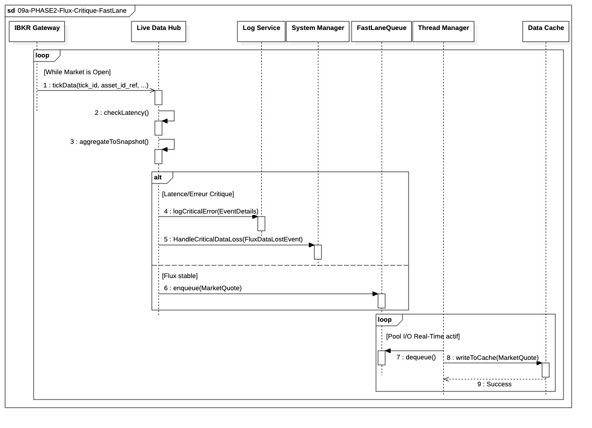

## `09a-PHASE2-Flux-Critique-FastLane`

  

---

### 1. Objectif

La finalité de ce module est de garantir la **disponibilité immédiate** des prix de marché les plus récents dans le cache en mémoire (`DataCache`), avec une **latence minimale**, en assurant que le thread de réception de données ne soit **jamais bloqué** par des opérations d'écriture ou de logging.

---

### 2. Contexte

Ce module est le **cœur opérationnel** de la Phase II (In-Trade). Il s'inscrit directement dans la boucle principale d'exécution. Il est activé dès l'ouverture du marché et représente la **Fast-Lane** des données, qui est critique pour la prise de décision en temps réel et la surveillance du risque. Il est **isolé** de toutes les opérations lentes (Bulk I/O, persistance base de données) et intègre également des mécanismes d'autodéfense contre la volatilité extrême (burst de ticks).

---

### 3. Logique Générale

Le fonctionnement repose sur un modèle **Producteur/Consommateur** découplé par une **Queue Non Bloquante** (`FastLaneQueue`) :

* **Le Producteur (`LiveDataHub`)** reçoit les `TickData` bruts, applique une politique de **Backpressure (Drop Oldest)** en cas de saturation, puis vérifie la latence. Si le flux est sain, il agrège les Ticks en un objet **`MarketQuote`** immuable. En cas de latence, il bascule en **Mode Dégradé** via le `SystemManager`. Il **dépose** ensuite ce `MarketQuote` dans la `FastLaneQueue` de manière asynchrone.
* **Le Consommateur** (un thread dédié du `ThreadManager` / `Pool I/O Real-Time`) est en **boucle d'écoute persistante** sur la `FastLaneQueue`. Dès qu'un `MarketQuote` est disponible, il le retire et l'écrit dans le `DataCache`.

---

### 4.1 Règles Critiques

* **Priorité Sécurité & Backpressure :** La gestion de charge (Drop Oldest) et la vérification de la latence (`checkLatency()`) sont exécutées **avant** toute agrégation. En cas de latence critique, le `LiveDataHub` alerte le `SystemManager` qui peut ordonner un basculement en **Mode Dégradé**.
* **Non-Blocage Absolu :** L'opération d'enregistrement des incidents (`logEvent`) est strictement **asynchrone**. L'opération `enqueue` sur la `:FastLaneQueue` reste non bloquante, garantissant que l'agrégateur absorbe le flux maximum sans gigue (jitter).
* **Isolation des Tâches :** Le calcul (agrégation en `MarketQuote`) est effectué par le Producteur, tandis que l'I/O (écriture cache) est effectuée par le Consommateur, isolant le CPU du temps I/O.
* **Structure de Données :** Seul l'objet **`MarketQuote`** (cotation consolidée immuable) transite par la queue, minimisant la charge utile.
* 

### 4.2 Politique de Gestion de Charge et Dégradation Contrôlée

Le **Live Data Hub (LDH)** applique une politique explicite de gestion de charge visant à garantir **la continuité de la diffusion des données de marché**, y compris en conditions de volatilité extrême, sans jamais bloquer le producteur ni interrompre le système.

#### Principe Général

Le flux de ticks entrants est absorbé via une **queue bornée** en amont de l’agrégation.
En cas de saturation, la politique **Drop Oldest** est appliquée afin de préserver en priorité les données de marché les plus récentes.
Aucune forme de *backpressure* ou de blocage n’est autorisée sur le LDH.

Les seuils de capacité de la queue, ainsi que les critères précis de dégradation, ne sont **pas figés à ce stade** et seront calibrés lors des **phases de stress test et de mock de charge**, en fonction des caractéristiques réelles du marché et de la fréquence de snapshot retenue (ex. 1 minute).

#### Niveaux de Fonctionnement

La Fast-Lane reste non bloquante en toutes circonstances, tandis que la Slow-Lane reçoit et absorbe les snapshots de manière asynchrone, garantissant que l’agrégation critique reste prioritaire. Le système supporte plusieurs niveaux de fonctionnement, activés dynamiquement sans interruption :

* **Fonctionnement nominal**
  * Agrégation complète des données de marché (bid, ask, volumes, last price)
  * Snapshots produits à l’intervalle nominal
  * Aucun drop significatif, métriques stables

* **Stress de marché (volatilité élevée)**
  * Politique Drop Oldest active sur la queue d’entrée
  * Agrégation maintenue sans interruption
  * Le `MetricManager` est notifié d’un taux de drop élevé
  * Le `RiskMonitor` et le `PortfolioManager` continuent d’opérer sur le **dernier snapshot valide**

* **Stress extrême**
  * Toujours aucun blocage ni arrêt du système
  * Maintien impératif de la fraîcheur des snapshots
  * Dégradation contrôlée de l’agrégation (ex. priorité au `last_price`, enrichissement bid/ask optionnel)
  * Snapshots potentiellement moins riches mais **toujours exploitables pour la gestion du risque**

#### Observabilité

Tout événement de drop ou de dégradation est **mesuré et remonté** vers un composant dédié (`MetricManager`).
Ces métriques ont un rôle **strictement observatoire** et ne déclenchent aucun arrêt automatique, l’objectif étant de préserver la capacité du système à produire des décisions de risque et d’exécution même dans les conditions de marché les plus dégradées.

---

### 5. Conclusion

Ce module garantit un flux de prix **déterministe et ultra-rapide**. Il assure la disponibilité des données immuables pour le `RiskMonitor` et le `PortfolioManager`, tout en intégrant une résilience dynamique face à la latence ou aux pics de volume via une orchestration avec le `SystemManager`.

---

| ID | Fonction / Message | Émetteur | Récepteur | Description |
|:---|:---|:---|:---|:---|
| 1 | tickData(...) | IBKR Gateway | Live Data Hub | Réception du flux de marché brut. |
| 2 | applyBackpressure() | Live Data Hub | Live Data Hub | Politique Drop Oldest si saturation queue d'entrée. |
| 3 | checkLatency() | Live Data Hub | Live Data Hub | Mesure du delta temps pour détection de retard. |
| 4 | notifyHighLatency() | Live Data Hub | System Manager | Alerte de dégradation de performance au superviseur. |
| 5 | setOperatingMode(Mode) | System Manager | Live Data Hub | Commande synchrone : basculement NOMINAL ou DEGRADED. |
| 6 | logEvent(details) | Live Data Hub | Log Service | Enregistrement asynchrone non-bloquant de l'incident. |
| 7 | createMarketQuote() | Live Data Hub | Live Data Hub | Agrégation des ticks en un objet immuable et versionné. |
| 8 | enqueue(MarketQuote) | Live Data Hub | FastLaneQueue | Dépôt asynchrone (non-bloquant) de la cotation. |
| 9 | dequeue() | Thread Manager | FastLaneQueue | Récupération par un thread du Pool I/O Real-Time. |
| 10| writeToCache(quote) | Thread Manager | Data Cache | Écriture atomique dans la mémoire vive (DataCache). |
| 11| Success | Data Cache | Thread Manager | Acquittement libérant le thread consommateur. |

---

### 6. Ports et Interfaces

**IMarketDataCacheWriter**
* **Implémenté par** : Data Cache
* **Injecté dans / Utilisé par** : Live Data Hub (via fragment 09a)
* **Responsabilité opérationnelle** : Mise à jour ultra-rapide des `MarketQuotes` agrégés en mémoire vive pour une disponibilité immédiate.
* **Règles d’accès ou d’usage** : Accès non-bloquant. Priorité `CRITICAL`. Utilisation d'une queue asynchrone pour garantir la faible latence. Les objets écrits sont immuables et versionnés

**IMarketDataCacheReader**
* **Implémenté par** : DataCache
* **Injecté dans / Utilisé par** : RiskMonitor, PortfolioManager
* **Responsabilité opérationnelle** : Accès lecture seule, non bloquant, aux derniers MarketQuote disponibles. Règles d’accès ou d’usage. Lecture lock-free. Aucun accès aux structures internes. Retourne des snapshots immuables. Ne bloque jamais la Fast-Lane. Aucun effet de bord. Les objets écrits sont immuables et versionnés

---

### NOTE 

**Immutabilité des MarketQuotes :** Tout MarketQuote émis par le LiveDataHub est considéré comme un snapshot figé. Aucune modification, enrichissement ou recalcul n’est autorisé après publication.

**Kill Switch** : Interface `ISystemKillSwitchPort` définie, usage strictement contrôlé : aucun composant métier ne déclenche l’arrêt directement, toute action réelle passe par `IProcessControlPort`. À vérifier que l’orchestration respecte cette règle lors de la relecture finale.

**Versioning du flux marché** : Les snapshots et MarketQuotes doivent être immuables et versionnés. Les ports consommateurs (`MarketDataPort`, `IMarketDataCacheWriter`) ne doivent exposer que des versions validées, et tout accès à des données non versionnées doit être impossible.

---

### 4.2 Politique de Gestion de Charge et Dégradation Contrôlée

Le **Live Data Hub (LDH)** applique une politique explicite pour garantir la continuité de la diffusion, même en conditions extrêmes.

* **Gestion de Charge (Mécanique) :** Application systématique du **Drop Oldest** sur la queue d'entrée en cas de saturation pour privilégier la fraîcheur.
* **Niveaux de Fonctionnement (Logique) :** * **Fonctionnement nominal :** Agrégation complète (bid, ask, volumes, last price).
* **Mode Dégradé :** Activé par le `SystemManager`. Le LDH simplifie l'agrégation (ex: focus prioritaire sur le `last_price`) pour réduire la charge CPU et maintenir la fraîcheur des snapshots.

