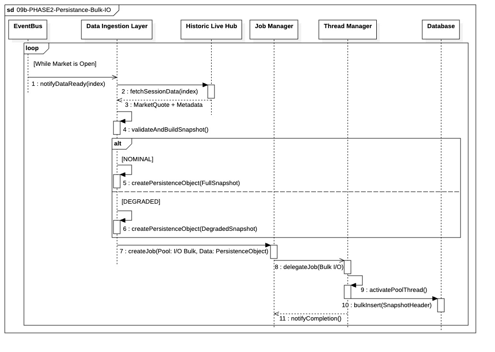

## `09b-PHASE2-Persistance-Bulk-IO`

  

---

### 1. Objectif

Garantir l'**auditabilité** et la **traçabilité** complète de l'activité de marché en enregistrant massivement les données agrégées (`MarketQuote` et `SnapshotHeader`) en base de données, sans jamais impacter la latence de la boucle d'exécution critique (`Fast-Lane`).

---

### 2. Contexte

Ce module existe pour isoler l'opération la plus **lourde en I/O** du système : l'écriture en masse (Bulk Insert) des données historiques dans la base de données. Il s'inscrit en parallèle de la boucle de trading et est déclenché par le `LiveDataHub` après que les données aient été distribuées en mémoire vers la `Fast-LaneQueue` pour l'exécution immédiate. Il utilise des ressources de basse priorité pour opérer en tâche de fond.

---

### 3. Logique Générale

Le `LiveDataHub` reçoit le flux de Ticks et, en plus d'alimenter la `FastLaneQueue`, il accumule les données agrégées (`MarketQuote`) dans un **buffer interne**.

Lorsque ce buffer atteint une taille critique (volume suffisant) et/ou qu'une période de temps définie s'est écoulée, le `LDH` soumet le bloc de données au `Data Ingestion Layer`. Le `DIL` crée les objets de persistance nécessaires (`SnapshotHeader` en tant que parent des `MarketQuote`) et les encapsule dans un **Job**. Ce Job est transmis au `Job Manager` qui l'alloue au **Pool I/O Bulk** (Pool de basse priorité) via le `Thread Manager`. Un thread de ce pool exécute alors l'insertion massive et asynchrone des données dans la base.

---

### 4. Règles Critiques

* **Isolation Critique :** L'exécution de l'insertion est **asynchrone** par rapport au `LiveDataHub`. Le thread du `LDH` ne doit jamais attendre la fin de l'écriture en base.
* **Priorité Basse :** La tâche utilise exclusivement le **Pool I/O Bulk**. Ce pool a la plus basse priorité afin que ses threads soient suspendus ou ralentis si une tâche critique (exécution d'ordre ou écriture `Fill`) nécessite des ressources I/O urgentes.
* **Condition de Déclenchement :** Le module ne s'active que de manière **périodique** (par temps écoulé) ou **conditionnelle** (par taille de buffer atteinte), jamais pour chaque `MarketQuote` individuel, afin de maximiser l'efficacité du *Bulk Insert*.
* **Cohérence des Données :** Le `DIL` est responsable de garantir la **cohérence des clés primaires/étrangères** en créant le `SnapshotHeader` et en rattachant l'ensemble des `MarketQuote` associés **avant** l'insertion en base.

---

### 5. Conclusion

Le module `09b-PHASE2-Persistance-Bulk-IO` est le garant de l'audit et de l'historique. En utilisant l'isolation des ressources du **Pool I/O Bulk**, il permet de capturer une image complète et cohérente du marché (`SnapshotHeader` + `MarketQuote`) pour l'analyse Post-Trade, sans impacter la performance en temps réel de la boucle de trading.

---

### Description des Fonctions 

`checkBufferStatus()` : Auto-appel périodique du `LiveDataHub`. Cette fonction vérifie l'état du buffer interne accumulant les `MarketQuote` destinés à la persistance. Elle compare le temps écoulé depuis la dernière soumission et la taille actuelle du bloc de données en attente avec les seuils configurés.

`submitTask(MarketQuoteBuffer)` : Le `LDH` transfère le bloc de `MarketQuote` accumulés au `DIL`. Cette action signale au `DIL` qu'un lot de données est prêt à être traité pour la persistance. Le `LDH` efface ensuite son buffer pour commencer une nouvelle accumulation.

`createPersistenceObjects()` : C'est une fonction de transformation et d'enrichissement. Le `DIL` crée d'abord une instance de l'entité parent (`SnapshotHeader`). Il génère un identifiant unique (`snapshot_id`) pour cet en-tête. Ensuite, il parcourt tous les `MarketQuote` reçus et leur injecte la référence à cet `snapshot_id` (`snapshot_id_ref`). Cela garantit que le bloc de données est atomique et cohérent pour l'insertion en masse.

`createJob(Pool: I/O Bulk, Data: PersistenceObject)` : Le `DIL` encapsule le bloc de données finalisé et la fonction d'insertion (`bulkInsert`) dans un objet `Job`. Crucialement, il spécifie le type de ressource requis : **`Pool I/O Bulk`**. Le `JM` prend le relais, enregistre le Job et le place dans la file d'attente d'exécution des tâches de basse priorité.

`delegateJob(Bulk I/O)` : Lorsque le `JM` est prêt à exécuter le Job (en fonction de la charge actuelle du système et de la basse priorité du Job), il demande au `TM` de lui fournir un thread libre du **Pool I/O Bulk**. Le `TM` alloue cette ressource d'exécution au Job.

`executeBulkInsert(DataBlock)` : Le thread alloué lance la fonction d'insertion réelle. L'appel est dirigé vers le `DIL` pour que ce dernier utilise son pilote d'accès à la base de données. Cet appel est **asynchrone** du point de vue de la boucle critique du système.

`bulkInsert(SnapshotHeader, MarketQuote)` : C'est l'opération physique d'écriture. Le `DIL` exécute une requête optimisée d'insertion en masse pour insérer les lignes `SnapshotHeader` et toutes les lignes `MarketQuote` rattachées en une seule transaction lourde. Le thread est bloqué sur cette opération jusqu'à la confirmation de la base de données.

`Job Completed` : Une fois la transaction (`bulkInsert`) confirmée par la base de données, l'état du Job est mis à jour. Le `JM` est notifié, ce qui lui permet de fermer la tâche et d'enregistrer l'audit de fin d'exécution.
