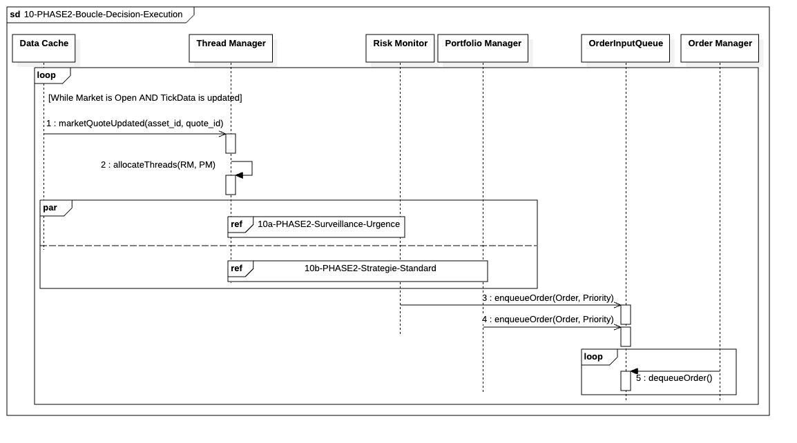

## `10-PHASE2-Boucle-Decision-Execution`

  

---

### 1. Objectif

La finalité de ce module est de garantir la **disponibilité immédiate et cohérente** des prix de marché les plus récents dans le cache en mémoire (`DataCache`). L'objectif est d'atteindre une **latence minimale absolue** en assurant que le thread de réception de données ne soit **jamais bloqué** par les opérations d'écriture et en transmettant l'état du marché par **blocs cohérents**.

---

### 2. Contexte

Ce module est le **cœur opérationnel** de la Phase II (In-Trade). Il s'inscrit directement dans la boucle principale d'exécution. Activé dès l'ouverture du marché, il représente la **Fast-Lane** des données, essentielle pour la prise de décision en temps réel et la surveillance du risque. Il est **isolé** de toutes les opérations lentes (Bulk I/O base de données), mais assure la **cohérence en bloc** des données transitées.

---

### 3. Logique Générale

Le fonctionnement repose sur un modèle **Producteur/Consommateur** découplé par une **Queue Non Bloquante** (`FastLaneQueue`) :

* Le **Producteur** (`:LiveDataHub`) reçoit les `TickData` bruts, vérifie leur intégrité et leur latence. Si le flux est sain, il agrège les Ticks accumulés localement et crée l'objet **`SnapshotHeader` complet** (contenant tous les `MarketQuote` consolidés pour l'instant $T$). Il **dépose** cet objet `SnapshotHeader` complet dans la `FastLaneQueue` de manière asynchrone et continue immédiatement à écouter le prochain Tick, sans attendre la fin de l'écriture.
* Le **Consommateur** (un thread dédié du `Pool I/O Real-Time`) est en **boucle d'écoute persistante** sur la `:FastLaneQueue`. Dès qu'un `SnapshotHeader` est disponible, il le retire de la queue et exécute son unique mission : l'écriture en **Bulk I/O en mémoire** de tous les `MarketQuote` contenus dans le `SnapshotHeader` vers le `DataCache`.

---

### 4. Règles Critiques

* **Priorité Sécurité :** La vérification de la latence (`checkLatency()`) est exécutée **avant** toute agrégation. En cas de défaillance, l'enregistrement de l'incident (`logCriticalError`) est synchrone et prioritaire avant d'alerter le `SystemManager` (`REF: SM-HandleCriticalDataLoss`).
* **Non-Blocage Absolu :** L'opération clé (`enqueue` sur la `FastLaneQueue`) doit être **non bloquante** pour le thread du `LiveDataHub`. Le thread agrégateur ne doit jamais perdre de temps à attendre l'I/O du cache.
* **Cohérence de Bloc :** Le transit et l'écriture des données se font au niveau de l'objet **`SnapshotHeader`**. Ceci garantit que l'ensemble des cotations utilisées par le Consommateur appartient au même instant $T$.
* **Isolation des Tâches :** Le calcul intensif (agrégation et création du `SnapshotHeader`) est effectué par le Producteur (`LiveDataHub`), tandis que l'I/O critique (écriture en cache) est effectuée par le Consommateur (`ThreadManager`).

---

### 5. Conclusion

Ce module garantit un flux de prix **déterministe, ultra-rapide et cohérent** pour le système. Il assure que des blocs complets de données de marché (`SnapshotHeader`) sont disponibles en mémoire avec la plus faible latence possible pour la surveillance du risque (Risk Monitor) et l'exécution des stratégies (Portfolio Manager), en isolant la charge de calcul de la charge d'écriture en mémoire.

---

### 6. Description des Fonctions 

* **`tickData(tick_id, asset_id_ref, ...)`** : L'IBKR Gateway transmet de manière asynchrone la mise à jour brute du marché (`TickData`). C'est l'événement déclencheur de chaque itération.

* **`checkLatency()`** : Exécuté immédiatement après la réception du Tick. Le Live Data Hub compare le `timestamp` du `TickData` reçu avec l'heure actuelle pour détecter une latence excessive et déterminer si le flux est sain (point de décision `ALT`).

* **`logCriticalError(EventDetails)`** : Si une défaillance critique est détectée par `checkLatency()`, envoi synchrone d'un message au service de journalisation pour garantir l'auditabilité de l'incident.

* **`REF: SM-HandleCriticalDataLoss(FluxDataLostEvent)`** : Référence à la séquence externe de gestion d'urgence. Le System Manager est alerté pour lancer la procédure d'arrêt ou de reprise.

* **`createSnapshotHeader(AccumulatedTicks)`** : Exécuté si la latence est jugée acceptable. Le Live Data Hub utilise les Ticks accumulés pour créer et consolider tous les `MarketQuote` nécessaires, puis il les encapsule dans un **`SnapshotHeader`** unique (avec `snapshot_id`, etc.) prêt à être distribué.

* **`enqueue(SnapshotHeader)` (Mise à Jour de la Charge Utile)** : Le Live Data Hub (Producteur) insère l'objet **`SnapshotHeader` complet** (le bloc de données cohérent) dans la queue non bloquante. C'est l'opération de découplage critique qui libère immédiatement le thread du Producteur.

* **`dequeue()`** : Un thread dédié du Pool I/O Real-Time (Consommateur) retire l'objet `SnapshotHeader` de la queue. L'opération représente la boucle continue et à haute fréquence de consommation.

* **`writeToCache(SnapshotHeader)` (Mise à Jour de la Charge Utile)** : Le thread du Pool I/O Real-Time exécute l'écriture physique de tous les `MarketQuote` contenus dans le `SnapshotHeader` vers le cache. C'est l'opération de **Bulk I/O en mémoire** finale. L'opération est synchrone pour le thread consommateur, qui attend la confirmation avant de revenir au `dequeue`.
