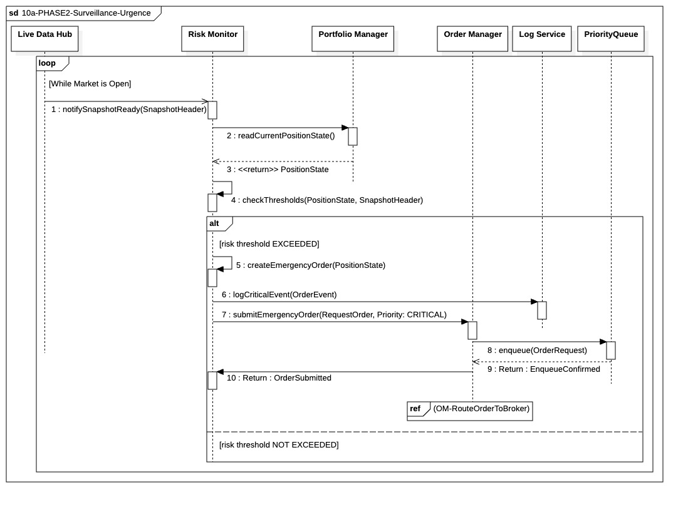

## `10a-PHASE2-Surveillance-Urgence`

---

### 1. Objectif

La finalité de ce module est de garantir la **détection immédiate** d'une violation critique des limites de risque et de déclencher l'exécution d'un ordre de liquidation (Stop-Loss ou Kill-Switch) avec une **priorité maximale absolue**, préservant ainsi le capital.

---

### 2. Contexte

Ce processus s'inscrit dans la **Phase II (In-Trade)** et est piloté par le **`RiskMonitor`**, un composant fonctionnant sur un thread de haute priorité dédié. Il est déclenché de manière asynchrone par l'événement **`notifySnapshotReady`** émis par le `LiveDataHub`, assurant que la surveillance s'effectue sur des données de prix complètes et cohérentes, à une fréquence régulière et critique (par exemple, toutes les minutes).

---

### 3. Logique Générale

Le `RiskMonitor` fonctionne en boucle continue. À chaque signal `SnapshotReady`, il initie un double processus de récupération synchrone (Fetch) : il lit le prix dans le **`DataCache`** et l'état de la position auprès du **`PortfolioManager`**. Muni de ces deux données, il procède à l'évaluation des seuils (`checkThresholds`). Si un seuil est franchi, il crée un ordre d'urgence, journalise l'incident de manière bloquante, puis soumet cet ordre à l'`OrderManager` avec une priorité **`CRITICAL`**. L'ordre est ensuite sécurisé dans la `PriorityQueue` de l'OM avant d'être routé pour l'exécution physique.

---

### 4. Règles Critiques

* **Déclenchement et Découplage :** Le `RiskMonitor` est entièrement découplé de la logique de trading standard. Il ne dépend que des sources de données passives (caches) et du `PortfolioManager` pour son état, et agit uniquement sur le signal cohérent du `Snapshot`.
* **Audit Synchrone :** L'enregistrement de l'incident (`logCriticalEvent`) est **obligatoirement synchrone et bloquant** (étape 9). Le `RiskMonitor` doit attendre la confirmation de l'écriture de la preuve d'audit avant de procéder à la soumission de l'ordre. C'est le prix de la conformité et de l'irréfutabilité.
* **Priorité Maximale :** L'ordre est soumis avec la priorité **`CRITICAL`**. L'`OrderManager` doit garantir que cet ordre est inséré en tête de la `PriorityQueue` et traité avant tout ordre `STANDARD` ou `NORMAL`.
* **Contrôle du Thread :** Le `RiskMonitor` utilise des appels synchrones pour l'audit et la soumission d'ordre (jusqu'à l'étape d'enfilement confirmée) afin de garantir que l'ordre est pris en charge avant que le thread ne soit libéré pour le cycle de surveillance suivant.

---

### 5. Conclusion

Le module **`10a-PHASE2-Surveillance-Urgence`** est le mécanisme de défense à haute priorité du système. Il garantit que toute violation de risque est détectée, auditée et contrée par une action immédiate (liquidation) dont la priorité d'exécution est formellement supérieure à toute autre opération de trading en cours.

---

|ID|Fonction/Message|Émetteur|Récepteur|Description|
|:---|:---|:---|:---|:---|
|1|notifyDataReady(MarketStateContext)|EventBus|Risk Monitor|Notification asynchrone déclenchant le cycle de surveillance avec l'index de synchronisation du LHB.|
|2|getCurrentExposure()|Risk Monitor|Portfolio Manager|Appel non-bloquant pour consulter l'état actuel de l'exposition via le PositionExposureStore.|
|3|<< return >> PositionExposureSnapshot|Portfolio Manager|Risk Monitor|Retour de l'objet immuable contenant les positions et agrégats d'exposition.|
|4|getRawBufferSlice()|Risk Monitor|Live Historic Buffer|Extraction des séries temporelles brutes à partir de l'index fourni par le contexte.|
|5|checkRiskViolation()|Risk Monitor|Risk Monitor|Calcul interne (Feature Engineering + Modèle ML) pour détecter un dépassement de seuil.|
|6|createEmergencyOrder(PositionState)|Risk Monitor|Risk Monitor|Génération d'un ordre de liquidation si une violation critique est confirmée.|
|7|logCriticalEvent(OrderEvent)|Risk Monitor|Log Service|Enregistrement synchrone et bloquant de l'incident pour garantir l'auditabilité.|
|8|submitEmergencyOrder(Request, CRITICAL)|Risk Monitor|Order Manager|Transmission de l'ordre d'urgence avec le niveau de priorité maximale.|
|9|enqueue(OrderRequest)|Order Manager|PriorityQueue|Insertion de l'ordre en tête de la file d'attente prioritaire de l'OM.|
|10|Return: EnqueueConfirmed|PriorityQueue|Order Manager|Confirmation technique de la mise en file d'attente sécurisée.|
|11|Return: OrderSubmitted|Order Manager|Risk Monitor|Confirmation finale du traitement de l'ordre au moniteur de risque.|
|ref|(OM-RouteOrderToBroker)|Order Manager|Externe|Fragment de référence pour le routage physique de l'ordre vers le broker.|
