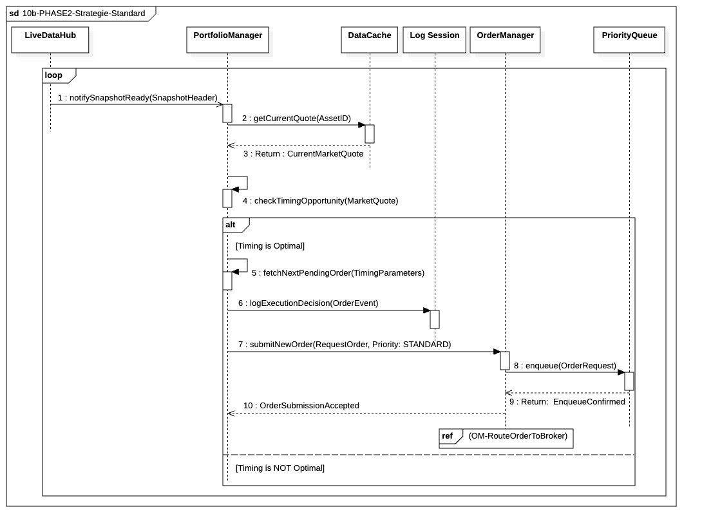

## `10b-PHASE2-Strategie-Standard`

  

### 1. Objectif

L'objectif de ce module est d'exécuter de manière optimisée les ordres de trading standards **prédéterminés** (issus du rééquilibrage ou des ordres chargés), en sélectionnant le moment tactique optimal (timing) pour la soumission à l'exécution.

---

### 2. Contexte

Ce processus s'inscrit au cœur de la **boucle de décision In-Trade** et est piloté par le **`PortfolioManager`**. Contrairement à l'urgence, il s'agit d'une **exécution opportuniste et planifiée**. Le cycle est déclenché par l'événement régulier **`notifySnapshotReady`** du `LiveDataHub`, qui fournit au PM l'opportunité d'évaluer l'état du marché à intervalles précis.

---

### 3. Logique Générale

Le `PortfolioManager` fonctionne en boucle persistante, s'activant à chaque notification de Snapshot. Il procède à un **Fetch synchrone** du prix le plus frais depuis le **`DataCache`**. Il utilise ensuite un algorithme de *timing* (ex: TWAP, VWAP) pour évaluer si ce prix est favorable par rapport à l'objectif de l'ordre précalculé, ou si le temps imparti pour l'exécution d'une tranche est écoulé. Si la condition est jugée optimale, le PM récupère l'ordre correspondant, journalise sa décision d'exécution, et soumet l'ordre à l'`OrderManager`.

---

### 4. Règles Critiques

* **Déclenchement Périodique :** Le `PortfolioManager` utilise la notification du Snapshot comme un *tick* d'horloge régulier pour ses algorithmes de *timing*, évitant de gaspiller des ressources sur une analyse à la fréquence brute des *ticks*.
* **Priorité Standard :** L'ordre est soumis avec la priorité **`STANDARD`**. Il doit obligatoirement être inséré dans la `PriorityQueue` derrière tout ordre de priorité **`CRITICAL`** (Urgence).
* **Audit Synchrone :** L'enregistrement de la décision d'exécution (`logExecutionDecision`) est **synchrone**. Le PM doit enregistrer la justification de son choix de *timing* (le prix et le moment) avant de soumettre l'ordre pour garantir l'auditabilité de la performance d'exécution.
* **Rôle d'Exécuteur :** Le `PortfolioManager` n'est pas le créateur de l'intention de trading, mais le **gestionnaire tactique de l'exécution**, se concentrant uniquement sur le "quand" et non le "quoi" ou le "pourquoi" de l'ordre.

---

### 5. Conclusion

Le module garantit que les ordres de stratégie sont exécutés au moment jugé le plus favorable par les algorithmes d'optimisation (TWAP/VWAP), sans jamais interférer avec la priorité absolue accordée aux ordres de surveillance et d'urgence gérés par le `RiskMonitor`. Il assure l'efficacité des transactions planifiées dans le respect strict des contraintes de priorité du système.
