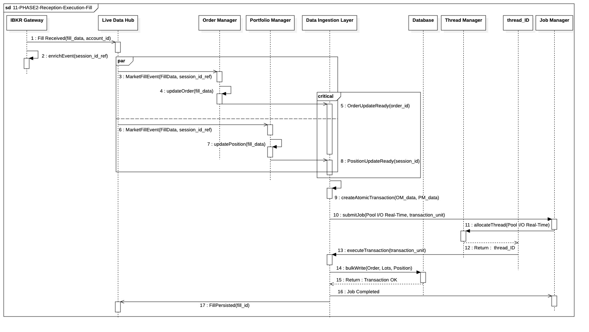

## `11-PHASE2-Reception-Execution-Fill`

  

### 1. Objectif

Garantir l'**atomicité** et la **faible latence** du traitement d'une exécution de marché (`Fill`) en synchronisant la mise à jour des états internes (Ordre et Position) avant leur persistance critique en base de données.

---

### 2. Contexte

Ce processus s'inscrit dans la **"Fast Lane"** des événements de marché. Il est déclenché immédiatement après la réception d'une confirmation d'exécution par le courtier IBKR. Il est crucial car il valide l'exécution physique et met à jour l'état financier et technique du système, impactant directement le calcul du PnL et le statut des ordres en cours.

---

### 3. Logique Générale

Le processus suit un enchaînement centralisé et contrôlé :

* **Réception et Enrichissement :** La passerelle reçoit le Fill et le transmet au `LiveDataHub` qui ajoute le contexte essentiel (`session\_id\_ref`).
* **Traitement Parallèle :** Le Fill enrichi est distribué simultanément au `OrderManager (OM)` et au `PortfolioManager (PM)`. Ces deux entités travaillent en parallèle pour mettre à jour l'Ordre (statut) et la Position (lots méthode FIFO) en mémoire.
* **Coordination Critique :** Le `Data Integrity Layer` (DIL) attend la confirmation des deux managers (`OrderUpdateReady` et `PositionUpdateReady`).
* **Délégation Atomique :** Une fois les deux états prêts, le DIL crée l'unité de transaction, la soumet au `JobManager` (qui l'alloue à un thread I/O Real-Time), et exécute le processus générique de persistance atomique (`DIL-AtomicDBWriteProces`).

---

### 4. Règles Critiques

* **Atomicité Absolue :** Le DIL garantit que la mise à jour de l'Ordre **ET** de la Position est effectuée dans une unique transaction de base de données (COMMIT ou ROLLBACK). Il n'y a pas d'état intermédiaire persistant.
* **Priorité I/O :** L'écriture en base de données doit être effectuée par un thread du **Pool I/O Real-Time** pour isoler cette charge critique des autres processus.
* **Condition de Démarrage :** Le Job de persistance ne peut être soumis que si les confirmations de l'OM et du PM ont été reçues. Toute défaillance à produire ces confirmations empêche l'écriture.
* **Gestion des Erreurs :** En cas d'échec de la transaction, le processus générique (`DIL-AtomicDBWriteProces`) déclenche un `ROLLBACK` et une alerte immédiate (Notification Manager), assurant l'intégrité des données.

---

### 5. Conclusion

Ce module garantit que l'exécution d'un ordre de marché est traitée avec une **garantie totale d'intégrité** et une **latence in-memory minimale**, tout en assurant que la persistance finale utilise une ressource I/O isolée et de haute priorité. Il est le point de vérité qui synchronise l'état physique du courtier avec l'état logique et financier de la plateforme.

---

|ID|Fonction / Message|Émetteur|Récepteur|Description|
|:---|:---|:---|:---|:---|
|1|Fill Received(fill_data, account_id)|IBKR Gateway|Live Data Hub|Réception de la notification d'exécution brute en provenance du courtier.|
|2|enrichEvent(session_id_ref)|Live Data Hub|Live Data Hub|Auto-enrichissement du fill avec les métadonnées de session internes.|
|3|MarketFillEvent(FillData, session_id_ref)|Live Data Hub|Order Manager|Transmission de l'événement d'exécution pour mise à jour du cycle de vie de l'ordre.|
|4|updateOrder(fill_data)|Order Manager|Order Manager|Mise à jour interne du statut de l'ordre en mémoire vive (RAM).|
|5|OrderUpdateReady(order_id)|Order Manager|Data Ingestion Layer|Notification au DIL que la mise à jour technique de l'ordre est prête pour persistance.|
|6|MarketFillEvent(FillData, session_id_ref)|Live Data Hub|Portfolio Manager|Transmission de l'événement pour mise à jour comptable du portefeuille.|
|7|updatePosition(fill_data)|Portfolio Manager|Portfolio Manager|Recalcul des positions nettes et des lots (méthode FIFO) en mémoire vive.|
|8|PositionUpdateReady(session_id)|Portfolio Manager|Data Ingestion Layer|Notification au DIL que la mise à jour financière est prête pour persistance.|
|9|createAtomicTransaction(OM_data, PM_data)|Data Ingestion Layer|Data Ingestion Layer|Préparation d'une unité de transaction groupée garantissant l'atomicité Ordre/Position.|
|10|submitJob(Pool I/O Real-Time, transaction_unit)|Data Ingestion Layer|Job Manager|Soumission de la transaction au gestionnaire de tâches pour exécution asynchrone prioritaire.|
|11|allocateThread(Pool I/O Real-Time)|Job Manager|Thread Manager|Requête d'allocation d'un thread spécifique depuis le pool temps-réel dédié.|
|12|Return: thread_ID|Thread Manager|Job Manager|Retour de l'identifiant du thread alloué pour l'opération I/O.|
|13|executeTransaction(transaction_unit)|Job Manager|Database|Exécution physique de la transaction atomique vers la base de données.|
|14|bulkWrite(Order, Lots, Position)|Database|Database|Écriture simultanée des modifications techniques et financières dans le stockage persistant.|
|15|Return: Transaction OK|Database|Data Ingestion Layer|Confirmation du succès de l'écriture et du commit de la transaction.|
|16|Job Completed|Job Manager|Data Ingestion Layer|Notification de fin de processus de tâche par le gestionnaire.|
|17|FillPersisted(fill_id)|Data Ingestion Layer|Live Data Hub|Confirmation finale clôturant la séquence de réception et de traitement du Fill.|

---

### 6. Ports et Interfaces

**IExecutionReceiver**
* **Implémenté par** : `Live Data Hub`
* **Injecté dans / Utilisé par** : `IBKR Gateway`
* **Responsabilité opérationnelle** : Point d'entrée unique pour les confirmations d'exécution (`Fills`) en provenance du broker. Assure l'enrichissement initial avec le contexte de session.
* **Règles d’accès ou d’usage** : Accès asynchrone et non-bloquant. Doit supporter une haute fréquence de messages sans saturer le thread de réception réseau.

**IFillDistributionPort**
* **Implémenté par** : `Order Manager` et `Portfolio Manager`
* **Injecté dans / Utilisé par** : `Live Data Hub`
* **Responsabilité opérationnelle** : Définit le contrat de réception des événements de type `MarketFillEvent` pour la mise à jour des états internes.
* **Règles d’accès ou d’usage** : Traitement exclusif en mémoire vive (RAM). Priorité de traitement élevée pour garantir la fraîcheur de l'inventaire avant le cycle de décision suivant.

**IDataIntegrityCoordinator**
* **Implémenté par** : `Data Ingestion Layer (DIL)`
* **Injecté dans / Utilisé par** : `Order Manager` et `Portfolio Manager`
* **Responsabilité opérationnelle** : Collecte les signaux de préparation (`Ready`) des deux managers pour synchroniser la persistance.
* **Règles d’accès ou d’usage** : Agit comme une barrière de synchronisation (barrage technique). Ne déclenche la transaction DB que si les deux états (technique et financier) sont validés.

**IJobSubmissionPort**
* **Implémenté par** : `Job Manager`
* **Injecté dans / Utilisé par** : `Data Ingestion Layer (DIL)`
* **Responsabilité opérationnelle** : Soumission de l'unité de transaction atomique pour une exécution en arrière-plan.
* **Règles d’accès ou d’usage** : Doit impérativement utiliser le **Pool I/O Real-Time** pour isoler la latence d'écriture disque du reste du système.

**IAtomicDatabasePort**
* **Implémenté par** : `Database` (via un adaptateur de persistance)
* **Injecté dans / Utilisé par** : `Job Manager` (exécuté par le `Thread Manager`)
* **Responsabilité opérationnelle** : Exécution physique du `bulkWrite` pour les tables d'ordres, de lots et de positions.
* **Règles d’accès ou d’usage** : Transactionnelle (tout ou rien). En cas d'échec, doit notifier le DIL pour déclencher les procédures de rollback ou d'alerte critique.
