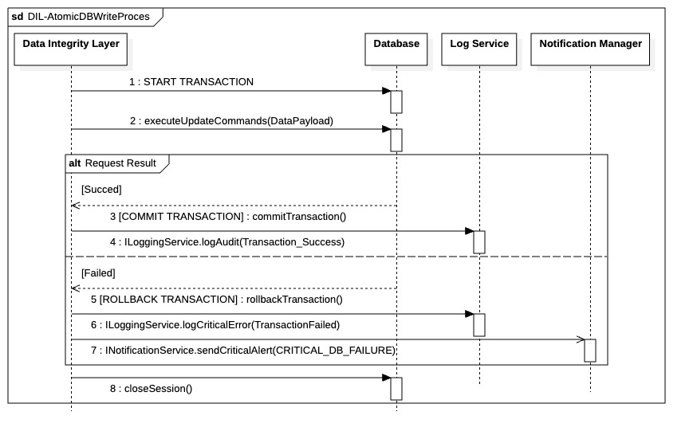

# `DIL-AtomicDBWriteProces` 

  

Ce fragment modélise le processus générique qui garantit la **persistance atomique** des données critiques dans votre système de trading. Son exécution est **synchrone** et se déroule au sein d'un *thread* du Job Manager, garantissant que les données sont intégralement écrites ou annulées.

## Flux de Travail et Garantie ACID

1.  **Démarrage Transactionnel :** Le **Data Integrity Layer (DIL)** initie la transaction avec la **Database** (`START TRANSACTION`).
2.  **Mise à Jour :** Le DIL envoie toutes les commandes de mise à jour nécessaires (`executeUpdateCommands`) au moteur de base de données. Ces changements sont tracés en mémoire par la session.
3.  **Arbitrage du Résultat :** Le DIL gère le flux avec une structure **Try/Except** :
    * **Succès :** Le DIL envoie la commande **`COMMIT TRANSACTION`**. Si l'écriture réussit, le DIL logue l'audit de succès.
    * **Échec :** Si une exception est levée (contrainte violée, panne), le DIL envoie la commande **`ROLLBACK TRANSACTION`**. Toutes les modifications faites depuis le démarrage de la transaction sont annulées. Le DIL logue l'erreur critique et alerte le Notification Manager.

## Gestion des Ressources (`closeSession`)

Pour garantir l'efficacité du pool de connexions, l'action de nettoyage de session est vitale :

* L'opération **`closeSession()`** est exécutée **après** le `COMMIT` ou le `ROLLBACK`.
* Cette méthode **relâche la session** et retourne la connexion physique au pool de connexions.
* Ceci est une étape indispensable qui empêche le système d'épuiser son pool de connexions disponibles, assurant ainsi la performance pour les jobs suivants.

| ID | Fonction / Message | Émetteur | Récepteur | Description |
|:---|:---|:---|:---|:---|
| 1 | START TRANSACTION | Data Integrity Layer | Database | Initialise une transaction atomique au niveau du moteur de base de données. |
| 2 | executeUpdateCommands(DataPayload) | Data Integrity Layer | Database | Envoie les instructions SQL de mise à jour (Insert/Update/Delete) basées sur le payload. |
| 3 | [COMMIT TRANSACTION] : commitTransaction() | Data Integrity Layer | Database | Valide et rend permanentes toutes les modifications de la transaction en cours. |
| 4 | ILoggingService.logAudit(Transaction_Success) | Data Integrity Layer | Log Service | Enregistre une trace d'audit confirmant le succès de l'opération de persistance. |
| 5 | [ROLLBACK TRANSACTION] : rollbackTransaction() | Data Integrity Layer | Database | Annule toutes les modifications effectuées depuis le START TRANSACTION en cas d'erreur. |
| 6 | ILoggingService.logCriticalError(TransactionFailed) | Data Integrity Layer | Log Service | Enregistre les détails de l'échec pour diagnostic technique immédiat. |
| 7 | INotificationService.sendCriticalAlert(CRITICAL_DB_FAILURE) | Data Integrity Layer | Notification Manager | Déclenche une alerte prioritaire (Email/SMS/Slack) suite à l'échec de l'écriture. |
| 8 | closeSession() | Data Integrity Layer | Database | Ferme la session et libère la connexion physique vers le pool de connexions (indispensable). |
