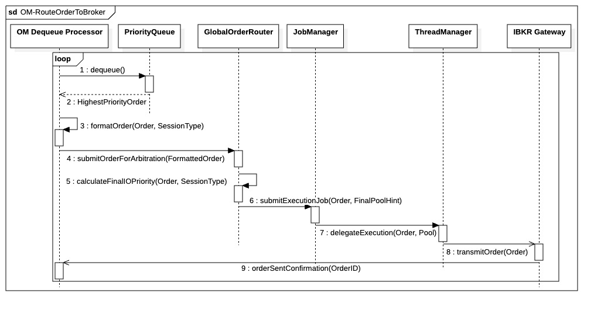

## `OM-RouteOrderToBroker`

  

---

### 1. Objectif

La finalité de ce processus est de garantir la **transmission physique et priorisée** des ordres de trading à la plateforme du courtier (`IBKR Gateway`), en appliquant une **politique de priorité globale** (Live avant Paper) et en utilisant les ressources I/O appropriées.

---

### 2. Contexte

Cette séquence est un processus asynchrone interne au module **`OrderManager`** et est déclenchée après l'insertion sécurisée d'un ordre dans la `PriorityQueue` locale. Elle représente l'exécution du routage et de la communication externe, gérée par le **Dequeue Processor** de l'OM. L'introduction du **`Global Order Router` (GOR)** dans cette séquence est nécessaire pour arbitrer les conflits de priorité entre les différentes sessions (Live vs. Paper) avant d'allouer des ressources I/O.

---

### 3. Logique Générale

Un thread de fond (le Dequeue Processor) dans l'`OrderManager` surveille la `PriorityQueue` locale et en extrait l'ordre de plus haute priorité **locale**. L'ordre, ainsi que son **Type de Session** (Live ou Paper), est ensuite soumis au **`Global Order Router` (GOR)**. Le GOR utilise cette priorité réévaluée pour solliciter le **`JobManager`** et le **`ThreadManager`**, garantissant que l'ordre est transmis par l'`IBKR Gateway` en utilisant le **Pool I/O** le plus adapté à sa priorité finale. L'état de l'ordre passe alors à `SUBMITTED` dès la confirmation de la passerelle.

---

### 4. Règles Critiques

* **Priorité d'Arbitrage :** La règle de super-priorité du GOR doit être respectée de manière absolue : tous les ordres d'une session Live doivent être routés avant tous les ordres de même priorité logique d'une session Paper.
* **Isolation I/O :** Le `JobManager` doit allouer la tâche à un **Pool I/O dédié** (Pool I/O Critical ou autre) en fonction de la priorité finale décidée par le GOR. Cela isole les communications rapides des opérations de fond.
* **Statut de l'Ordre :** L'état de l'ordre passe de `PENDING_QUEUE` à un état de transmission (`SUBMITTED`) uniquement après que l'`IBKR Gateway` ait confirmé que l'ordre a quitté le système.
* **Asynchronisme :** L'intégralité du routage est un processus asynchrone qui ne doit jamais bloquer les threads de décision (PM ou RM). L'exécution du routage est pilotée par le thread de fond du Dequeue Processor. L’état SUBMITTED n’est pas persisté localement. La confirmation broker constitue la première preuve durable d’existence de l’ordre hors système.

---

### 5. Conclusion

Le module garantit l'exécution des ordres dans le respect strict des priorités logiques et architecturales. Il s'assure que les ordres sont non seulement priorisés au niveau de la session locale, mais aussi correctement arbitrés au niveau global pour favoriser les cycles de test sans compromettre l'urgence des ordres réels.

---

| ID | Fonction / Message | Émetteur | Récepteur | Description |
|:---|:---|:---|:---|:---|
| 1 | dequeue() | OM Dequeue Processor | PriorityQueue | Extrait l'ordre ayant la priorité locale la plus élevée de la file d'attente interne. |
| 2 | HighestPriorityOrder | PriorityQueue | OM Dequeue Processor | Retourne l'objet Order sélectionné au processeur pour traitement. |
| 3 | formatOrder(Order, SessionType) | OM Dequeue Processor | OM Dequeue Processor | Prépare les données de l'ordre et injecte le contexte de session (Live/Paper). |
| 4 | submitOrderForArbitration(FormattedOrder) | OM Dequeue Processor | GlobalOrderRouter | Transmet l'ordre au routeur global pour arbitrage des priorités inter-sessions. |
| 5 | calculateFinalIOPriority(Order, SessionType) | GlobalOrderRouter | GlobalOrderRouter | Applique la règle de super-priorité : les sessions Live priment sur le Paper. |
| 6 | submitExecutionJob(Order, FinalPoolHint) | GlobalOrderRouter | JobManager | Soumet une tâche d'exécution asynchrone avec une directive de pool spécifique. |
| 7 | delegateExecution(Order, Pool) | JobManager | ThreadManager | Alloue le job au Pool I/O (Critical ou Standard) selon la priorité arbitrée. |
| 8 | transmitOrder(Order) | ThreadManager | IBKR Gateway | Exécute la transmission physique de l'ordre vers l'API du courtier. |
| 9 | orderSentConfirmation(OrderID) | IBKR Gateway | OM Dequeue Processor | Confirme que l'ordre a quitté le système, déclenchant le passage au statut SUBMITTED. |

---

### 6. Ports et Interfaces

**IOrderManagerControl**
* **Implémenté par** : `OrderManager`
* **Injecté dans / Utilisé par** : `OrderManager` (Boucle interne / Dequeue Processor)
* **Responsabilité opérationnelle** : Extraction (`dequeue`) et séquençage des ordres depuis la `PriorityQueue` vers la logique de routage.
* **Règles d’accès ou d’usage** : Consommation priorisée. Assure qu'aucun ordre n'est perdu entre la file d'attente locale et l'envoi technique.

**IJobSubmissionPort**
* **Implémenté par** : `Job Manager`
* **Injecté dans / Utilisé par** : `GlobalOrderRouter` (via le message 6 : `submitExecutionJob`)
* **Responsabilité opérationnelle** : Point d'entrée unique pour la soumission de tâches asynchrones (Jobs d'exécution). Découple l'arbitrage du routage de l'exécution physique.
* **Règles d’accès ou d’usage** : Appel **non-bloquant**. Doit inclure le pool cible (`FinalPoolHint`) pour l'arbitrage par le Thread Manager.

**BrokerGatewayPort**
* **Implémenté par** : Gateway externe (`IBKR Gateway`)
* **Injecté dans / Utilisé par** : `ThreadManager` / `OrderManager`
* **Responsabilité opérationnelle** : Transmission technique des ordres au courtier (message 8 : `transmitOrder`) et retour des confirmations (message 9).
* **Règles d’accès ou d’usage** : Encapsulation totale. Aucun accès direct par les modules de décision (PM/RM).

**IGlobalOrderRouter**
* **Implémenté par** : `GlobalOrderRouter` (GOR)
* **Injecté dans / Utilisé par** : `OrderManager` (Dequeue Processor)
* **Responsabilité opérationnelle** : Arbitrage inter-sessions (Live vs Paper). Reçoit l'ordre formaté et calcule la priorité finale de routage I/O.
* **Règles d’accès ou d’usage** : Doit appliquer la règle de super-priorité (Live avant Paper). Fournit le `FinalPoolHint` nécessaire au JobManager.

**IThreadDelegatePort**
* **Implémenté par** : `ThreadManager`
* **Injecté dans / Utilisé par** : `JobManager`
* **Responsabilité opérationnelle** : Allocation d'un thread spécifique depuis le pool désigné (CRITICAL, STANDARD, BULK) pour exécuter la transmission physique.
* **Règles d’accès ou d’usage** : Utilisation de pools isolés pour garantir que les flux "Paper" ne saturent pas les ressources "Live".

**IOrderFormatter**
* **Implémenté par** : `OrderManager` (ou un ProtocolAdapter dédié)
* **Injecté dans / Utilisé par** : `OrderManager` (Dequeue Processor)
* **Responsabilité opérationnelle** : Traduction de l'objet `Order` interne vers le format propriétaire du courtier (message 3 : `formatOrder`).
* **Règles d’accès ou d’usage** : Purement transformationnel (stateless). Doit supporter différents `SessionTypes`.

---

### NOTE

* **Pureté de l'Exécution (Choix Architectural)**
La séquence est volontairement limitée à l'exécution "In-Memory" sans écriture DB pour minimiser la latence ; la persistance et le logging sont délégués aux étapes de préparation (amont) et de retour broker (aval).
* **Gestion des Timeouts et Orphelins**
Le `ThreadManager` doit implémenter un mécanisme de notification vers le superviseur en cas d'échec de socket ou d'absence de réponse du message 8, évitant ainsi que l'ordre ne reste bloqué indéfiniment.
* **Idempotence et Redémarrage**
L'intégrité du système repose sur l'unicité du `clientOrderID` généré en amont, garantissant qu'en cas de crash du `Dequeue Processor`, aucun ordre déjà transmis ne puisse être exécuté en double par le broker.
* **Broker-Centric Truth**
Le broker est la seule source de vérité temps réel ; la base de données n’est qu’une projection retardée mise à jour à partir des ACK broker. Cette approche impose une réconciliation au démarrage, la détection d’ordres orphelins par timeout (état `UNKNOWN_TRANSMISSION`) et un audit basé exclusivement sur les confirmations broker, garantissant performance et résilience sans compromis.
* **Verrouillage "In-Flight" :** Dès l'acquittement transport (Message 9), notifier l'EventBus pour marquer l'ordre comme "en cours" en RAM et empêcher le PM de le ré-émettre au snapshot suivant.
* **Résilience Socket :** Tout échec de transmission physique (Message 8) doit lever une alerte `SYSTEM_CRITICAL` immédiate et geler l'ordre pour éviter toute perte ou corruption du flux I/O.
