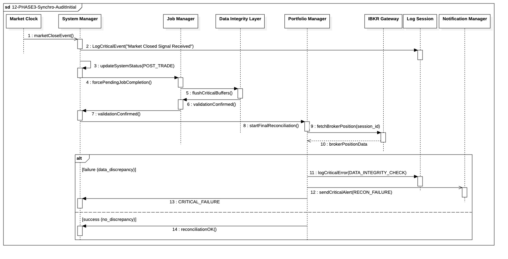

## `12-PHASE3-Synchro-AuditInitial`

  

---

### 1. Objectif

La finalité de ce module est de garantir l'**intégrité totale et l'atomicité** de l'état du système à la clôture du marché, en synchronisant la fin de toutes les opérations d'exécution pour permettre le démarrage sécurisé de la phase d'audit.

---

### 2. Contexte

Ce module est le **point de transition critique** entre la Phase II (In-Trade) et la Phase III (Post-Trade). Déclenché par le signal de fermeture du marché (`marketCloseEvent`), il existe pour **geler** l'état du système et **vérifier la cohérence** des données financières avant toute analyse ou calcul stratégique. Il est le garant de la fiabilité des audits post-trade.

---

### 3. Logique Générale

Le processus est initié par le `SystemManager` recevant l'événement de fermeture. Il procède en deux étapes principales :

1. **Synchronisation Forcée** 
   Le `SystemManager` ordonne au `JobManager` de **bloquer** l'exécution jusqu'à ce que tous les I/O critiques en cours soient **atomiquement confirmés** par le `DIL`.

2. **Réconciliation Typée**
   Le `PortfolioManager` récupère l'état final auprès du courtier (`IBKR Gateway`) et le compare avec l'état interne gelé.
   Cette comparaison retourne désormais un **statut typé**, permettant trois chemins explicites :

   * **RECONCILED_OK** : cohérence fonctionnelle atteinte (écarts négligeables ou arrondis).
   * **DEGRADED_OK** : écarts mesurés mais tolérés (différences de quantité dans une marge définie).
   * **CRITICAL_FAILURE** : incohérence bloquante (instrument manquant, position inversée, écart hors seuil).

Seul le statut **CRITICAL_FAILURE** empêche la poursuite du workflow Post-Trade.

---

### 4. Règles Critiques

* **Atomicité Précédente**
  L'audit ne peut démarrer qu'après confirmation explicite du `DIL`.

* **Log de Transition**
  Le `marketCloseEvent` est journalisé de manière synchrone.

* **Gestion de la Gravité**
  La réconciliation finale doit classifier l’écart selon trois niveaux :

  * **CRITICAL_FAILURE** : arrêt immédiat du workflow stratégique.
  * **DEGRADED_OK** : poursuite contrôlée avec log d’anomalie et alerte humaine.
  * **RECONCILED_OK** : poursuite nominale sans action corrective.

* **Tolérance Paramétrée**
  Les seuils de tolérance (quantité, arrondis, micro-écarts) sont **définis statiquement** et versionnés pour audit.

---

### 5. Conclusion

Ce module garantit que le passage en Phase III s’effectue sur un **état final cohérent, qualifié et auditable**.
L’introduction de niveaux de gravité explicites renforce la **résilience opérationnelle**, évite les arrêts excessifs et améliore l’exploitabilité post-incident sans compromettre l’intégrité financière.

---

|ID|Fonction/Message|Émetteur|Récepteur|Description|
|:---|:---|:---|:---|:---|
|1|marketCloseEvent()|Market Clock|System Manager|Signal de clôture déclenchant la fin de la session de trading.|
|2|LogCriticalEvent("Market Closed...")|System Manager|Log Session|Journalisation synchrone immédiate de l'événement de fermeture.|
|3|updateSystemStatus(POST_TRADE)|System Manager|System Manager|Changement interne d'état pour verrouiller les fonctions In-Trade.|
|4|forcePendingJobCompletion()|System Manager|Job Manager|Commande de vidage des files d'attente pour finaliser les tâches en cours.|
|5|flushCriticalBuffers()|Job Manager|Data Integrity Layer|Ordre de persistance immédiate des buffers de données critiques.|
|6|validationConfirmed()|Data Integrity Layer|Job Manager|Confirmation que toutes les écritures atomiques sont sécurisées en DB.|
|7|validationConfirmed()|Job Manager|System Manager|Notification globale de la fin de la synchronisation I/O.|
|8|startFinalReconciliation()|System Manager|Portfolio Manager|Déclenchement de la procédure de vérification des positions finales.|
|9|fetchBrokerPosition(session_id)|Portfolio Manager|IBKR Gateway|Requête externe pour récupérer l'inventaire réel chez le courtier.|
|10|brokerPositionData|IBKR Gateway|Portfolio Manager|Retour des données d'inventaire du courtier.|
|11|logCriticalError(DATA_INTEGRITY...)|Portfolio Manager|Log Session|Enregistrement d'un écart entre le local et le broker (chemin Failure).|
|12|sendCriticalAlert(RECON_FAILURE)|Portfolio Manager|Notification Manager|Alerte asynchrone pour intervention humaine immédiate.|
|13|CRITICAL_FAILURE|Portfolio Manager|System Manager|Signal d'arrêt du workflow suite à une corruption ou un écart de données.|
|14|reconciliationOK()|Portfolio Manager|System Manager|Confirmation de cohérence permettant la suite du cycle Post-Trade.|

---

### 6. Ports et Interfaces

**IProcessControlPort**
* **Implémenté par** : `Runtime Environment` / `System Manager`
* **Injecté dans / Utilisé par** : `System Manager`
* **Responsabilité opérationnelle** : Gérer les transitions d'état de vie du processus, notamment le passage à l'état `POST_TRADE` (Message 3) ou l'arrêt immédiat via `systemStop(CRITICAL_ERROR)` en cas d'échec de réconciliation (Message 13).
* **Règles d’accès ou d’usage** : L'appel doit être atomique et garantir la fermeture des descripteurs de fichiers ouverts lors d'un arrêt forcé.

**IJobSubmissionPort**
* **Implémenté par** : `Job Manager`
* **Injecté dans / Utilisé par** : `System Manager`
* **Responsabilité opérationnelle** : Permettre au System Manager de commander la finalisation forcée des tâches en cours via `forcePendingJobCompletion()` (Message 4).
* **Règles d’accès ou d’usage** : Dans cette séquence de clôture, l'appel est utilisé pour vider les files asynchrones et assurer que plus aucun job "In-Trade" ne sature les ressources durant l'audit.

**PersistencePort**
* **Implémenté par** : Data Integrity Layer (DIL) / AtomicDBWriteProcess
* **Utilisé par** : `Job Manager`
* **Responsabilité opérationnelle** : Exécuter le vidage physique des buffers critiques (`flushCriticalBuffers`, Message 5) pour garantir que l'audit porte sur des données persistées.
* **Règles d’accès ou d’usage** : Transactions atomiques obligatoires. L'audit ne peut démarrer qu'après la confirmation de cette couche.

**BrokerGatewayPort**
* **Implémenté par** : Gateway externe (IBKR)
* **Utilisé par** : `Portfolio Manager`
* **Responsabilité opérationnelle** : Fournir l'accès aux données réelles du courtier via `fetchBrokerPosition` (Message 9) pour comparaison avec l'état interne.
* **Règles d’accès ou d’usage** : Encapsulation totale. Le Portfolio Manager utilise ce port uniquement pour la lecture de l'inventaire final.

**INotificationService**
* **Implémenté par** : AlertingService (Email, SMS, PagerDuty)
* **Utilisé par** : `Portfolio Manager`
* **Responsabilité opérationnelle** : Envoi immédiat d'alertes critiques (`RECON_FAILURE`, Message 12) aux opérateurs humains en cas d'écart de données.
* **Règles d’accès ou d’usage** : Usage strictement limité aux erreurs de sévérité CRITICAL ou FATAL détectées lors de la réconciliation.

**IDataIntegrityCheckPort**
* **Implémenté par** : `PortfolioManager`  
* **Utilisé par** : `System Manager`
* **Responsabilité** : Exécute la **réconciliation finale Post-Trade** entre l’état interne gelé (via DIL) et l’état réel du broker (IBKR) avant le démarrage de l’audit.
**Statuts de retour** :
  * **RECONCILED_OK** : cohérence atteinte, écarts négligeables.
  * **DEGRADED_OK** : écart toléré (dans un seuil défini), poursuite avec alerte.
  * **CRITICAL_FAILURE(FailureCode)** : incohérence bloquante, arrêt immédiat.
**Règles d’usage** :
  * Appel autorisé uniquement après `validationConfirmed`.
  * État strictement en lecture (système gelé).
  * Seuils de tolérance statiques, auditables.
  * Toute sortie ≠ `RECONCILED_OK` est journalisée synchronement.

---

### NOTE 

* **Timeout :** L'appel fetchBrokerPosition doit intégrer une limite temporelle stricte ; en cas de dépassement, le système doit lever une alerte de connectivité et stopper l'audit.

