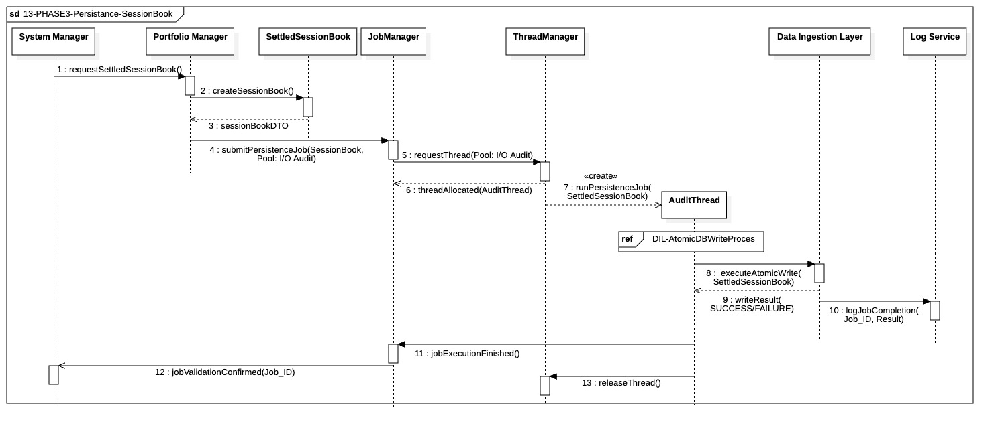

## `13-PHASE3-Persistance-SessionBook`

  

---

### 1. Objectif

La finalité de ce module est d'assurer l'**enregistrement atomique et auditable** des résultats financiers définitifs de la journée (Position finale, PnL, ...) dans l'objet `SettledSessionBook`. Ce processus crée la **source de vérité** de la performance de la session.

---

### 2. Contexte

Ce module s'inscrit immédiatement après la validation de l'intégrité des données lors de l'Audit Initial (Étape 12). Il est crucial car il **prépare les données nécessaires** au calcul stratégique du prochain rebalancement (Phase IV - Pre-Market Setup). Contrairement aux enregistrements en temps réel (Fills), celui-ci est un enregistrement d'état global unique qui ne peut être exécuté qu'une seule fois à la clôture.

---

### 3. Logique Générale

Le `SystemManager` donne l'ordre au `PortfolioManager` de **cristalliser** son état en mémoire. Le `PortfolioManager` génère alors le DTO (`SettledSessionBook`) et le soumet au `JobManager`. Ce dernier alloue une ressource d'exécution (`AuditThread`) provenant du **Pool I/O Audit** pour garantir la priorité. Le thread exécute l'écriture via le `DIL` qui, en utilisant le processus **`DIL-AtomicDBWriteProces`**, garantit une transaction ACID (tout ou rien). Une fois l'écriture réussie et confirmée, le `JobManager` émet un signal au `SystemManager` pour débloquer la suite du cycle.

---

### 4. Règles Critiques

* **Dépendance Strict :** Ce module ne se lance que si l'Audit Initial (Étape 12) a réussi sans erreur critique.
* **Pool d'Isolation :** L'écriture doit obligatoirement utiliser le **Pool I/O Audit** pour s'assurer qu'elle n'est pas retardée par des tâches I/O moins critiques.
* **Garantie ACID :** L'exécution de la persistance doit impérativement utiliser le fragment `DIL-AtomicDBWriteProces` pour s'assurer que l'enregistrement du livre de compte final est **atomique** et que la connexion est relâchée après le `COMMIT` ou le `ROLLBACK`.
* **Validation de Flux :** Le `SystemManager` attend le signal **asynchrone** de `jobValidationConfirmed` pour considérer le module achevé, et non le simple retour de l'appel de soumission du job.

---

### 5. Conclusion

Ce module garantit que l'état financier de la session est **enregistré de manière sûre, complète et auditable** avant d'entamer la phase d'analyse et de planification du jour suivant. Il est le point de vérité pour le PnL final.

---

| ID | Fonction / Message | Émetteur | Récepteur | Description |
|:---|:---|:---|:---|:---|
| 1 | requestSettledSessionBook() | System Manager | Portfolio Manager | Ordre de cristallisation de l'état financier final basé sur la réconciliation broker effectuée en étape 12. |
| 2 | createSessionBook() | Portfolio Manager | SettledSessionBook | Instanciation de l'objet bilan. Les positions sont alignées sur la "Golden Source" du courtier. |
| 3 | sessionBookDTO(UID, State) | SettledSessionBook | Portfolio Manager | Génération du DTO incluant l'ID unique (PortfolioID + Date) pour garantir l'idempotence au niveau du DIL. |
| 4 | submitPersistenceJob(...) | Portfolio Manager | JobManager | Envoi de la tâche au pool "I/O Audit" pour isoler cette écriture critique des flux de trading. |
| 5 | requestThread(Pool: I/O Audit) | JobManager | ThreadManager | Demande d'allocation d'un thread prioritaire pour l'audit de fin de session. |
| 6 | threadAllocated(AuditThread) | ThreadManager | JobManager | Confirmation de l'assignation d'une ressource d'exécution dédiée. |
| 7 | runPersistenceJob(...) | JobManager | AuditThread | Lancement de la procédure de persistance sur le thread alloué. |
| 8 | executeAtomicWrite(...) | AuditThread | Data Ingestion Layer | Appel au DIL. Le système vérifie l'unicité de l'UID avant de déclencher la transaction ACID. |
| 9 | writeResult(SUCCESS/FAILURE) | Data Ingestion Layer | AuditThread | Retour du statut de l'écriture (Commit réussi ou Rollback en cas d'erreur/doublon). |
| 10 | logJobCompletion(Job_ID, FAIL, Details) | AuditThread | Log Service | [Branche Failure] Journalisation immédiate de l'échec technique avec détails pour audit. |
| 11 | jobExecutionFinished(ERROR) | AuditThread | JobManager | [Branche Failure] Notification au manager que la tâche a échoué. |
| 12 | notifyPersistenceError(Job_ID, Code) | JobManager | System Manager | [Branche Failure] Alerte à l'orchestrateur : la source de vérité financière n'a pas pu être sauvegardée. |
| 13 | sendCriticalAlert(SESSION_BOOK_FAIL) | JobManager | Notification Manager | [Branche Failure] Déclenchement d'une alerte externe (SMS/Pager) pour action humaine urgente. |
| 14 | logJobCompletion(Job_ID, SUCCESS, Hash) | AuditThread | Log Service | [Branche Success] Journalisation de la réussite avec empreinte numérique (Hash) du SessionBook. |
| 15 | jobExecutionFinished() | AuditThread | JobManager | [Branche Success] Notification de fin de tâche nominale. |
| 16 | jobValidationConfirmed(Job_ID) | JobManager | System Manager | [Branche Success] Signal de déblocage permettant de passer à la suite du workflow Post-Trade. |
| 17 | releaseThread() | AuditThread | ThreadManager | Libération de la ressource et retour du thread dans le pool I/O Audit. |

---

### NOTE 

* **Gestion du Failure Job :**
  * Retry avec Exponential Backoff : Ne pas retenter immédiatement. Programmer 3 tentatives avec un délai croissant (ex: 1s, 5s, 30s).
  * Circuit Breaker : Si les 3 tentatives échouent, le JobManager doit basculer le statut en CRITICAL_STALL. Au lieu de retenter, il déclenche une alerte via le NotificationManager.
  * Mode "Emergency Local Dump" : En cas d'échec persistant en base de données, le thread d'audit tente d'écrire le SessionBookDTO dans un fichier plat local (JSON/CSV). Cela permet au SystemManager de confirmer la fermeture tout en laissant une trace physique pour une récupération manuelle le lendemain. 
