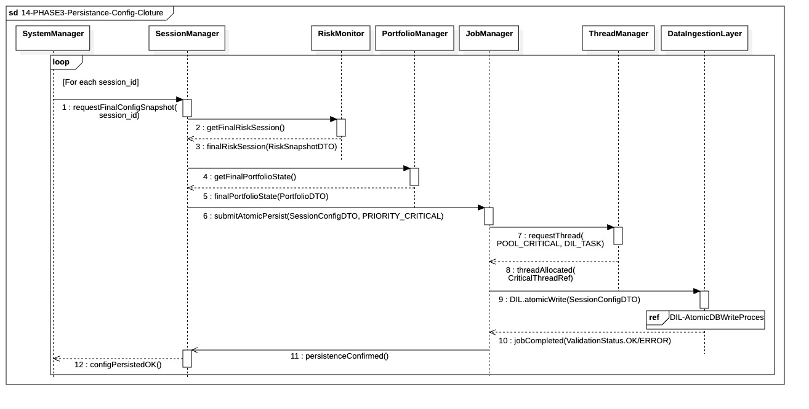

## `14-PHASE3-Persistance-Config-Cloture`

  

---

### 1. Objectif

Ce module a pour finalité d'enregistrer l'**État de Reprise (Configuration de Clôture)** du système. Il garantit la persistance atomique des métadonnées de la session pour assurer un redémarrage sécurisé et intègre lors du prochain *bootstrapping* (Phase I).

---

### 2. Contexte

Ce processus s'inscrit dans la **Phase III (Post-Trade)**, se concentrant sur la sauvegarde des **règles**. Il est essentiel pour distinguer les données d'audit financier de la configuration opérationnelle. Son exécution est un prérequis critique pour la transition vers l'arrêt sécurisé (Étape 15).

---

### 3. Logique Générale

Le **System Manager** déclenche le **Session Manager**, qui orchestre la collecte des configurations de reprise auprès des trois managers métiers : **Risk Monitor (RM)**, **Portfolio Manager (PM)** et **Order Manager (OM)**. Ces configurations (`RiskManagerConfigDTO`, `PortfolioManagerConfigDTO`, `OrderManagerConfigDTO`) sont agrégées dans un unique objet **`SessionConfigDTO`**. Ce DTO est ensuite soumis au **Job Manager** pour une exécution atomique via le **Data Integrity Layer (DIL)**, en utilisant obligatoirement un thread du **Pool I/O Critique**.

---

### 4. Règles Critiques

* **Cohérence de Reprise :** L'écriture doit inclure les métadonnées des trois managers (RM, PM, OM) pour garantir une vision complète des règles actives au moment de l'arrêt.
* **Priorité I/O et Atomicité :** La persistance doit être exécutée avec la plus haute priorité et de manière atomique (tout ou rien) grâce au processus DIL, assurant que l'état de la configuration est intégralement enregistré ou annulé.
* **Dépendance Fatale :** Le **System Manager** ne peut jamais progresser vers l'arrêt sécurisé (Étape 15) tant que la validation réussie de cette écriture critique n'a pas été confirmée par le Session Manager. En cas d'échec du `COMMIT`, une alerte fatale est levée.
* **Isolation :** Cette étape vise à enregistrer uniquement les *configs* (règles de démarrage/protection), et non l'état financier (géré en Étape 13).

---

### 5. Conclusion

Le module **14-PHASE3-Persistance-Config-Cloture** garantit l'établissement d'un **point de vérité immuable** pour la configuration du moteur de trading. Il est la vérification finale que les paramètres de sécurité et les compteurs internes ont été correctement verrouillés, permettant un redémarrage du système dans un état d'intégrité opérationnelle absolue.

---

|ID|Fonction/Message|Émetteur|Récepteur|Description|
|:---|:---|:---|:---|:---|
|1|requestFinalConfigSnapshot(session_id)|SystemManager|SessionManager|Initialise le processus de clôture pour une session spécifique.|
|2|getRiskManagerConfig()|SessionManager|RiskMonitor|Collecte les paramètres de risque actifs (seuils, limites).|
|3|getOrderManagerConfig()|SessionManager|OrderManager|Récupère l'état des compteurs et des séquences d'ordres.|
|4|getPortfolioManagerConfig()|SessionManager|PortfolioManager|Récupère les pondérations et allocations du portefeuille.|
|5|mapToEntity(RiskDTO,OrderDTO,PortDTO)|SessionManager|SessionManager|Mapping interne et consolidation des DTO en une Entité technique unique.|
|6|logClosureWarning(Report)|SessionManager|LogService|Enregistre un bilan de santé si des données de config sont manquantes.|
|7|sendCriticalAlert(REPORT_INCOMPLETE)|SessionManager|NotificationManager|Alerte les opérateurs d'une clôture avec des données partielles.|
|8|submitAtomicPersist(SessionConfigEntity, PRIORITY_CRITICAL)|SessionManager|JobManager|Soumission asynchrone de l'entité pour persistance prioritaire.|
|9|requestThread(POOL_CRITICAL,DIL_TASK)|JobManager|ThreadManager|Demande d'allocation d'un thread dédié au pool d'Audit/IO.|
|10|threadAllocated(CriticalThreadRef)|ThreadManager|JobManager|Confirmation de l'allocation d'une ressource de calcul pour l'IO.|
|11|DIL.atomicWrite(SessionConfigEntity)|JobManager|DataIngestionLayer|Tentative d'écriture transactionnelle en base de données.|
|12|jobCompleted(ValidationStatus.OK/ERROR)|DataIngestionLayer|JobManager|Retour de l'état d'exécution (déclenche le fallback interne si ERROR).|
|13|persistenceConfirmed(Status)|JobManager|SessionManager|Confirmation finale du stockage (Nominal ou Dégradé/Local Dump).|
|14|configPersistedOK()|SessionManager|SystemManager|Signal final autorisant l'arrêt physique sécurisé du moteur.|

---

