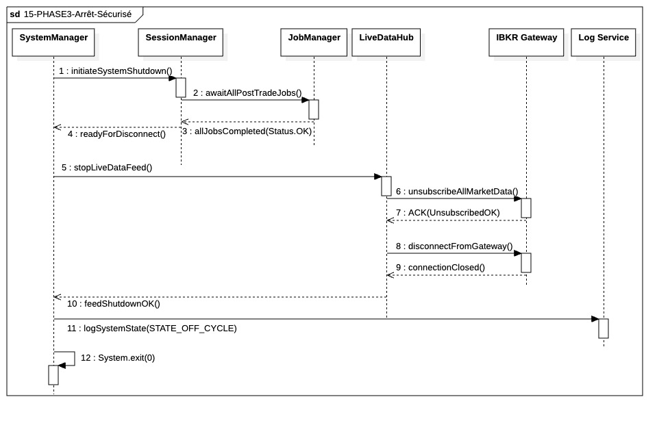

## `15-PHASE3-Arrêt-Sécurisé`

  

---

### 1. Objectif

Ce module a pour finalité de réaliser l'**extinction ordonnée** de l'application de trading. Il garantit que toutes les opérations critiques de la Phase III sont terminées, que les connexions externes sont fermées proprement, et que le processus logiciel est arrêté, laissant le système dans l'état sécurisé et auditable **`OFF_CYCLE`**.

---

### 2. Contexte

Ceci est la dernière étape de la **Phase III (Post-Trade)**. Elle s'exécute uniquement après que le **System Manager** a reçu la confirmation que les persistances atomiques du SessionBook (Étape 13) et de la persitance des configurations (Étape 14) ont réussi. Le but est de passer de l'état actif de clôture à l'état inactif (éteint) en minimisant les risques de données résiduelles en mémoire ou de connexions réseau actives.

---

### 3. Logique Générale

Le **System Manager (SM)** initie la séquence en ordonnant au **Session Manager** d'attendre la complétion des derniers jobs I/O en cours via le **Job Manager**. Une fois que la couche métier est stable et que tous les threads I/O sont terminés, le SM prend la main pour l'arrêt des ressources globales. Il ordonne au **LiveDataHub (LDH)** de se désabonner des flux de prix (via l'**IBKR Gateway**) puis de couper la connexion physique. Une fois la déconnexion confirmée, le SM enregistre l'état final (`OFF_CYCLE`) dans le **Logger** et procède à l'**Arrêt du Processus** logiciel de l'application.

---

### 4. Règles Critiques

* **Précondition Stricte :** Le processus d'arrêt ne doit pas commencer tant que la complétion des jobs Post-Trade est confirmée, garantissant que les écritures critiques ne sont pas interrompues.
* **Ordre de Déconnexion :** La déconnexion doit être propre et hiérarchique : désabonnement avant coupure de la connexion physique.
* **Timeout Sévère :** Un délai d'attente court et fixe doit être appliqué à l'attente des derniers jobs I/O. Si ce délai est dépassé, l'arrêt doit basculer vers une erreur critique (`Timeout`) et forcer l'extinction immédiate pour éviter un état indéfini.
* **Auditabilité :** La transition finale vers l'état `OFF_CYCLE` doit être enregistrée de manière asynchrone dans le journal du système (Logger) juste avant l'arrêt physique du processus.

---

### 5. Conclusion

Le module **15-PHASE3-Arrêt-Sécurisé** est le garant de la **propreté de l'extinction**. Il s'assure qu'au moment où l'application est éteinte, toutes les données de reprise nécessaires sont sécurisées et que les ressources externes (flux de marché, connexions API) ont été libérées selon les protocoles établis.

---

|ID|Fonction/Message|Émetteur|Récepteur|Description|
|:---|:---|:---|:---|:---|
|1|initiateSystemShutdown()|SystemManager|SessionManager|Déclenche la procédure d'arrêt ordonné du cycle de vie session.|
|2|awaitAllPostTradeJobs()|SessionManager|JobManager|Demande de barrière pour attendre la fin des écritures I/O Post-Trade.|
|3|allJobsCompleted(Status.OK)|JobManager|SessionManager|Confirmation que tous les threads I/O (DIL/Audit) sont libérés.|
|4|readyForDisconnect()|SessionManager|SystemManager|Signal indiquant que la couche métier est gelée et persistée.|
|5|stopLiveDataFeed()|SystemManager|LiveDataHub|Ordre d'arrêt des services de données de marché en temps réel.|
|6|unsubscribeAllMarketData()|LiveDataHub|IBKR Gateway|Envoi des requêtes de résiliation d'abonnements via l'API broker.|
|7|ACK(UnsubscribedOK)|IBKR Gateway|LiveDataHub|Confirmation logique du désabonnement des flux de prix.|
|8|disconnectFromGateway()|LiveDataHub|IBKR Gateway|Fermeture physique de la socket TCP/API avec le courtier.|
|9|connectionClosed()|IBKR Gateway|LiveDataHub|Confirmation de la rupture de la liaison externe.|
|10|feedShutdownOK()|LiveDataHub|SystemManager|Signal de libération totale des ressources réseau.|
|11|logSystemState(STATE_OFF_CYCLE)|SystemManager|Log Service|Enregistrement final du statut immuable de l'application.|
|12|System.exit(0)|SystemManager|SystemManager|Appel réflexif au runtime OS pour tuer le processus logiciel.|
