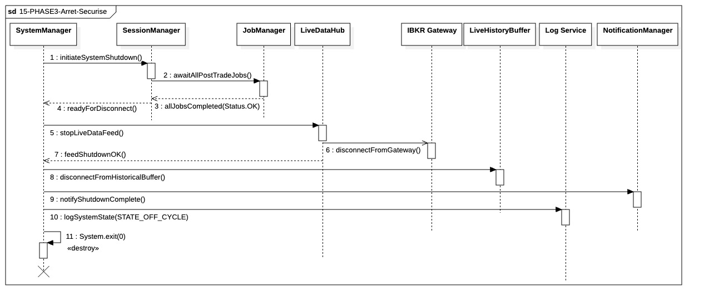

## `15-PHASE3-Arrêt-Sécurisé`

  

---

### 1. Objectif

Ce module assure l'**extinction ordonnée** de l'application de trading. Il garantit la libération des ressources réseau sans blocage, le nettoyage intégral de la mémoire vive du singleton **Live History Buffer (LHB)**, et l'arrêt physique du processus après l'enregistrement d'un état final auditable **`OFF_CYCLE`**.

---

### 2. Contexte

Dernière étape de la **Phase III (Post-Trade)**, cette séquence s'exécute après la confirmation des persistances critiques des sessions et des configurations. Le passage à l'état éteint est orchestré pour éliminer tout risque de "Ghost Threads" (threads fantômes) ou de données résiduelles en RAM qui pourraient corrompre un redémarrage ultérieur.

---

### 3. Logique Générale

1. **Synchronisation Finale :** Le **System Manager (SM)** ordonne au **Session Manager** de valider que le **Job Manager** a terminé tous les threads I/O et persistances atomiques.
2. **Rupture Réseau Agile :** Une fois le gel métier confirmé, le SM commande au **LiveDataHub (LDH)** de rompre les liaisons avec l'**IBKR Gateway**. Cette déconnexion utilise une stratégie **"Fire-and-forget"** : le désabonnement et la coupure de socket sont envoyés de manière asynchrone pour éviter qu'une latence du broker ne bloque l'extinction du système.
3. **Nettoyage Singleton (LHB) :** Le SM commande la libération explicite des structures de données du **Live History Buffer** pour vider proprement la mémoire vive intraday.
4. **Extinction Auditable :** Le système envoie une notification finale de clôture, enregistre l'état `OFF_CYCLE` par un flush synchrone dans le logger, puis procède à la destruction du processus via l'appel système `exit(0)`.

---

### 4. Règles Critiques

* **Précondition de Persistance :** Aucune déconnexion ne peut débuter avant le signal `allJobsCompleted(Status.OK)`, garantissant l'intégrité des données sur disque.
* **Timeout Sévère :** Un délai d'attente court et fixe doit être appliqué à l'attente des derniers jobs I/O. Si ce délai est dépassé, l'arrêt doit basculer vers une erreur critique (`Timeout`) et forcer l'extinction immédiate pour éviter un état indéfini.
* **Stratégie Non-Bloquante :** La déconnexion Gateway ne doit pas attendre d'accusé de réception (`ACK`) externe. La priorité est donnée à la clôture locale pour respecter les fenêtres de maintenance.
* **Libération Mémoire :** L'appel `disconnectFromHistoricalBuffer()` est obligatoire pour notifier les observateurs et nettoyer les caches immuables avant l'arrêt.
* **Flush Synchrone :** L'enregistrement du statut final doit être bloquant pour garantir que la ligne `OFF_CYCLE` est physiquement écrite sur le support avant que le processus ne soit tué.

---

### 5. Conclusion

Ce module garantit une extinction déterministe en libérant les ressources réseau via une stratégie fire-and-forget et en purgeant intégralement la mémoire vive du `Live History Buffer`. Il assure ainsi qu'au moment de l'arrêt physique du processus, toutes les données critiques sont sécurisées et le système est laissé dans un état OFF_CYCLE propre, prêt pour un redémarrage sans résidus.

---

|ID|Fonction/Message|Émetteur|Récepteur|Description|
|:---|:---|:---|:---|:---|
|1|initiateSystemShutdown()|SystemManager|SessionManager|Déclenche la procédure d'extinction ordonnée après la clôture des marchés.|
|2|awaitAllPostTradeJobs()|SessionManager|JobManager|Vérifie la complétion de tous les threads I/O et persistances atomiques en cours.|
|3|allJobsCompleted(Status.OK)|JobManager|SessionManager|Confirmation que la file d'attente des jobs critiques est vide et sécurisée.|
|4|readyForDisconnect()|SessionManager|SystemManager|Signal autorisant le début de la déconnexion des ressources externes.|
|5|stopLiveDataFeed()|SystemManager|LiveDataHub|Ordre de fermeture des flux de données de marché en temps réel.|
|6|disconnectFromGateway()|LiveDataHub|IBKR Gateway|Désabonnement et fermeture de socket asynchrone sans attente de retour (Fire-and-forget).|
|7|feedShutdownOK()|LiveDataHub|SystemManager|Confirmation interne que les ressources réseau du hub ont été libérées.|
|8|disconnectFromHistoricalBuffer()|SystemManager|LiveHistoryBuffer|Libération explicite de la mémoire vive du singleton contenant l'historique intraday.|
|9|notifyShutdownComplete()|SystemManager|NotificationManager|Envoi d'une alerte finale asynchrone signalant la clôture propre de la session.|
|10|logSystemState(STATE_OFF_CYCLE)|SystemManager|Log Service|Journalisation synchrone (Flush) de l'état final immuable du système.|
|11|System.exit(0)|SystemManager|SystemManager|Appel réflexif au runtime pour détruire le processus logiciel («destroy»).|

---

### 6. Ports et Interfaces

**IJobSubmissionPort**
* **Implémenté par** : `Job Manager`
* **Injecté dans / Utilisé par** : `SessionManager`, `SystemManager`
* **Responsabilité opérationnelle** : Point d'entrée pour la soumission et la vérification de la complétion des tâches asynchrones de clôture (Barrière I/O).
* **Règles d’accès ou d’usage** : Dans cette séquence, utilisé via `awaitAllPostTradeJobs()` pour garantir que plus aucune écriture n'est en vol avant la déconnexion.

**IProcessControlPort**

* **Implémenté par** : `Runtime Environment` / `System Manager`
* **Injecté dans / Utilisé par** : `System Manager`
* **Responsabilité opérationnelle** : Gérer les transitions d'état finales (`OFF_CYCLE`) et l'arrêt physique du processus via `System.exit(0)`.
* **Règles d’accès ou d’usage** : L'appel final doit être atomique et garantir la fermeture de tous les descripteurs de fichiers.

**BrokerGatewayPort**
* **Implémenté par** : Gateway externe (IBKR)
* **Utilisé par** : `LiveDataHub`
* **Responsabilité opérationnelle** : Encapsuler la rupture technique de la liaison avec le courtier.
* **Règles d’accès ou d’usage** : Pour cette séquence, doit supporter un mode **asynchrone (Fire-and-forget)** pour éviter de bloquer l'extinction en cas de latence réseau du broker.

**ILogger**
* **Implémenté par** : Logger Global
* **Utilisé par** : `SystemManager`
* **Responsabilité opérationnelle** : Journalisation de l'état final `STATE_OFF_CYCLE` pour l'auditabilité post-mortem.
* **Règles d’accès ou d’usage** : **Mode synchrone (Flush)** obligatoire pour ce message précis afin de garantir l'écriture disque avant le `System.exit`.

**INotificationService**
* **Implémenté par** : AlertingService
* **Utilisé par** : `SystemManager`
* **Responsabilité opérationnelle** : Envoi immédiat de l'alerte de session close aux opérateurs humains.
* **Règles d’accès ou d’usage** : Doit être non-bloquant (Asynchrone) pour ne pas retarder l'extinction physique.

**ILiveDataSubscriber**
* **Implémenté par** : `LiveHistoryBuffer` (Singleton)
* **Injecté dans / Utilisé par** : `LiveDataHub`
* **Responsabilité opérationnelle** : Réceptionner et accumuler les flux de prix en mémoire vive durant toute la session de trading.
* **Règles d’accès ou d’usage** : Port passif. En Phase 3, cesse de recevoir des données dès l'appel à `stopLiveDataFeed()`.

**ILiveHistoryControlPort**
* **Implémenté par** : `LiveHistoryBuffer`
* **Injecté dans / Utilisé par** : `System Manager`
* **Responsabilité opérationnelle** : Fournir la commande de nettoyage final des structures de données (`disconnectFromHistoricalBuffer`).
* **Règles d’accès ou d’usage** : Appel synchrone obligatoire juste avant la notification de clôture. Doit garantir la libération des objets immuables (Quotes/Ticks) pour le Garbage Collector.

---

### NOTE

**awaitAllPostTradeJobs :** En cas de dépassement du TIMEOUT_SHUTDOWN_IO, et puisque toutes les données critiques sont déjà persistées, le système doit logger un CRITICAL, lever le flag FORCED_SHUTDOWN puis forcer l’extinction immédiate du processus, sans tenter de cleanup supplémentaire, afin d’éviter tout état indéfini.
