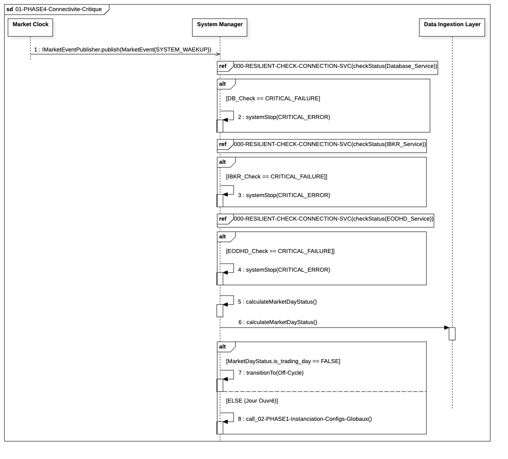

## `01-PHASE4-Connectivite-Critique`

  

### 1. Objectif

Ce module a pour finalité d'agir comme **point d'entrée sécurisé** du système de trading. Il garantit que le processus de *bootstrapping* ne se poursuit qu'après avoir validé la **disponibilité de toutes les dépendances critiques** (Base de Données et Courtier) et confirmé la **pertinence métier** (Jour Ouvré).

---

### 2. Contexte

Le module s'inscrit au début absolu de la **Phase IV (Préparation du portefeuille cible)**, immédiatement après la réception du signal **`SYSTEM_WAKEUP`** du `Market Clock`. Son existence vise à prévenir le gaspillage de ressources (temps d'instanciation des composants) si les services fondamentaux (I/O) ou la condition de marché sont absents.

---

### 3. Logique Générale

Le processus est géré par le **`System Manager`** et se déroule de manière séquentielle et conditionnelle :

1.  **Vérification Sécurisée :** Le `System Manager` vérifie séquentiellement la **Base de Données**, à l'**IBKR Gateway** puis à l'**API EODHD**, en utilisant une routine de résilience standard (gestion des *Retry*).
2.  **Calcul du Statut :** Une fois les connexions établies, le système détermine le **`MarketDayStatus`** (Jour Ouvré ou non) et le persiste pour l'audit.
3.  **Décision de Poursuite :** Le flux bifurque selon le statut du marché. Si le jour n'est pas ouvré, le système entre en veille (`Off-Cycle`). Si le jour est ouvré, le *bootstrapping* se poursuit vers l'étape d'instanciation.

---

### 4. Règles Critiques

* **Résilience Uniforme :** Toutes les vérifications de connexion critiques utilisent le fragment transversal **`00-CORE-RESILIENT-CHECK-CONNECTION-SVC`** pour garantir une logique uniforme de gestion des pannes transitoires et de l'audit.
* **Arrêt Atomique :** Un **échec critique et persistant** (épuisement des *retries*) sur la DB, l'IBKR Gateway ou l'API EODHD entraîne l'envoi immédiat d'une alerte et la **destruction immédiate** du processus (`systemStop`). Le système ne tolère aucune défaillance de dépendance à ce stade.
* **Priorité Métier :** La condition de **Jour Ouvré** agit comme un **garde-fou** final avant la consommation de ressources. Le système ne peut pas instancier les managers locaux si le marché est fermé.

---

### 5. Conclusion

Le module **`01-PHASE4-Connectivite-Critique`** garantit que l'initialisation du système est toujours **conditionnelle** à la santé de ses dépendances et à la pertinence du contexte de marché. Il assure l'**intégrité du démarrage** par une procédure d'arrêt strict en cas de défaillance fondamentale, avant de passer à la phase coûteuse d'instanciation.
