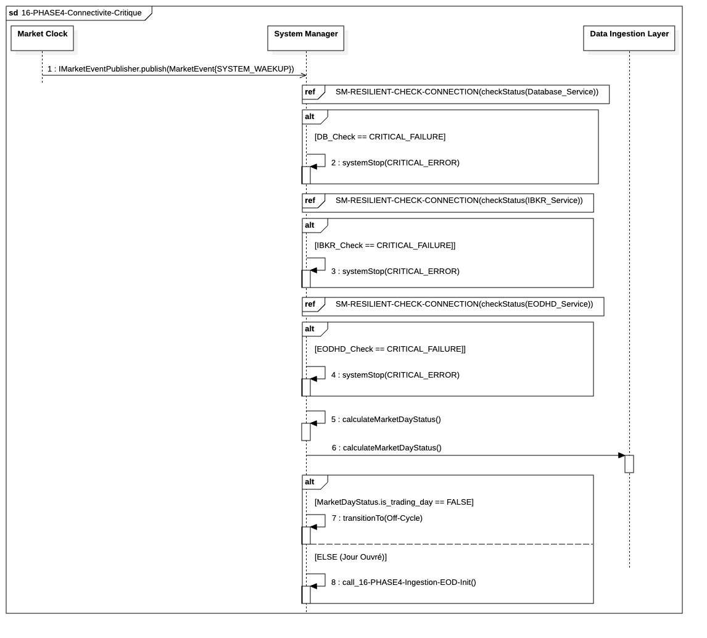

## `16-PHASE4-Connectivite-Critique`

  

---

### 1. Objectif

Ce module a pour finalité d'agir comme le **point d'entrée sécurisé** du système de trading après une période d'inactivité (`OFF_CYCLE`). Il garantit que le processus de préparation (`PHASE4`) ne se poursuit qu'après avoir validé la **disponibilité immédiate de toutes les dépendances critiques** (Base de Données, API de Données de Marché, et Courtier) suite à l'événement de réveil.

---

### 2. Contexte

Le module s'inscrit au début absolu de la **Phase IV (Préparation du Target)**, immédiatement après la réception du signal **`SYSTEM_WAKEUP`** (déclenché par l'Orchestrateur OS ou un *scheduler*). Son existence vise à prévenir le gaspillage de ressources et la consommation de temps d'initialisation si les services fondamentaux (I/O) sont indisponibles.

---

### 3. Logique Générale

Le processus est géré par le **`System Manager`** et se déroule de manière séquentielle et conditionnelle :

1. **Vérification Sécurisée des I/O :** Le `System Manager` vérifie séquentiellement les trois dépendances critiques : la **Base de Données**, l'**API EODHD** et l'**IBKR Gateway**. Ces vérifications utilisent le fragment de résilience standard pour gérer les pannes transitoires (*retries*).
2. **Calcul du Statut (À Suivre) :** L'établissement des connexions (cette séquence) est le **prérequis** au calcul du `MarketDayStatus` (Jour Ouvré ou non). La détermination du statut et la décision de poursuivre sont modélisées dans la **séquence suivante** (`02-PHASE4-`).
3. **Résultat :** Si les trois connexions sont établies, le `System Manager` confirme l'état de la connectivité et passe à l'étape d'initialisation des configurations de la Phase IV.

---

### 4. Règles Critiques

* **Résilience Uniforme :** Toutes les vérifications de connexion critiques utilisent le fragment transversal **`00-CORE-RESILIENT-CHECK-CONNECTION-SVC`** pour garantir une logique uniforme de gestion des pannes transitoires (*Exponential Backoff*), l'audit synchrone et la notification asynchrone des erreurs.
* **Arrêt Atomique :** Un **échec critique et persistant** (épuisement des *retries*) sur la DB, l'API EODHD, ou l'IBKR Gateway entraîne l'envoi immédiat d'une alerte et l'**Arrêt du Processus** (`systemStop`). Le système ne tolère aucune défaillance de dépendance fondamentale à ce stade de réveil.
* **Dépendance Séquentielle :** Les vérifications sont effectuées dans un ordre strict (DB, EODHD, IBKR). Le processus s'arrête immédiatement à la première défaillance persistante, sans vérifier les dépendances suivantes.

---

### 5. Conclusion

Le module **`16-PHASE4-Connectivite-Critique`** garantit que le réveil et l'initialisation du système sont toujours **conditionnels** à la santé de ses dépendances I/O. Il assure l'**intégrité du démarrage** par une procédure d'arrêt strict en cas de défaillance fondamentale, avant de passer aux étapes coûteuses d'initialisation des données et du contexte métier.
