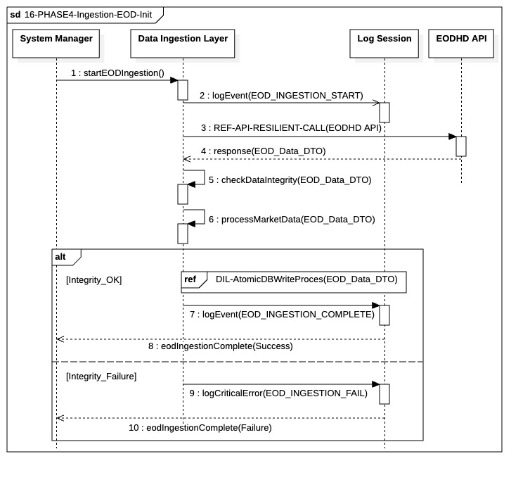

## `16-PHASE4-Ingestion-EOD-Init`

  

---

### 1. Objectif

Ce module a pour finalité d'assurer l'**ingestion complète et intègre** des données de marché de fin de journée (EOD) les plus récentes. Il garantit que le *Strategy Engine* dispose de la source de données la plus fiable et fraîche, dans un format vérifié, avant le calcul du plan d'ordres cible.

---

### 2. Contexte

La séquence s'exécute dans la **Phase IV (Préparation du Target)**, immédiatement après la confirmation de la connectivité et de la pertinence du Jour Ouvré. Son existence est cruciale car le calcul stratégique (`17-PHASE4`) dépend directement de la qualité des données EOD. Le processus est orchestré par le `Data Ingestion Layer` (DIL).

---

### 3. Logique Générale

Le processus est orchestré par le `DIL` de manière séquentielle et conditionnelle :

* **Récupération Résiliente :** Le `DIL` sollicite l'`EODHD API` via un mécanisme d'appel résilient (`REF-API-RESILIENT-CALL`) qui gère les pannes transitoires (retries/backoff).
* **Vérification d'Intégrité :** Les données reçues subissent une vérification métier (`checkDataIntegrity`) pour détecter toute anomalie (ex: valeurs nulles, incohérences). Un échec ici stoppe le flux de persistance.
* **Persistance Atomique :** Les données vérifiées sont soumises au processus d'écriture atomique (`REF-DIL-AtomicDBWriteProces`), qui garantit que l'enregistrement en base de données est **tout ou rien** (transaction complète ou annulée).
* **Résultat :** Le `DIL` notifie le `System Manager` du succès ou de l'échec de l'opération.

---

### 4. Règles Critiques

* **Résilience de l'API :** L'appel à l'`EODHD API` doit utiliser le même patron de résilience que la vérification de connectivité pour garantir une gestion uniforme des I/O externes.
* **Arrêt sur Défaillance :** Un échec critique et persistant lors de la récupération (épuisement des retries), de la vérification d'intégrité, ou de la persistance atomique doit remonter un statut d'échec au `System Manager` pour gestion de crise.
* **Intégrité avant Stockage :** Aucune donnée n'est envoyée à la couche de persistance atomique sans avoir réussi la vérification d'intégrité, protégeant ainsi la qualité des données de la DB.
* **Atomicité de la Persistance :** Le `REF-DIL-AtomicDBWriteProces` doit garantir qu'une défaillance durant l'écriture entraîne un `rollback` complet, évitant les enregistrements partiels ou inconsistants.

---

### 5. Conclusion

Le module `16-PHASE4-Ingestion-EOD-Init` assure que l'étape cruciale de l'acquisition des données EOD est effectuée sous un contrôle rigoureux de **fiabilité (résilience)** et d'**intégrité (vérification + atomicité)**. Il constitue la base factuelle nécessaire au `Strategy Engine` pour procéder à l'étape suivante, le calcul du portefeuille cible.
