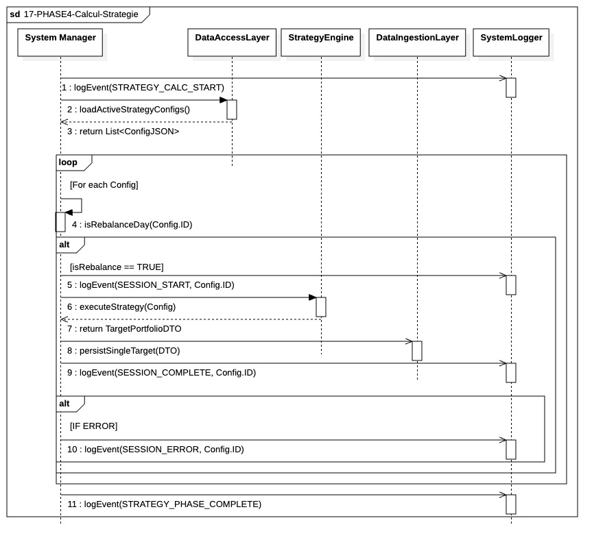

## `17-PHASE4-Calcul-Strategie`

  

### 1. Objectif

La finalité de ce module est de générer les plans d'ordres cibles pour chaque stratégie active. Il transforme les paramètres de configuration et les données de marché en décisions d'investissement concrètes, prêtes à être exécutées.

---

### 2. Contexte

Ce module constitue le cœur décisionnel de la **Phase IV (Préparation du Target Portfolio)**. Il intervient après l'ingestion des données de fin de journée (EOD) et avant la phase de transition vers l'exécution. Son rôle est de faire le pont entre la donnée brute et l'action de trading.

---

### 3. Logique Générale

Le processus fonctionne selon une boucle itérative pilotée par le `System Manager`. Pour chaque session identifiée dans les configurations JSON :

* **Filtrage temporel :** Le système vérifie si la stratégie spécifique doit rebalancer aujourd'hui via le calendrier qui lui est propre.
* **Exécution isolée :** Si le rebalancement est requis, le `Strategy Engine` prend le relais pour effectuer ses calculs complexes, incluant ses propres requêtes de données via le `DataAccessLayer`.
* **Persistance immédiate :** Chaque résultat validé est transmis au `Data Ingestion Layer` pour une inscription directe en base de données.
* **Résultat :** Le module produit une série de `TargetPortfolioDTO` persistés individuellement en base.

---

### 4. Règles Critiques

* **Indépendance des Sessions :** L'échec d'un calcul ou d'une persistance pour une stratégie donnée ne doit pas interrompre le cycle des autres sessions. Le système privilégie la continuité opérationnelle sur l'atomicité globale.
* **Internalisation des Données :** Le moteur de stratégie est responsable de la récupération de ses propres intrants, déchargeant l'orchestrateur de la gestion des volumes de données de marché.
* **Audit Granulaire :** Chaque étape (début de session, succès, erreur ou saut de calendrier) fait l'objet d'un événement de log spécifique pour garantir une traçabilité totale en cas d'anomalie.
* **Priorité à la Persistance :** Un portefeuille cible calculé doit être écrit en base de données immédiatement pour sécuriser le travail accompli avant de passer à la session suivante.

---

### 5. Conclusion

Le module `17-PHASE4-Calcul-Strategie` garantit une production décentralisée et résiliente des décisions de trading. En isolant les erreurs par session et en automatisant le suivi des calendriers de rebalancement, il assure que le système dispose toujours du maximum de cibles valides avant d'engager les phases de marché suivantes.
