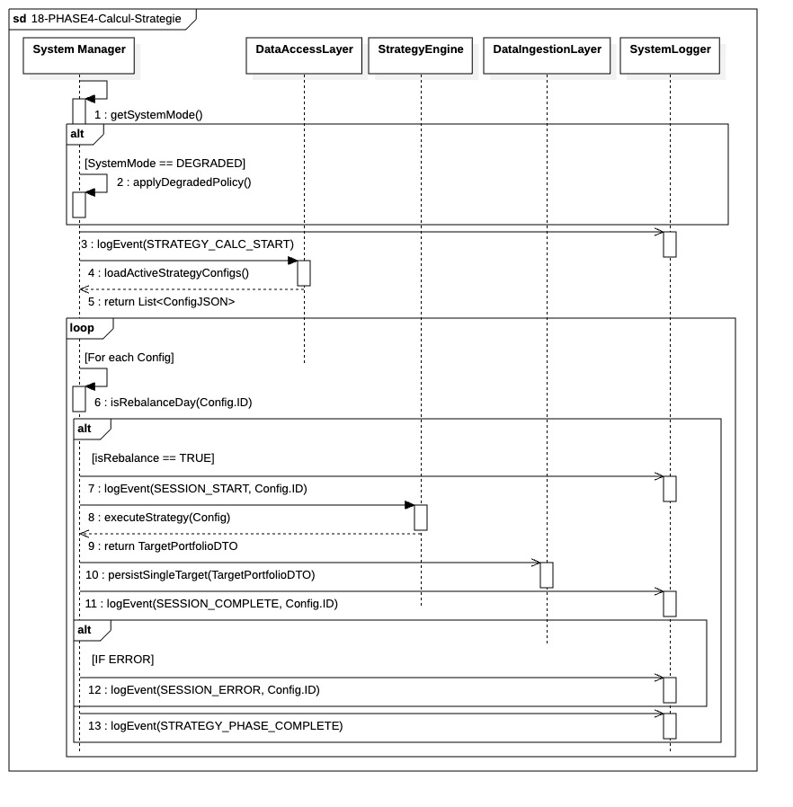

## `18-PHASE4-Calcul-Strategie`

  

---

### 1. Objectif

La finalité de ce module est d'orchestrer le calcul et la persistance des portefeuilles cibles. Il filtre les stratégies éligibles au rebalancement et transforme les configurations actives en décisions d'investissement sécurisées en base de données.

---

### 2. Contexte

Ce module est le moteur d'exécution de la **Phase IV**. Il intervient une fois les configurations chargées depuis le **DAL**. Son rôle est de centraliser l'intelligence de planification du cycle en décidant, pour chaque session, si le déclenchement du moteur de calcul est requis pour la journée en cours.

---

### 3. Logique Générale

Le **System Manager (SM)** pilote une boucle itérative structurée comme suit :

* **Auto-Vérification (SM vers SM) :** Pour chaque configuration, le SM appelle sa propre méthode interne `isRebalanceDay(Config.ID)`. Il analyse les règles temporelles du JSON pour confirmer si la stratégie doit agir ce jour.
* **Exécution Déléguée :** Si le test interne est positif, le SM sollicite le **Strategy Engine**. Ce dernier devient alors responsable de récupérer ses données via le **DAL** et de produire le `TargetPortfolioDTO`.
* **Persistance Unitaire :** Tout résultat produit est immédiatement envoyé au **Data Ingestion Layer (DIL)** pour une écriture en base de données.
* **Gestion du saut :** Si l'auto-vérification est négative, le SM passe immédiatement à la session suivante sans solliciter les ressources de calcul.

---

### 4. Règles Critiques

* **Centralisation du Calendrier :** Le SM détient la responsabilité du "Go/No-Go" temporel via `isRebalanceDay`, assurant que le **Strategy Engine** n'est activé que pour des opérations productives.
* **Indépendance des Flux :** La persistance est réalisée au fil de l'eau. L'échec d'une écriture ou d'un calcul pour une session spécifique n'entrave pas le traitement des autres stratégies de la boucle.
* **Optimisation des Ressources :** En internalisant la vérification du rebalancement, le SM évite des instanciations inutiles du moteur de calcul et des requêtes de données superflues vers le DAL.
* **Traçabilité des Décisions :** Le système doit loguer explicitement les sessions ignorées (`SESSION_SKIPPED`) afin de distinguer un oubli technique d'une décision volontaire basée sur le calendrier.

---

### 5. Conclusion

Le module **17-PHASE4-Calcul-Strategie** garantit une gestion rigoureuse et autonome des cycles de trading. En combinant l'auto-vérification du calendrier et la délégation du calcul complexe, il assure une production de cibles optimisée, résiliente et directement exploitable par les phases d'exécution.

---

|ID|Fonction/Message|Émetteur|Récepteur|Description|
|:---|:---|:---|:---|:---|
|1|getSystemMode()|System Manager|System Manager|Vérification interne du statut opérationnel du système (NOMINAL ou DEGRADED).|
|2|applyDegradedPolicy()|System Manager|System Manager|Application des restrictions métier ou de risque si le mode dégradé est actif.|
|3|logEvent(STRATEGY_CALC_START)|System Manager|SystemLogger|Journalisation du démarrage de la phase de calcul des stratégies.|
|4|loadActiveStrategyConfigs()|System Manager|DataAccessLayer|Requête de récupération des fichiers de configuration JSON pour les stratégies actives.|
|5|return List< ConfigJSON >|DataAccessLayer|System Manager|Retour de la liste des configurations à traiter pour le cycle actuel.|
|6|isRebalanceDay(Config.ID)|System Manager|System Manager|Validation logique permettant de déterminer si la stratégie doit s'exécuter ce jour.|
|7|logEvent(SESSION_START, Config.ID)|System Manager|SystemLogger|Marquage du début de traitement pour une session de stratégie identifiée.|
|8|executeStrategy(Config)|System Manager|StrategyEngine|Appel au moteur de calcul pour transformer la configuration en décisions d'investissement.|
|9|return TargetPortfolioDTO|StrategyEngine|System Manager|Retour de l'objet de transfert contenant le portefeuille cible calculé.|
|10|persistSingleTarget(TargetPortfolioDTO)|System Manager|DataIngestionLayer|Commande de persistance unitaire du résultat via le port de persistance du DIL.|
|11|logEvent(SESSION_COMPLETE, Config.ID)|System Manager|SystemLogger|Journalisation du succès du cycle complet pour une session donnée.|
|12|logEvent(SESSION_ERROR, Config.ID)|System Manager|SystemLogger|Journalisation d'une défaillance technique ou métier durant le traitement de la session.|
|13|notifyStrategyOrderFailure(Config.ID, ErrorCode)|System Manager|Notification Manager|Envoi d'une alerte asynchrone détaillant l'échec de la session pour intervention.|
|14|logEvent(STRATEGY_PHASE_COMPLETE)|System Manager|SystemLogger|Confirmation finale de la clôture de la Phase IV avant passage à l'exécution.|
