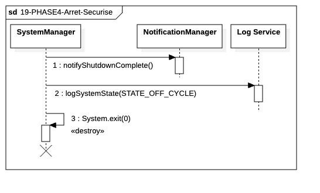

## `19-PHASE4-Arret-Securise`

---

### 1. Objectif

La finalité de ce module est d'assurer la **clôture technique** du cycle de préparation stratégique. Il garantit que les opérateurs sont informés du succès de la planification et que le processus système est libéré proprement après avoir persisté l'état final, évitant ainsi toute consommation de ressources inutile jusqu'au prochain réveil.

---

### 2. Contexte

Ce module est l'étape terminale de la **Phase IV (Target Portfolio Preparation)**. Il intervient immédiatement après la clôture de la boucle de calcul des stratégies (`18-PHASE4`). Contrairement à la fin d'une session de trading "Live", cet arrêt est simplifié car il n'existe pas d'instances de managers locaux ou de singletons persistants (PortfolioManager, RiskMonitor) à désallouer.

---

### 3. Logique Générale

L'orchestration est gérée directement par le **System Manager** :

1. **Notification de Clôture :** Le `System Manager` sollicite le `Notification Manager` via `notifyShutdownComplete()`. Ce message confirme aux administrateurs que les cibles d'investissement ont été générées et persistées avec succès.
2. **Audit de Fin de Cycle :** Un dernier log de transition est envoyé au `Log Service` pour marquer le passage à l'état **`STATE_OFF_CYCLE`**. Cela garantit que la trace d'audit indique une fin de tâche normale et non un crash.
3. **Destruction du Processus :** Le `System Manager` invoque la commande finale `System.exit(0)`. Cette instruction libère tous les descripteurs de fichiers, ferme les sockets résiduels du DIL/DAL et détruit l'instance JVM.

---

### 4. Règles Critiques

* **Immuabilité des Cibles :** L'arrêt ne peut être initié que si la Phase 18 a confirmé la persistance atomique de toutes les cibles.
* **Code de Sortie Normalisé :** L'usage de `System.exit(0)` est impératif pour signaler à l'orchestrateur externe (script Bash) que la tâche s'est terminée sans erreur. Tout autre code déclencherait une alerte système inutile.
* **Priorité de Notification :** La notification doit être envoyée *avant* l'appel au `Log Service` pour s'assurer que l'alerte part avant que les ressources de logging ne soient potentiellement verrouillées par l'arrêt du système.

---

### 5. Conclusion

Ce module clôture le cycle de préparation avec efficacité. En évitant les procédures lourdes de nettoyage propres au trading en direct, il assure une libération rapide de l'infrastructure tout en confirmant l'intégrité des résultats produits. Le système retourne ainsi en mode **IDLE**, prêt pour le prochain cycle de trading ou de rebalancement.

---

| ID | Fonction / Message | Émetteur | Récepteur | Description |
| --- | --- | --- | --- | --- |
| 1 | notifyShutdownComplete() | System Manager | Notification Manager | Envoi du rapport final de succès de la Phase IV aux opérateurs. |
| 2 | logSystemState(STATE_OFF_CYCLE) | System Manager | Log Service | Journalisation de l'état final "Hors Cycle" pour la traçabilité post-mortem. |
| 3 | System.exit(0) | System Manager | System Manager (Self) | Commande de destruction du processus et libération totale de la mémoire. |

---

### 6. Ports et Interfaces

**INotificationService**
* **Responsabilité opérationnelle** : Confirmer la fin du cycle via `notifyShutdownComplete()`.
* **Usage** : Message asynchrone final.

**ILogger**
* **Responsabilité opérationnelle** : Enregistrer le statut `STATE_OFF_CYCLE`.
* **Usage** : Synchrone pour garantir l'écriture avant la destruction.

**IProcessControlPort**
* **Responsabilité opérationnelle** : Exécuter l'arrêt physique du processus via `System.exit(0)`.
* **Usage** : Point final de l'application.
